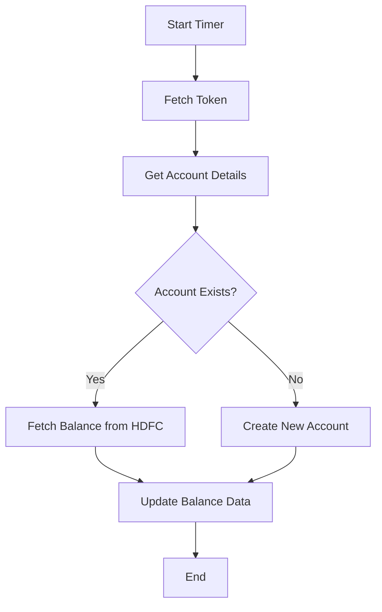

<h1 style="color: #1f4e79; text-align: center; font-size: 3.5em; margin-bottom: 10px;">HDFC BalanceUpdate</h1><h2 style="text-align: center; font-size: 1.8em; font-weight: normal; margin-top: 0;">Technical Specification Document</h2>

<table style="width: 60%; margin: 0 auto;"><tr><th>Author</th><td>Rohancherian783</td></tr><tr><th>Date</th><td>2026-01-05</td></tr><tr><th>Version</th><td>1.0.0</td></tr></table>

<h1 style="color: #1f4e79; font-size: 2.5em; text-align: left;">Table of Contents</h1>
1. Introduction  
&nbsp;&nbsp;&nbsp; 1.1 Purpose  
&nbsp;&nbsp;&nbsp; 1.2 Scope  
2. Integration Overview  
&nbsp;&nbsp;&nbsp; 2.1 Integration Architecture  
&nbsp;&nbsp;&nbsp; 2.2 Integration Components  
3. Integration Scenarios  
&nbsp;&nbsp;&nbsp; 3.1 Scenario Description  
&nbsp;&nbsp;&nbsp; 3.2 Data Flows  
&nbsp;&nbsp;&nbsp; 3.3 Security Requirements  
4. Error Handling and Logging  
5. Testing Validation  
6. Reference Documents  

<h1 style="color: #1f4e79; text-align: left;">1. Introduction</h1>
<b style="color: #1f4e79;">1.1 Purpose:</b>

The 'HDFC_BalanceUpdate' iFlow is designed to address the business need for real-time balance updates from HDFC Bank to the SAP S/4HANA system. The primary business problem this iFlow solves is the synchronization of bank account balances, ensuring that the financial data in the SAP system reflects the most current information available from HDFC Bank. 

The trigger mechanism for this iFlow is a scheduled timer event, which initiates the process at defined intervals. The desired technical outcome is to fetch the latest balance information from HDFC Bank, transform it into the required format, and update the corresponding records in the SAP S/4HANA system. This ensures that financial reporting and decision-making are based on accurate and up-to-date data.

<b style="color: #1f4e79;">1.2 Scope:</b>

The scope of the 'HDFC_BalanceUpdate' iFlow includes the following components:

- **Endpoints**: 
  - HDFC Bank API for balance inquiries.
  - SAP S/4HANA endpoints for updating balance information.
  
- **Data Transformation Logic**: 
  - The iFlow includes logic to transform the data received from HDFC Bank into the format required by SAP S/4HANA.
  - It handles the mapping of fields such as Company Code, Bank Account Number, and Available Balance.

- **Target Systems**: 
  - The primary target system is SAP S/4HANA, where the balance updates will be reflected.

- **Constraints**: 
  - The iFlow is designed to handle specific error scenarios, including connection failures and data validation errors.
  - It operates under the constraints of the HDFC Bank API, including rate limits and authentication requirements.

- **Exclusions**: 
  - The iFlow does not handle historical data updates; it only processes real-time balance updates.
  - It does not include any user interface components for manual intervention.

<h1 style="color: #1f4e79; text-align: left;">2. Integration Overview</h1>
<b style="color: #1f4e79;">2.1 Integration Architecture:</b>

<b style="color: #1f4e79;">2.2 Integration Components:</b>

| Component | Role | Details |
| :--- | :--- | :--- |
| Start Timer | Trigger | Initiates the iFlow at scheduled intervals. |
| Fetch Token | Service Task | Retrieves authentication token from HDFC Bank. |
| Get Account Details | Service Task | Fetches account details from SAP S/4HANA. |
| Fetch Balance from HDFC | Service Task | Calls HDFC Bank API to retrieve the latest balance. |
| Update Balance Data | Service Task | Updates the balance information in SAP S/4HANA. |
| Create New Account | Service Task | Handles the creation of new accounts if not found. |
| End | End Event | Marks the completion of the iFlow. |

<h1 style="color: #1f4e79; text-align: left;">3. Integration Scenarios</h1>
<b style="color: #1f4e79;">3.1 Scenario Description:</b>

1. **Start Timer**: The iFlow is triggered by a timer event, which initiates the process at predefined intervals.
   
2. **Fetch Token**: The iFlow calls the HDFC Bank API to retrieve an authentication token required for subsequent API calls.

3. **Get Account Details**: The iFlow queries the SAP S/4HANA system to retrieve the account details associated with the bank account.

4. **Check Account Existence**: A decision point checks if the account exists in the SAP system.
   - If the account exists, the flow proceeds to fetch the balance from HDFC Bank.
   - If the account does not exist, the flow creates a new account in SAP.

5. **Fetch Balance from HDFC**: The iFlow calls the HDFC Bank API to retrieve the latest balance for the specified account.

6. **Update Balance Data**: The iFlow updates the balance information in the SAP S/4HANA system with the data retrieved from HDFC Bank.

7. **End**: The iFlow completes its execution.

<b style="color: #1f4e79;">3.2 Data Flows:</b>

- Data is fetched from HDFC Bank using the API, transformed into the required format, and then sent to SAP S/4HANA for updating the balance records.
- The iFlow handles both successful and error scenarios, ensuring that appropriate notifications are sent in case of failures.

<b style="color: #1f4e79;">3.3 Security Requirements:</b>

- The iFlow requires secure communication with HDFC Bank using HTTPS.
- Authentication is handled via tokens, which are fetched at the beginning of the process.
- Sensitive data, such as bank account information, is encrypted during transmission.

<h1 style="color: #1f4e79; text-align: left;">4. Error Handling and Logging</h1>

The iFlow includes error handling mechanisms to manage exceptions that may occur during execution. This includes:

- Logging errors to a centralized logging system for monitoring and troubleshooting.
- Sending email notifications to the support team in case of critical failures.
- Implementing retry logic for transient errors, such as network issues.

<h1 style="color: #1f4e79; text-align: left;">5. Testing Validation</h1>

**Testing Details – Sheet: Testing**

| Test Case ID | Scenario | Expected Outcome |
| :--- | :--- | :--- |
| TC_001 | Validate Token Fetch | Token is successfully retrieved from HDFC Bank. |
| TC_002 | Validate Account Details Fetch | Account details are correctly fetched from SAP S/4HANA. |
| TC_003 | Validate Balance Fetch | Latest balance is successfully retrieved from HDFC Bank. |
| TC_004 | Validate Balance Update | Balance is correctly updated in SAP S/4HANA. |
| TC_005 | Validate Error Handling | Errors are logged and notifications are sent as expected. |

<h1 style="color: #1f4e79; text-align: left;">6. Reference Documents</h1>

- HDFC Bank API Documentation
- SAP S/4HANA Integration Guide
- CPI Error Handling Best Practices
- Testing and Validation Procedures Document
