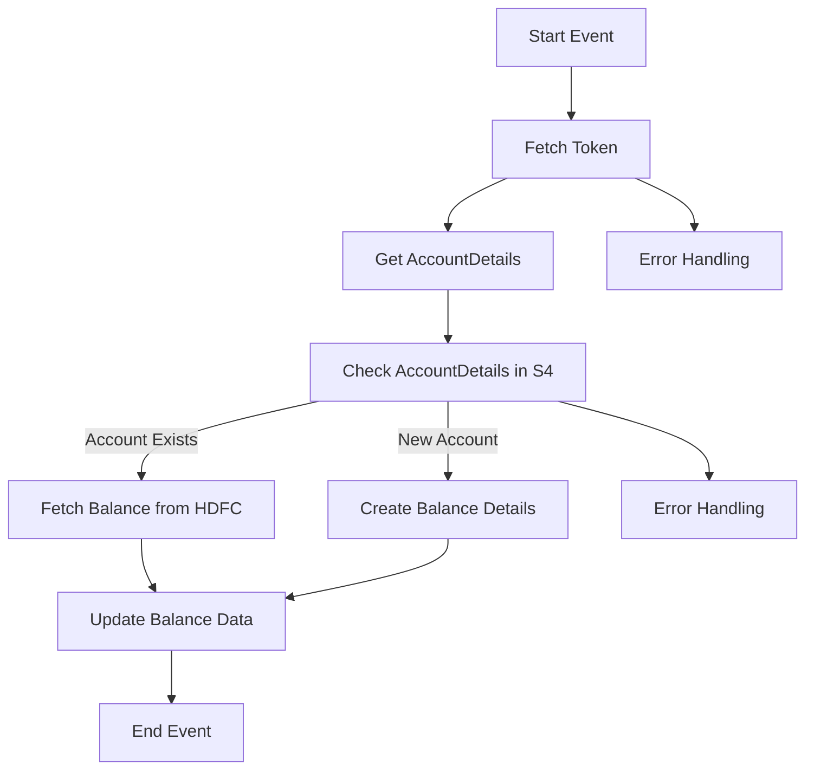

<h1 style="color: #1f4e79; text-align: center; font-size: 3em;">HDFC BalanceUpdate</h1><h2 style="text-align: center;">Technical Specification</h2>

<table border="1" style="margin: 0 auto; border-collapse: collapse;"><tr><td style="padding: 10px;"><b>Author</b></td><td style="padding: 10px;">Rohancherian783</td></tr><tr><td style="padding: 10px;"><b>Date</b></td><td style="padding: 10px;">2025-12-23</td></tr></table>

<h1 style="color: #1f4e79;">Table of Contents</h1>
1. Introduction 
2. Integration Overview 
3. Integration Scenarios 
4. Error Handling and Logging 
5. Testing Validation 
6. Reference Documents 

<h1 style="color: #1f4e79;">1. Introduction</h1>
[cite_start]1.1 Purpose: Explain the solution conceptualized[cite: 28]. 
The purpose of the HDFC_BalanceUpdate iFlow is to facilitate the integration of balance updates from HDFC Bank into the S4 system, ensuring that financial data is accurately reflected in real-time.

[cite_start]1.2 Scope: Outline data flows and integration touchpoints[cite: 30].
The scope includes data flows between HDFC Bank and the S4 system, covering the retrieval of bank account details, balance updates, and error handling mechanisms.

<h1 style="color: #1f4e79;">2. Integration Overview</h1>
[cite_start]2.1 Integration Architecture: Provide a Mermaid graph[cite: 35].

[cite_start]2.2 Integration Components: List Sender/Receiver and Adapters[cite: 37].
- **Senders**: 
  - HDFC Bank
  - Mail1, Mail2, Mail3
- **Receivers**: 
  - S4_BANKBALANCE
  - S4_BANKBALANCE_CDS
  - S4_BANKACCOUNTDETAILS_CDS
- **Adapters**: 
  - HTTP Adapter
  - OData Adapter
  - Mail Adapter

<h1 style="color: #1f4e79;">3. Integration Scenarios</h1>
[cite_start]3.1 Scenario Description: Step-by-step logic[cite: 39].
1. The process starts with a timer event that triggers the fetching of the token.
2. The token is used to retrieve account details from HDFC Bank.
3. The account details are checked against the S4 system.
4. Depending on whether the account exists or is new, the appropriate actions are taken to update or create balance details.
5. Finally, the process ends with either a successful update or error handling.

[cite_start]3.2 Data Flows: Explain Mapping (Field to Field) and Groovy/XSLT logic[cite: 41, 45].
- **Field Mapping**:
  - BankAccountNumber → ${property.BankAccount}
  - AvailableBalance → ${property.availableBalance}
  - NetAvailableBalance → ${property.netAvailableBalance}
- **Groovy Logic**:
  - Scripts are used to manipulate and transform data as it flows through the integration process, including error handling and payload preparation.

[cite_start]3.3 Security Requirements: Credentials and Auth mechanisms[cite: 48].
- **Credentials**: 
  - Basic authentication for HTTP calls.
  - Client certificates for secure communication with HDFC.
- **Auth Mechanisms**: 
  - OAuth tokens for secure access to HDFC services.

<h1 style="color: #1f4e79;">4. Error Handling and Logging</h1>
[cite_start]Describe exception subprocesses and logging scripts[cite: 51, 53].
The iFlow includes exception subprocesses that handle errors during the integration process. Logging scripts capture error messages and relevant details, which are then sent via email to the concerned teams for resolution.

<h1 style="color: #1f4e79;">5. Testing Validation</h1>
[cite_start]Provide Test Case IDs and Scenarios[cite: 67].
- **Test Case ID 1**: Validate successful token retrieval.
- **Test Case ID 2**: Validate account details fetching from HDFC.
- **Test Case ID 3**: Validate balance update in S4.
- **Test Case ID 4**: Validate error handling for invalid account numbers.

<h1 style="color: #1f4e79;">6. Reference Documents</h1>
[cite_start]List analyzed files (iFlowContent.xml, scripts, etc.)[cite: 21, 23].
- iFlowContent.xml
- script1.groovy
- script2.groovy
- script3.groovy
- script4.groovy
- script5.groovy
- script6.groovy
- script7.groovy
- script8.groovy
- script9.groovy
- script10.groovy
