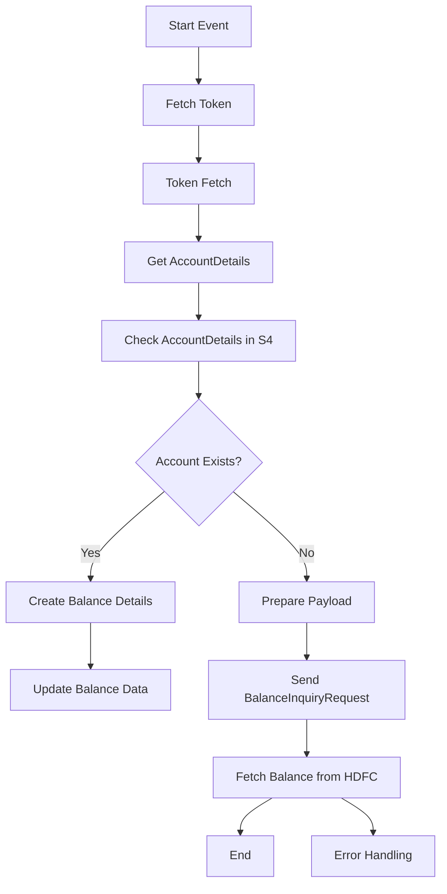

<h1 style="color: #1f4e79; text-align: center; font-size: 3.5em;">HDFC BalanceUpdate</h1><h2 style="text-align: center; color: #666;">Technical Specification Document</h2>

<table style="margin: 0 auto; border: 1px solid #ccc; border-collapse: collapse;"><tr><th style="padding: 10px; border: 1px solid #ccc; background: #f9f9f9;">Author</th><td style="padding: 10px; border: 1px solid #ccc;">Rohancherian783</td></tr><tr><th style="padding: 10px; border: 1px solid #ccc; background: #f9f9f9;">Date</th><td style="padding: 10px; border: 1px solid #ccc;">2025-12-23</td></tr></table>

<h1 style="color: #1f4e79; font-size: 2.5em;">Table of Contents</h1>
1. Introduction  
2. Integration Overview  
3. Integration Scenarios  
4. Error Handling and Logging  
5. Testing Validation  
6. Reference Documents  

<h1 style="color: #1f4e79;">1. Introduction</h1>
1.1 Purpose: The purpose of this document is to provide a comprehensive technical report on the HDFC_BalanceUpdate integration flow, detailing its architecture, components, scenarios, error handling, and testing validation.

1.2 Scope: This report covers the integration between HDFC and SAP systems, focusing on balance updates and related functionalities.

<h1 style="color: #1f4e79;">2. Integration Overview</h1>
2.1 Integration Architecture:

2.2 Integration Components:
| Component Type | Name/Details | Description |
| :--- | :--- | :--- |
| Sender System | HDFC | The bank system that provides balance information. |
| Receiver System | S4_BANKBALANCE | The SAP system that receives balance updates. |
| Adapter | HTTP | Used for communication between HDFC and SAP systems. |

<h1 style="color: #1f4e79;">3. Integration Scenarios</h1>
3.1 Scenario Description:
1. Fetch token from HDFC.
2. Retrieve account details from SAP.
3. Check if the account exists in SAP.
4. If the account exists, create balance details; if not, prepare a payload for balance inquiry.
5. Send balance inquiry request to HDFC and fetch balance details.

3.2 Data Flows:
- **Mapping Logic**: The integration uses various mapping artifacts to transform data between HDFC and SAP formats.
- **XSLT**: XSLT transformations are applied to convert XML data formats as needed.
- **Groovy Scripts**: Groovy scripts are used for custom logic, such as adding headers and processing responses.

3.3 Security Requirements:
| Security Aspect | Details |
| :--- | :--- |
| Authentication | Basic authentication is used for API calls. |
| Encryption | Data is encrypted during transmission using TLS. |
| Token Management | JWT tokens are used for secure API access. |

<h1 style="color: #1f4e79;">4. Error Handling and Logging</h1>
The integration flow includes an exception subprocess that captures errors during execution. It logs error messages and sends notifications to the relevant stakeholders. The logging is configured to capture all events for monitoring and troubleshooting.

<h1 style="color: #1f4e79;">5. Testing Validation</h1>
Testing validation will be conducted to ensure that the integration flow works as expected, including unit tests for individual components and end-to-end tests for the entire flow.

<h1 style="color: #1f4e79;">6. Reference Documents</h1>
- iFlowContent.xml
- script1.groovy
- script2.groovy
- script3.groovy
- script4.groovy
- script5.groovy
- script6.groovy
- script7.groovy
- script8.groovy
- script9.groovy
- script10.groovy
