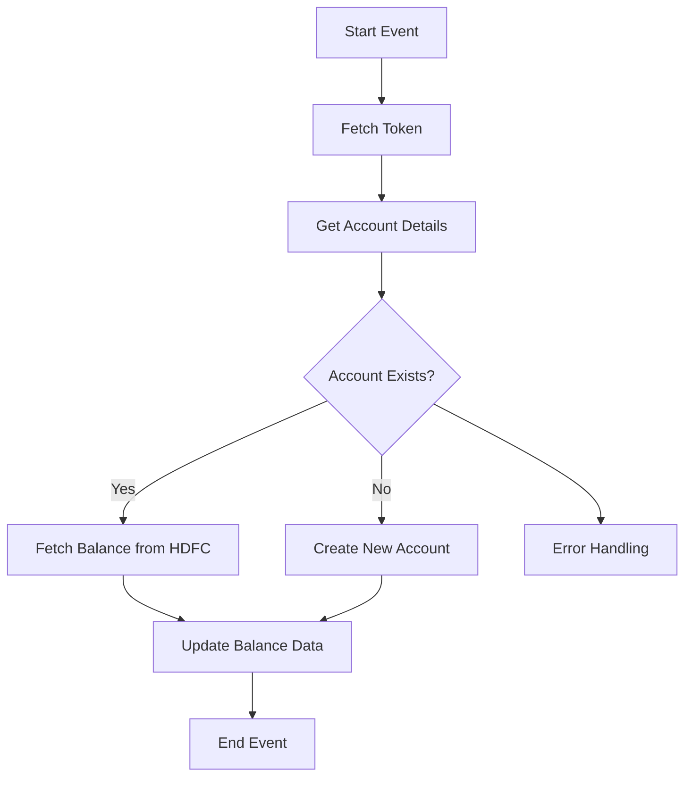

<h1 style="color: #1f4e79; text-align: center; font-size: 3em;">HDFC BalanceUpdate</h1><h2 style="text-align: center;">Technical Specification Document</h2>

<table border="1" style="margin: 0 auto; border-collapse: collapse; min-width: 350px;"><tr><th style="padding: 10px; background-color: #f2f2f2; text-align: left;">Author</th><td style="padding: 10px;">Rohancherian783</td></tr><tr><th style="padding: 10px; background-color: #f2f2f2; text-align: left;">Date</th><td style="padding: 10px;">2025-12-23</td></tr><tr><th style="padding: 10px; background-color: #f2f2f2; text-align: left;">Version</th><td style="padding: 10px;">1.0.0</td></tr></table>

<h1 style="color: #1f4e79; font-size: 2.5em;">Table of Contents</h1>

1. Introduction  
&nbsp;&nbsp;&nbsp; 1.1 Purpose  
&nbsp;&nbsp;&nbsp; 1.2 Scope  
2. Integration Overview  
&nbsp;&nbsp;&nbsp; 2.1 Integration Architecture  
&nbsp;&nbsp;&nbsp; 2.2 Integration Components  
3. Integration Scenarios  
&nbsp;&nbsp;&nbsp; 3.1 Scenario Description  
&nbsp;&nbsp;&nbsp; 3.2 Data Flows  
&nbsp;&nbsp;&nbsp; 3.3 Security Requirements  
4. Error Handling and Logging  
5. Testing Validation  
6. Reference Documents  

<h1 style="color: #1f4e79;">1. Introduction</h1>

<b style="color: #1f4e79;">1.1 Purpose:</b>

The purpose of the 'HDFC_BalanceUpdate' integration flow is to facilitate the seamless exchange of banking balance information between the HDFC banking system and the SAP S/4HANA system. This integration is crucial for ensuring that the financial data within the SAP system is always up-to-date, reflecting the latest balances from HDFC. The integration aims to automate the process of balance updates, thereby reducing manual intervention, minimizing errors, and enhancing operational efficiency.

The integration flow is designed to handle various scenarios, including fetching balance details, updating account information, and managing error handling effectively. It utilizes OData services to interact with the HDFC banking system, ensuring secure and reliable data transmission. The technical goal is to implement a robust and scalable solution that can handle high volumes of transactions while maintaining data integrity and security.

<b style="color: #1f4e79;">1.2 Scope:</b>

The scope of the 'HDFC_BalanceUpdate' integration flow encompasses the following key components and processes:

- **Systems Involved:** The integration involves the HDFC banking system, which provides balance information through OData services, and the SAP S/4HANA system, which receives and processes this data.
  
- **Processes Covered:** The integration flow includes processes for fetching balance details, updating account information, and sending notifications in case of errors. It also includes subprocesses for token fetching and error handling.

- **Data Handling:** The integration flow is responsible for managing various data formats, including JSON and XML, and ensuring that data is transformed appropriately for each system's requirements.

- **Error Management:** The integration includes comprehensive error handling mechanisms to log errors, send notifications, and ensure that the integration can recover gracefully from failures.

Overall, the integration flow is designed to provide a comprehensive solution for managing banking balance updates, ensuring that all relevant data is synchronized between HDFC and SAP S/4HANA.

<h1 style="color: #1f4e79;">2. Integration Overview</h1>

<b style="color: #1f4e79;">2.1 Integration Architecture:</b>

<b style="color: #1f4e79;">2.2 Integration Components:</b>

| Component Type | Name/Details | Description |
| :--- | :--- | :--- |
| Integration Process | HDFC_BalanceUpdate | Main process for handling balance updates. |
| Subprocess | Token Fetch | Handles the retrieval of authentication tokens. |
| Service Task | Fetch Token | External call to fetch authentication tokens. |
| Service Task | Get Account Details | Fetches account details from SAP S/4HANA. |
| Service Task | Fetch Balance from HDFC | Calls HDFC OData service to retrieve balance information. |
| Service Task | Update Balance Data | Updates the balance information in SAP S/4HANA. |
| Error Handling | Exception Subprocess | Manages errors and sends notifications. |

<h1 style="color: #1f4e79;">3. Integration Scenarios</h1>

<b style="color: #1f4e79;">3.1 Scenario Description:</b>

1. **Token Retrieval:** The integration flow starts with fetching an authentication token from the HDFC system to ensure secure communication.
  
2. **Account Verification:** The flow checks if the account exists in the SAP S/4HANA system. If it does, it proceeds to fetch the balance; if not, it creates a new account.

3. **Balance Retrieval:** The integration fetches the latest balance information from the HDFC system using OData services.

4. **Data Update:** The retrieved balance data is then updated in the SAP S/4HANA system.

5. **Error Handling:** If any errors occur during the process, they are logged, and notifications are sent to the relevant stakeholders.

<b style="color: #1f4e79;">3.2 Data Flows:</b>

- **Token Flow:** 
  - Fetch Token → HDFC Authentication Service → Token Received

- **Account Flow:**
  - Get Account Details → SAP S/4HANA → Account Details Retrieved

- **Balance Flow:**
  - Fetch Balance from HDFC → HDFC OData Service → Balance Data Retrieved

- **Update Flow:**
  - Update Balance Data → SAP S/4HANA → Balance Updated Successfully

<b style="color: #1f4e79;">3.3 Security Requirements:</b>

| Security Aspect | Description |
| :--- | :--- |
| Authentication | Basic authentication using credentials stored securely. |
| Data Encryption | All sensitive data transmitted between systems must be encrypted. |
| Token Management | Tokens must be securely fetched and managed to prevent unauthorized access. |
| Error Logging | All errors must be logged with sufficient detail for troubleshooting. |

<h1 style="color: #1f4e79;">4. Error Handling and Logging</h1>

The integration flow includes a dedicated error handling subprocess that captures any errors occurring during the execution of the main process. This subprocess logs the error details, including the error message and the associated message processing log ID. Notifications are sent to the relevant stakeholders to ensure timely resolution of issues.

<h1 style="color: #1f4e79;">5. Testing Validation</h1>

Testing of the 'HDFC_BalanceUpdate' integration flow will involve unit testing of individual components, integration testing to ensure seamless communication between systems, and end-to-end testing to validate the entire process. Test cases will cover various scenarios, including successful balance updates, error scenarios, and edge cases.

<h1 style="color: #1f4e79;">6. Reference Documents</h1>

- SAP Integration Documentation
- HDFC API Documentation
- Internal Process Guidelines for Integration Flows
- Error Handling Best Practices in SAP CPI
