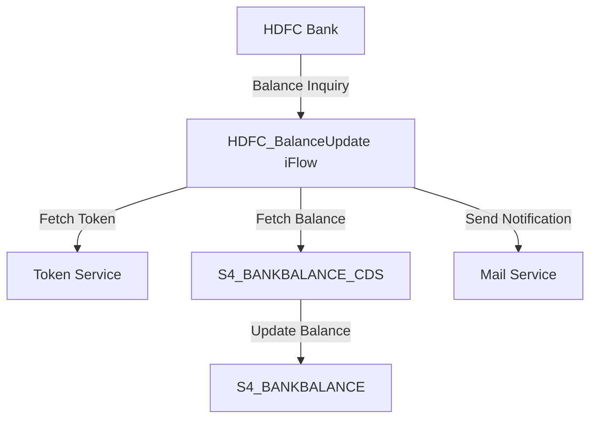

<h1 style="color: #1f4e79; text-align: center; font-size: 3em;">HDFC BalanceUpdate</h1><h2 style="text-align: center;">Technical Specification Document</h2>

<table border="1" style="margin: 0 auto; border-collapse: collapse;"><tr><td style="padding: 10px;"><b>Author</b></td><td style="padding: 10px;">Rohancherian783</td></tr><tr><td style="padding: 10px;"><b>Date</b></td><td style="padding: 10px;">2025-12-22</td></tr></table>

<h1 style="color: #1f4e79; font-size: 2.5em;">Table of Contents</h1>
1. Introduction 
1.1 Purpose 
1.2 Scope 
2. Integration Overview 
2.1 Integration Architecture 
2.2 Integration Components 
3. Integration Scenarios 
3.1 Scenario Description 
3.2 Data Flows 
3.3 Security Requirements 
4. Error Handling and Logging 
5. Testing Validation 
6. Reference Documents 

<h1 style="color: #1f4e79;">1. Introduction</h1>
<h2 style="color: #1f4e79;">1.1 Purpose</h2>
The purpose of the HDFC_BalanceUpdate iFlow is to facilitate the integration of balance updates from HDFC Bank into the SAP S/4HANA system. This integration ensures that the financial data is accurately reflected in the SAP system, allowing for real-time updates and improved financial reporting.

<h2 style="color: #1f4e79;">1.2 Scope</h2>
This iFlow covers the end-to-end process of fetching balance details from HDFC Bank, updating the SAP S/4HANA system, and handling any errors that may occur during the process. It includes the necessary configurations, data mappings, and security measures required for successful integration.

<h1 style="color: #1f4e79;">2. Integration Overview</h1>
<h2 style="color: #1f4e79;">2.1 Integration Architecture</h2>

<h2 style="color: #1f4e79;">2.2 Integration Components</h2>
- **Sender System**: HDFC Bank
- **Receiver Systems**: 
  - S4_BANKBALANCE_CDS
  - S4_BANKBALANCE
  - S4_BANKACCOUNTDETAILS_CDS
- **Adapters**: 
  - HTTP Adapter for REST calls
  - OData Adapter for data fetching
  - Mail Adapter for notifications

<h1 style="color: #1f4e79;">3. Integration Scenarios</h1>
<h2 style="color: #1f4e79;">3.1 Scenario Description</h2>
The integration scenario involves the following steps:
1. Trigger the iFlow based on a scheduled event.
2. Fetch the authentication token from HDFC Bank.
3. Retrieve balance details for specified bank accounts.
4. Update the balance information in the SAP S/4HANA system.
5. Send notifications via email in case of errors or successful updates.

<h2 style="color: #1f4e79;">3.2 Data Flows</h2>
- **Mapping Logic**: The data from HDFC Bank is mapped to the corresponding fields in the SAP S/4HANA system using XSLT transformations.
- **XSLT**: The XSLT scripts are used to transform the incoming XML data from HDFC into the required format for SAP.
- **Groovy Scripts**: Groovy scripts are utilized for additional processing, such as setting properties and handling dynamic values.

<h2 style="color: #1f4e79;">3.3 Security Requirements</h2>
- **Credentials**: Basic authentication is used for accessing HDFC Bank APIs.
- **Auth Mechanisms**: The iFlow uses OAuth tokens for secure communication with the HDFC Bank services.

<h1 style="color: #1f4e79;">4. Error Handling and Logging</h1>
The iFlow includes an exception subprocess that captures errors during execution. It logs error messages and sends notifications to the relevant stakeholders via email. The error handling mechanism ensures that any issues are promptly addressed, and the process can be retried if necessary.

<h1 style="color: #1f4e79;">5. Testing Validation</h1>
Testing of the iFlow involves:
- Unit testing of individual components (e.g., token fetching, balance retrieval).
- Integration testing to ensure that the entire flow works as expected.
- Performance testing to validate the response times and throughput under load.

<h1 style="color: #1f4e79;">6. Reference Documents</h1>
- iFlowContent.xml
- Groovy scripts (script1.groovy, script2.groovy, etc.)
- XSLT transformation files
- API documentation for HDFC Bank services
- Email notification templates
