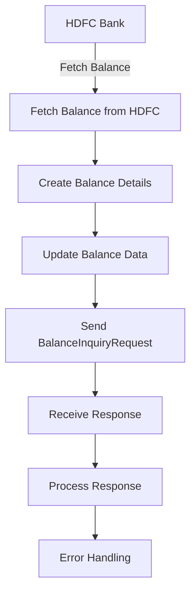

<h1 style="color: #1f4e79; text-align: center; font-size: 3em;">HDFC BalanceUpdate</h1><h2 style="text-align: center;">Technical Specification Document</h2>

<table border="1" style="margin: 0 auto; border-collapse: collapse; min-width: 300px;"><tr><th style="padding: 10px; background-color: #f2f2f2;">Author</th><td style="padding: 10px;">Rohancherian783</td></tr><tr><th style="padding: 10px; background-color: #f2f2f2;">Date</th><td style="padding: 10px;">2025-12-23</td></tr></table>

<h1 style="color: #1f4e79; font-size: 2.5em;">Table of Contents</h1>

1. Introduction  

2. Integration Overview  

3. Integration Scenarios  

4. Error Handling and Logging  

5. Testing Validation  

6. Reference Documents  

<h1 style="color: #1f4e79;">1. Introduction</h1>

1.1 **Purpose**: 

The purpose of the 'HDFC_BalanceUpdate' iFlow is to facilitate the integration of balance update information from HDFC Bank to an SAP S/4HANA system. This integration ensures that the latest balance information is accurately reflected in the SAP system, enabling timely financial reporting and decision-making.

1.2 **Scope**: 

This report covers the technical aspects of the iFlow, including its architecture, integration components, scenarios, error handling mechanisms, and testing validation processes. It is intended for technical architects and developers involved in the implementation and maintenance of the integration.

<h1 style="color: #1f4e79;">2. Integration Overview</h1>

2.1 **Integration Architecture**: 

2.2 **Integration Components**:

| Component Type     | Name/Details                          | Description                                           |
| :------------------| :-------------------------------------| :----------------------------------------------------|
| Sender System      | HDFC Bank                             | The source system providing balance data.            |
| Receiver System    | SAP S/4HANA                           | The target system receiving balance updates.          |
| Adapter            | HTTP Adapter                          | Used for communication between HDFC Bank and SAP.    |

<h1 style="color: #1f4e79;">3. Integration Scenarios</h1>

3.1 **Scenario Description**: 

1. The iFlow is triggered by a scheduled event to fetch balance updates from HDFC Bank.

2. The balance data is retrieved and processed.

3. The updated balance information is sent to the SAP S/4HANA system.

3.2 **Data Flows**:

- **Mapping Logic**: The mapping logic transforms the incoming balance data from HDFC Bank into the required format for SAP S/4HANA.

- **XSLT**: XSLT transformations are applied to convert XML data structures as needed.

- **Groovy Scripts**: Groovy scripts are utilized for custom processing and data manipulation during the integration flow.

3.3 **Security Requirements**:

| Security Aspect    | Details                                   |
| :------------------| :-----------------------------------------|
| Authentication     | Basic authentication using credentials.   |
| Encryption         | Data is encrypted during transmission.    |

<h1 style="color: #1f4e79;">4. Error Handling and Logging</h1>

The iFlow incorporates robust error handling mechanisms, including:

- Exception subprocesses to capture and manage errors during execution.

- Logging of error messages and processing logs for troubleshooting.

- Notifications sent via email to relevant stakeholders in case of failures.

<h1 style="color: #1f4e79;">5. Testing Validation</h1>

Testing validation includes:

- Unit testing of individual components and scripts.

- Integration testing to ensure end-to-end functionality.

- Performance testing to validate the response times and throughput of the iFlow.

<h1 style="color: #1f4e79;">6. Reference Documents</h1>

- HDFC_BalanceUpdate iFlow Definition

- Integration Architecture Diagrams

- Error Handling Guidelines

- Testing Strategy Document
