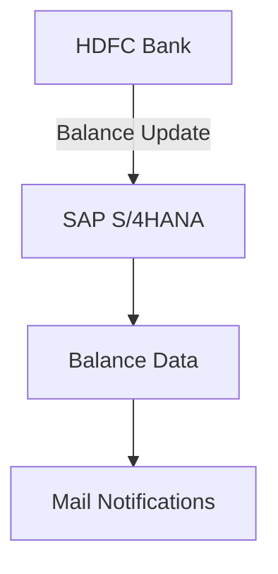

<h1 style="color: #1f4e79; text-align: center; font-size: 3em;">HDFC BalanceUpdate</h1><h2 style="text-align: center;">Technical Specification Document</h2>

<table border="1" style="margin: 0 auto; border-collapse: collapse; min-width: 300px;"><tr><th style="padding: 10px; background-color: #f2f2f2;">Author</th><td style="padding: 10px;">Rohancherian783</td></tr><tr><th style="padding: 10px; background-color: #f2f2f2;">Date</th><td style="padding: 10px;">2025-12-23</td></tr></table>

<h1 style="color: #1f4e79; font-size: 2.5em;">Table of Contents</h1>

1. Introduction  

2. Integration Overview  

3. Integration Scenarios  

4. Error Handling and Logging  

5. Testing Validation  

6. Reference Documents  

<h1 style="color: #1f4e79;">1. Introduction</h1>

<b style="color: #1f4e79;">1.1 Purpose:</b> 

The purpose of the 'HDFC_BalanceUpdate' iFlow is to facilitate the integration between HDFC Bank and SAP S/4HANA for balance updates. This integration ensures that balance information is accurately reflected in the SAP system based on transactions occurring in the HDFC banking system.

<b style="color: #1f4e79;">1.2 Scope:</b> 

This report covers the technical aspects of the iFlow, including its architecture, integration components, scenarios, error handling mechanisms, and testing validation processes.

<h1 style="color: #1f4e79;">2. Integration Overview</h1>

<b style="color: #1f4e79;">2.1 Integration Architecture:</b> 

<b style="color: #1f4e79;">2.2 Integration Components:</b>

| Component Type | Name/Details | Description |
| :--- | :--- | :--- |
| Sender System | HDFC | Source of balance updates |
| Receiver System | SAP S/4HANA | Target system for balance updates |
| Adapter | HTTP, OData | Protocols used for communication |

<h1 style="color: #1f4e79;">3. Integration Scenarios</h1>

<b style="color: #1f4e79;">3.1 Scenario Description:</b> 

1. Fetch balance details from HDFC Bank.
  
2. Update the balance in SAP S/4HANA.

3. Send notifications via email regarding the balance update.

<b style="color: #1f4e79;">3.2 Data Flows:</b>

- **Mapping Logic**: The mapping logic transforms the data from HDFC format to SAP format.
  
- **XSLT**: XSLT is used for transforming XML data structures as needed.

- **Groovy Scripts**: Groovy scripts are utilized for custom logic and data manipulation.

<b style="color: #1f4e79;">3.3 Security Requirements:</b>

| Security Aspect | Details |
| :--- | :--- |
| Authentication | Basic authentication is used for secure communication. |
| Encryption | Data is encrypted during transmission to ensure confidentiality. |

<h1 style="color: #1f4e79;">4. Error Handling and Logging</h1>

The error handling strategy involves the use of subprocesses to capture and log errors. If an error occurs during the execution of the iFlow, an error message is generated and sent via email to the relevant stakeholders. The error details include the exception message and the SAP Message Processing Log ID for tracking purposes.

<h1 style="color: #1f4e79;">5. Testing Validation</h1>

Validation steps include:

- Testing the integration flow with various balance update scenarios to ensure data accuracy.
  
- Verifying the email notifications for successful and failed transactions.

- Conducting performance testing to ensure the iFlow can handle the expected load.

<h1 style="color: #1f4e79;">6. Reference Documents</h1>

- cpi-artifacts/MC/HDFC_BalanceUpdate/src/main/resources/scenarioflows/integrationflow/test_update toS4.iflw

- SAP Integration Documentation

- HDFC Bank API Documentation
