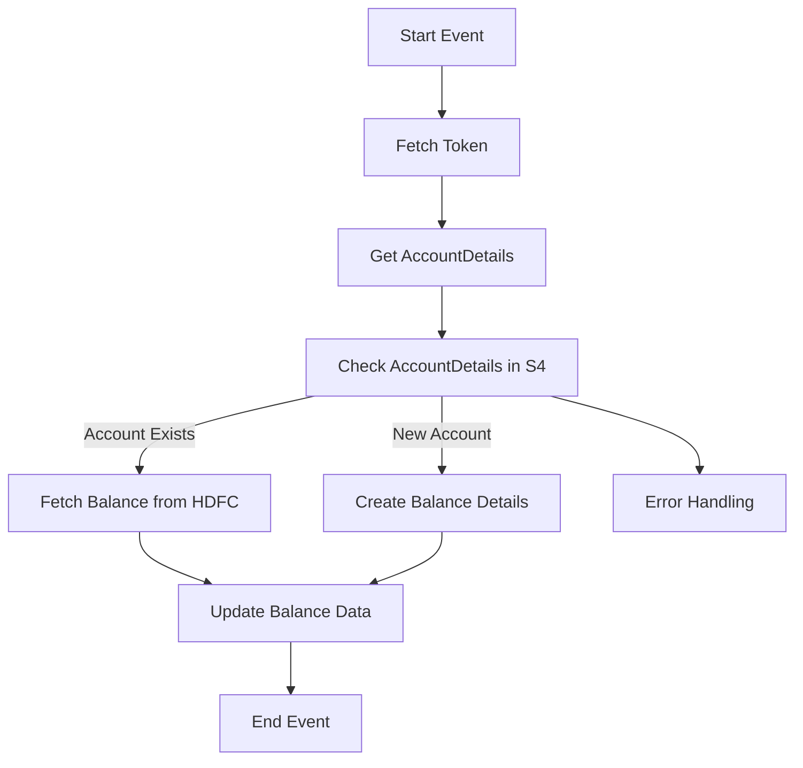

<h1 style="color: #1f4e79; text-align: center; font-size: 3em;">HDFC BalanceUpdate</h1><h2 style="text-align: center;">Technical Specification Document</h2>

<table border="1" style="margin: 0 auto; border-collapse: collapse; min-width: 350px;"><tr><th style="padding: 10px; background-color: #f2f2f2; text-align: left;">Author</th><td style="padding: 10px;">Rohancherian783</td></tr><tr><th style="padding: 10px; background-color: #f2f2f2; text-align: left;">Date</th><td style="padding: 10px;">2025-12-23</td></tr><tr><th style="padding: 10px; background-color: #f2f2f2; text-align: left;">Version</th><td style="padding: 10px;">1.0.0</td></tr></table>

<h1 style="color: #1f4e79; font-size: 2.5em;">Table of Contents</h1>

1. Introduction  
&nbsp;&nbsp;&nbsp; 1.1 Purpose  
&nbsp;&nbsp;&nbsp; 1.2 Scope  
2. Integration Overview  
&nbsp;&nbsp;&nbsp; 2.1 Integration Architecture  
&nbsp;&nbsp;&nbsp; 2.2 Integration Components  
3. Integration Scenarios  
&nbsp;&nbsp;&nbsp; 3.1 Scenario Description  
&nbsp;&nbsp;&nbsp; 3.2 Data Flows  
&nbsp;&nbsp;&nbsp; 3.3 Security Requirements  
4. Error Handling and Logging  
5. Testing Validation  
6. Reference Documents  

<h1 style="color: #1f4e79;">1. Introduction</h1>

<b style="color: #1f4e79;">1.1 Purpose:</b> The purpose of the 'HDFC_BalanceUpdate' iFlow is to facilitate the integration of balance updates from HDFC Bank into the SAP S/4HANA system. This integration ensures that financial data is accurately reflected in real-time, enhancing the overall financial management capabilities of the organization.

<b style="color: #1f4e79;">1.2 Scope:</b> The scope of this iFlow includes the retrieval of bank balance information from HDFC Bank, processing this data, and updating the corresponding records in the SAP S/4HANA system. It also encompasses error handling and notification mechanisms to ensure data integrity and timely alerts in case of failures.

<h1 style="color: #1f4e79;">2. Integration Overview</h1>

<b style="color: #1f4e79;">2.1 Integration Architecture:</b> 

<b style="color: #1f4e79;">2.2 Integration Components:</b>

| Component Type | Name/Details | Description |
| :--- | :--- | :--- |
| Integration Process | HDFC_BalanceUpdate | Main process for handling balance updates |
| Subprocess | Token Fetch | Handles token retrieval for authentication |
| Service Task | Fetch Token | External call to fetch authentication token |
| Service Task | Get AccountDetails | Fetches account details from S4 |
| Service Task | Check AccountDetails in S4 | Validates account existence in S4 |
| Service Task | Fetch Balance from HDFC | Retrieves balance from HDFC Bank |
| Service Task | Update Balance Data | Updates balance information in S4 |
| Error Handling | Exception Subprocess | Manages errors and sends notifications |

<h1 style="color: #1f4e79;">3. Integration Scenarios</h1>

<b style="color: #1f4e79;">3.1 Scenario Description:</b> 

1. The process starts with a scheduled event that triggers the iFlow.
2. The iFlow fetches an authentication token from HDFC Bank.
3. It retrieves account details from the SAP S/4HANA system.
4. The iFlow checks if the account exists in S/4HANA.
5. If the account exists, it fetches the balance from HDFC Bank.
6. If the account is new, it creates balance details in S/4HANA.
7. Finally, it updates the balance data in S/4HANA.

<b style="color: #1f4e79;">3.2 Data Flows:</b> 

- Data is fetched from HDFC Bank using HTTP requests.
- The retrieved data is processed and transformed into the required format.
- Data is sent to the SAP S/4HANA system via OData services.

<b style="color: #1f4e79;">3.3 Security Requirements:</b>

| Security Aspect | Description |
| :--- | :--- |
| Authentication | Basic authentication using credentials stored securely |
| Token Management | Secure handling of tokens for API calls |
| Data Encryption | Sensitive data should be encrypted during transmission |
| Error Handling | Proper logging and notification for any errors encountered |

<h1 style="color: #1f4e79;">4. Error Handling and Logging</h1>

The iFlow includes an exception subprocess that captures errors during execution. It logs error details and sends notifications to the relevant stakeholders to ensure timely resolution.

<h1 style="color: #1f4e79;">5. Testing Validation</h1>

Testing will be conducted to validate the integration flow, including unit tests for individual components and end-to-end tests to ensure the entire process works as expected.

<h1 style="color: #1f4e79;">6. Reference Documents</h1>

- Integration Design Document
- API Documentation for HDFC Bank
- SAP S/4HANA Integration Guidelines
- Error Handling Best Practices Document
