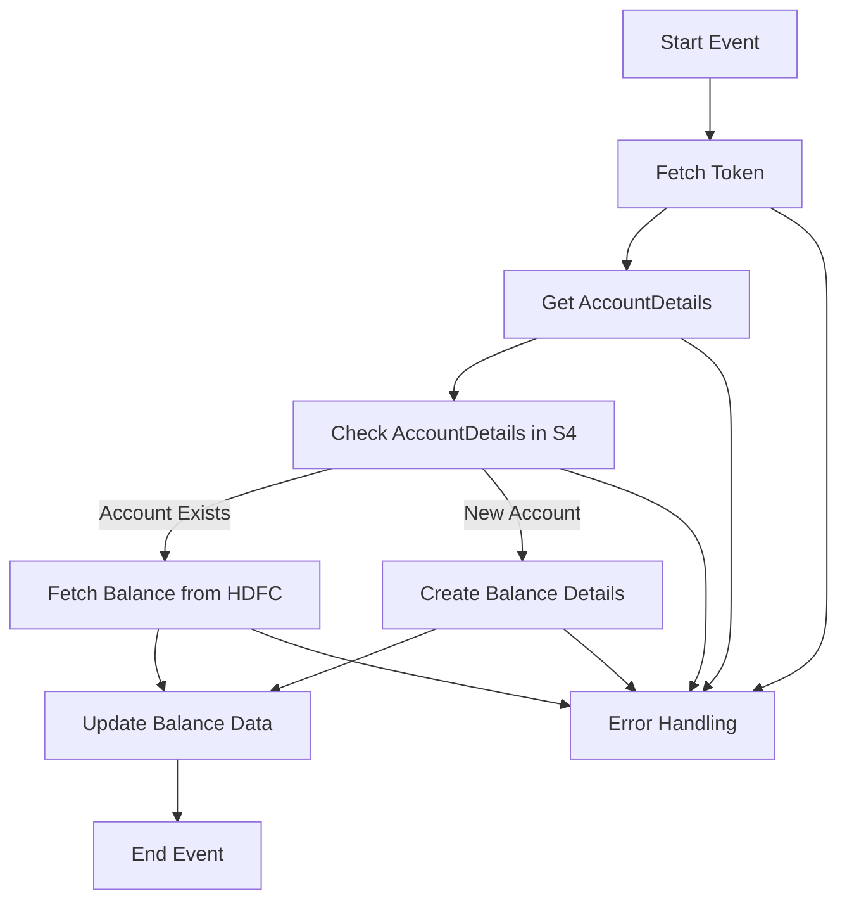

<h1 style="color: #1f4e79; text-align: center; font-size: 3em;">HDFC BalanceUpdate</h1><h2 style="text-align: center;">Technical Specification Document</h2>

<table border="1" style="margin: 0 auto; border-collapse: collapse;"><tr><td style="padding:10px"><b>Author</b></td><td style="padding:10px">Rohancherian783</td></tr><tr><td style="padding:10px"><b>Date</b></td><td style="padding:10px">2025-12-23</td></tr></table>

<h1 style="color: #1f4e79;">Table of Contents</h1>
1. Introduction 
2. Integration Overview 
3. Integration Scenarios 
4. Error Handling and Logging 
5. Testing Validation 
6. Reference Documents 

<h1 style="color: #1f4e79;">1. Introduction</h1>
1.1 Purpose  
The iFlow 'HDFC_BalanceUpdate' is designed to facilitate the integration of balance update requests from HDFC Bank into the SAP S/4HANA system. It handles the retrieval and updating of bank balance information, ensuring that the data is accurately reflected in the SAP system.

1.2 Scope  
The systems involved in this integration include:
- HDFC Bank API
- SAP S/4HANA
- SAP Cloud Platform Integration (CPI)

<h1 style="color: #1f4e79;">2. Integration Overview</h1>
2.1 Integration Architecture  

2.2 Integration Components  
- **Senders**: 
  - HDFC Bank API
- **Receivers**: 
  - SAP S/4HANA
  - Email Notifications
- **Adapters**: 
  - HTTP Adapter
  - OData Adapter
  - Mail Adapter

<h1 style="color: #1f4e79;">3. Integration Scenarios</h1>
3.1 Scenario Description  
The integration process begins with a scheduled trigger that fetches a token from HDFC Bank. It then retrieves account details and checks if the account exists in the SAP S/4HANA system. Depending on the existence of the account, it either fetches the balance from HDFC or creates new balance details. Finally, it updates the balance data in SAP S/4HANA.

3.2 Data Flows  
The iFlow utilizes Groovy scripts for data transformation and XSLT for XML manipulation. Key transformations include:
- Preparing the payload for the HDFC API request.
- Parsing the response from HDFC to extract balance details.

3.3 Security Requirements  
- **Authentication Types**:
  - Basic Authentication for HDFC API
  - OAuth for SAP S/4HANA
- **Certificates**: Client certificates are used for secure communication with HDFC.

<h1 style="color: #1f4e79;">4. Error Handling and Logging</h1>
The iFlow includes an Exception Subprocess that captures errors during the integration process. It logs error messages and sends notifications via email to the relevant stakeholders. The logging mechanism captures all events for monitoring and troubleshooting purposes.

<h1 style="color: #1f4e79;">5. Testing Validation</h1>
| Test Case ID | Scenario                          | Expected Outcome                               |
|--------------|-----------------------------------|------------------------------------------------|
| TC_001       | Fetch Token                       | Token is successfully retrieved from HDFC.    |
| TC_002       | Get AccountDetails                | Account details are fetched successfully.      |
| TC_003       | Check AccountDetails in S4       | Correct account status is returned.            |
| TC_004       | Fetch Balance from HDFC           | Balance is retrieved and updated in SAP.       |
| TC_005       | Create Balance Details             | New balance details are created in SAP.        |
| TC_006       | Error Handling                    | Error notifications are sent correctly.        |

<h1 style="color: #1f4e79;">6. Reference Documents</h1>
- HDFC_BalanceUpdate iFlow Definition
- Integration Flow Documentation
- API Documentation for HDFC Bank
- SAP S/4HANA Integration Guidelines
- Error Handling Best Practices Document
