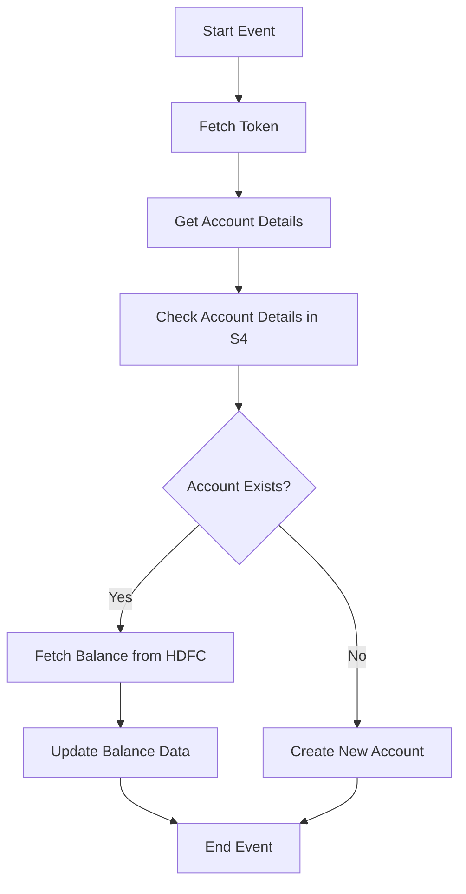

<h1 style="color: #1f4e79; text-align: center; font-size: 3.5em; margin-bottom: 10px;">HDFC BalanceUpdate</h1><h2 style="text-align: center; font-size: 1.8em; font-weight: normal; margin-top: 0;">Technical Specification Document</h2>

<table style="width: 60%; margin: 0 auto;"><tr><th>Author</th><td>Rohancherian783</td></tr><tr><th>Date</th><td>2026-01-05</td></tr><tr><th>Version</th><td>1.0.0</td></tr></table>

<h1 style="color: #1f4e79; font-size: 2.5em;">Table of Contents</h1>
1. Introduction  
&nbsp;&nbsp;&nbsp; 1.1 Purpose  
&nbsp;&nbsp;&nbsp; 1.2 Scope  
2. Integration Overview  
&nbsp;&nbsp;&nbsp; 2.1 Integration Architecture  
&nbsp;&nbsp;&nbsp; 2.2 Integration Components  
3. Integration Scenarios  
&nbsp;&nbsp;&nbsp; 3.1 Scenario Description  
&nbsp;&nbsp;&nbsp; 3.2 Data Flows  
&nbsp;&nbsp;&nbsp; 3.3 Security Requirements  
4. Error Handling and Logging  
5. Testing Validation  
6. Reference Documents  

<h1 style="color: #1f4e79;">1. Introduction</h1>
<b style="color: #1f4e79;">1.1 Purpose:</b>

The 'HDFC_BalanceUpdate' iFlow is designed to address the business need for real-time balance updates from HDFC Bank to an SAP S/4HANA system. The integration process is triggered by a scheduled event, which initiates the fetching of balance details for specified bank accounts. The iFlow ensures that the latest balance information is accurately reflected in the SAP system, thereby enabling timely financial reporting and decision-making.

The technical outcome desired from this iFlow is to successfully retrieve balance data from HDFC Bank's API, transform it into the required format, and update the corresponding records in the SAP S/4HANA system. The integration also includes error handling mechanisms to manage any issues that arise during the data retrieval and update processes.

<b style="color: #1f4e79;">1.2 Scope:</b>

The scope of the 'HDFC_BalanceUpdate' iFlow includes the following components:

- **Endpoints**: 
  - HDFC Bank API for balance inquiries.
  - SAP S/4HANA endpoints for updating balance records.
  
- **Data Transformation Logic**: 
  - The iFlow will transform the data retrieved from HDFC Bank into the format required by SAP S/4HANA.
  - It includes mapping fields such as `CompanyCode`, `BankAccountNumber`, `AvailableBalance`, etc.

- **Target Systems**: 
  - The primary target system is SAP S/4HANA, where the balance updates will be reflected.
  
- **Constraints**: 
  - The iFlow must handle various error scenarios, including network issues, data format mismatches, and API response errors.
  - The integration must comply with security protocols, including authentication and data encryption.

- **Exclusions**: 
  - The iFlow does not cover historical balance data retrieval or any other banking services beyond balance inquiries.

<h1 style="color: #1f4e79;">2. Integration Overview</h1>
<b style="color: #1f4e79;">2.1 Integration Architecture:</b>

<b style="color: #1f4e79;">2.2 Integration Components:</b>

| Component | Role | Details |
|-----------|------|---------|
| Start Event | Trigger | Initiates the iFlow based on a scheduled timer. |
| Fetch Token | Service Task | Retrieves an authentication token from HDFC Bank API. |
| Get Account Details | Service Task | Fetches account details from SAP S/4HANA. |
| Check Account Details in S4 | Service Task | Validates if the account exists in SAP S/4HANA. |
| Fetch Balance from HDFC | Service Task | Calls HDFC Bank API to retrieve balance information. |
| Update Balance Data | Service Task | Updates the balance information in SAP S/4HANA. |
| Create New Account | Service Task | Handles the creation of a new account in SAP if it does not exist. |
| End Event | Termination | Marks the completion of the iFlow. |

<h1 style="color: #1f4e79;">3. Integration Scenarios</h1>
<b style="color: #1f4e79;">3.1 Scenario Description:</b>

1. **Trigger**: The iFlow is triggered by a scheduled event, which initiates the process.
  
2. **Token Retrieval**: The iFlow first calls the 'Fetch Token' service task to obtain an authentication token from HDFC Bank's API.

3. **Account Details Fetching**: It then retrieves account details from the SAP S/4HANA system to check if the account exists.

4. **Account Validation**: The iFlow checks if the account exists in the SAP system. If it does, it proceeds to fetch the balance from HDFC Bank. If not, it creates a new account.

5. **Balance Retrieval**: The iFlow calls the HDFC Bank API to fetch the latest balance details.

6. **Data Update**: The retrieved balance data is transformed and updated in the SAP S/4HANA system.

7. **Completion**: The iFlow concludes with an end event, indicating successful completion of the process.

<b style="color: #1f4e79;">3.2 Data Flows:</b>

- Data flows from HDFC Bank to SAP S/4HANA, with transformations applied to ensure compatibility.
- The flow includes error handling paths to manage any issues that arise during the process.

<b style="color: #1f4e79;">3.3 Security Requirements:</b>

- The integration must utilize secure authentication methods (e.g., Basic Authentication) to access HDFC Bank's API.
- Data in transit must be encrypted to protect sensitive financial information.
- Proper error handling must be implemented to log and manage any security-related issues.

<h1 style="color: #1f4e79;">4. Error Handling and Logging</h1>

The iFlow includes an error handling subprocess that captures any exceptions that occur during the execution. This subprocess logs the error details and sends notifications to the relevant stakeholders via email. The error handling mechanism ensures that the iFlow can gracefully recover from failures and provide meaningful feedback.

<h1 style="color: #1f4e79;">5. Testing Validation</h1>

**Testing Details – Sheet: Testing**

| Test Case ID | Scenario | Expected Outcome |
| :--- | :--- | :--- |
| TC_001 | Trigger iFlow | iFlow should start and fetch token successfully. |
| TC_002 | Fetch Account Details | Account details should be retrieved from SAP S/4HANA. |
| TC_003 | Check Account Existence | Should return true for existing accounts and false for new accounts. |
| TC_004 | Fetch Balance | Balance should be retrieved from HDFC Bank API. |
| TC_005 | Update Balance | SAP S/4HANA should reflect the updated balance. |
| TC_006 | Error Handling | Errors should be logged and notifications sent. |

<h1 style="color: #1f4e79;">6. Reference Documents</h1>

- HDFC Bank API Documentation
- SAP S/4HANA Integration Guidelines
- CPI Error Handling Best Practices
- Security Protocols for API Integrations
