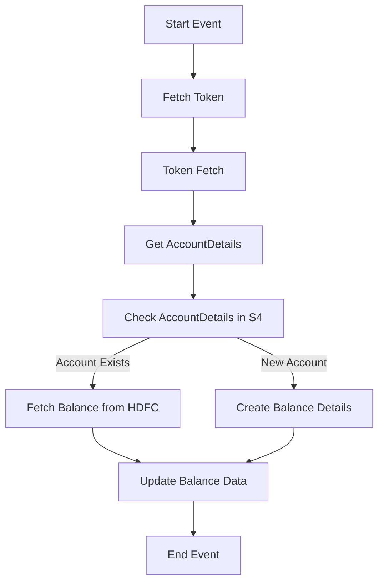

<h1 style="color: #1f4e79; text-align: center; font-size: 3em;">HDFC BalanceUpdate</h1><h2 style="text-align: center;">Technical Specification Document</h2>

<table border="1" style="margin: 0 auto; border-collapse: collapse;"><tr><td style="padding: 10px;"><b>Author</b></td><td style="padding: 10px;">Rohancherian783</td></tr><tr><td style="padding: 10px;"><b>Date</b></td><td style="padding: 10px;">2025-12-23</td></tr></table>

<h1 style="color: #1f4e79; font-size: 2.5em;">Table of Contents</h1>
1. Introduction 
1.1 Purpose 
1.2 Scope 
2. Integration Overview 
2.1 Integration Architecture 
2.2 Integration Components 
3. Integration Scenarios 
3.1 Scenario Description 
3.2 Data Flows 
3.3 Security Requirements 
4. Error Handling and Logging 
5. Testing Validation 
6. Reference Documents 

<h1 style="color: #1f4e79;">1. Introduction</h1>
<h2 style="color: #1f4e79;">1.1 Purpose</h2>
The purpose of the HDFC_BalanceUpdate iFlow is to facilitate the integration of balance updates from HDFC Bank into an SAP S/4HANA system. This integration ensures that the latest balance information is accurately reflected in the SAP system, enabling real-time financial reporting and decision-making.

<h2 style="color: #1f4e79;">1.2 Scope</h2>
This report covers the technical aspects of the HDFC_BalanceUpdate iFlow, including its architecture, components, integration scenarios, data flows, error handling, and testing validation. It is intended for technical architects, developers, and system integrators involved in the implementation and maintenance of this integration.

<h1 style="color: #1f4e79;">2. Integration Overview</h1>
<h2 style="color: #1f4e79;">2.1 Integration Architecture</h2>

<h2 style="color: #1f4e79;">2.2 Integration Components</h2>
- **Sender System**: HDFC Bank
- **Receiver System**: SAP S/4HANA
- **Adapters**: 
  - HTTP Adapter for communication with HDFC Bank
  - OData Adapter for interaction with SAP S/4HANA
  - Mail Adapter for notifications

<h1 style="color: #1f4e79;">3. Integration Scenarios</h1>
<h2 style="color: #1f4e79;">3.1 Scenario Description</h2>
The integration scenario involves the following steps:
1. A scheduled event triggers the iFlow.
2. The iFlow fetches an authentication token from HDFC Bank.
3. It retrieves account details from the SAP S/4HANA system.
4. Based on the account existence, it either fetches the balance from HDFC or creates new balance details.
5. The balance data is updated in the SAP system.
6. Notifications are sent via email in case of errors or successful updates.

<h2 style="color: #1f4e79;">3.2 Data Flows</h2>
- **Mapping Logic**: The iFlow utilizes Groovy scripts and content modifiers to transform incoming data from HDFC Bank into the required format for SAP S/4HANA.
- **XSLT**: XSLT transformations are applied where necessary to convert XML data formats.
- **Groovy Scripts**: Custom Groovy scripts are used for complex data manipulations and to set properties dynamically.

<h2 style="color: #1f4e79;">3.3 Security Requirements</h2>
- **Credentials**: Basic authentication is used for HTTP requests to HDFC Bank and SAP S/4HANA.
- **Auth Mechanisms**: OAuth tokens are fetched and used for secure communication with HDFC Bank.

<h1 style="color: #1f4e79;">4. Error Handling and Logging</h1>
The iFlow includes an exception subprocess that captures errors during execution. Errors are logged, and notifications are sent via email to the relevant stakeholders. The error messages include details such as the error type and message processing log ID for troubleshooting.

<h1 style="color: #1f4e79;">5. Testing Validation</h1>
Testing involves validating the integration by simulating various scenarios, including successful balance updates and error conditions. The iFlow is tested for performance, data integrity, and error handling capabilities.

<h1 style="color: #1f4e79;">6. Reference Documents</h1>
- iFlowContent.xml
- Groovy scripts (script1.groovy, script2.groovy, etc.)
- Configuration files for HTTP and OData adapters
- Email notification templates
