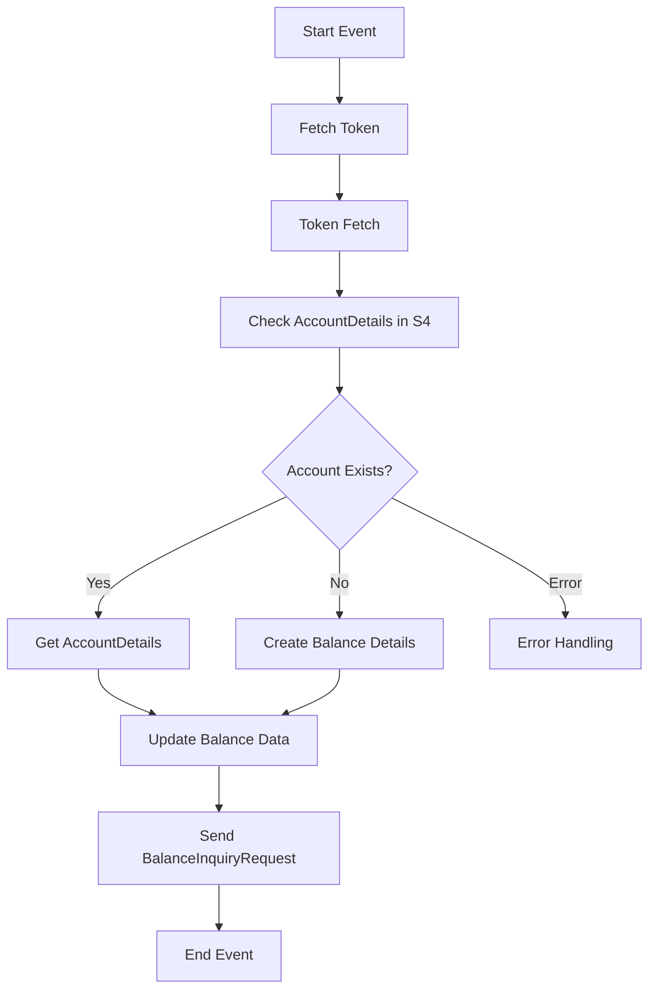

<h1 style="color: #1f4e79; text-align: center; font-size: 3em;">HDFC BalanceUpdate</h1><h2 style="text-align: center;">Technical Specification Document</h2>

<table border="1" style="margin: 0 auto; border-collapse: collapse;"><tr><td style="padding:10px"><b>Author</b></td><td style="padding:10px">Rohancherian783</td></tr><tr><td style="padding:10px"><b>Date</b></td><td style="padding:10px">2025-12-23</td></tr></table>

<h1 style="color: #1f4e79;">Table of Contents</h1>
1. Introduction 
1.1 Purpose 
1.2 Scope 
2. Integration Overview 
2.1 Integration Architecture 
2.2 Integration Components 
3. Integration Scenarios 
3.1 Scenario Description 
3.2 Data Flows 
3.3 Security Requirements 
4. Error Handling and Logging 
5. Testing Validation 
6. Reference Documents 

<h1 style="color: #1f4e79;">1. Introduction</h1>
1.1 Purpose 
The purpose of the 'HDFC_BalanceUpdate' iFlow is to facilitate the integration between HDFC Bank and the SAP S/4HANA system for real-time balance updates. This integration ensures that the bank's balance information is accurately reflected in the SAP system, allowing for better financial management and reporting.

1.2 Scope 
This document covers the technical aspects of the iFlow, including its architecture, components, integration scenarios, error handling, and testing validation. It is intended for technical architects, developers, and system integrators involved in the implementation and maintenance of the integration.

<h1 style="color: #1f4e79;">2. Integration Overview</h1>
2.1 Integration Architecture 

2.2 Integration Components 
- **Sender Systems**: 
  - HDFC Bank
- **Receiver Systems**: 
  - SAP S/4HANA
- **Adapters**: 
  - HTTP Adapter
  - OData Adapter
  - Mail Adapter

<h1 style="color: #1f4e79;">3. Integration Scenarios</h1>
3.1 Scenario Description 
The integration scenario involves fetching balance details from HDFC Bank and updating the corresponding records in the SAP S/4HANA system. The process includes token generation, account verification, and balance updates.

3.2 Data Flows 
The data flows through various service tasks and subprocesses, including fetching tokens, checking account details, and updating balance information. Each step is designed to ensure data integrity and accuracy.

3.3 Security Requirements 
The integration requires secure communication between HDFC Bank and SAP S/4HANA. This includes:
- Use of HTTPS for secure data transmission.
- Authentication mechanisms such as Basic Authentication and Client Certificates.
- CSRF protection for OData services.

<h1 style="color: #1f4e79;">4. Error Handling and Logging</h1>
Error handling is implemented through subprocesses that capture exceptions and log error messages. The system sends notifications via email to relevant stakeholders in case of failures, ensuring timely resolution of issues.

<h1 style="color: #1f4e79;">5. Testing Validation</h1>
Testing validation involves unit testing of individual components, integration testing of the entire flow, and performance testing to ensure the system can handle expected loads. Test cases will cover various scenarios, including successful transactions and error conditions.

<h1 style="color: #1f4e79;">6. Reference Documents</h1>
- Integration Design Document
- API Documentation for HDFC Bank
- SAP S/4HANA Integration Guidelines
- Error Handling Best Practices in SAP CPI
