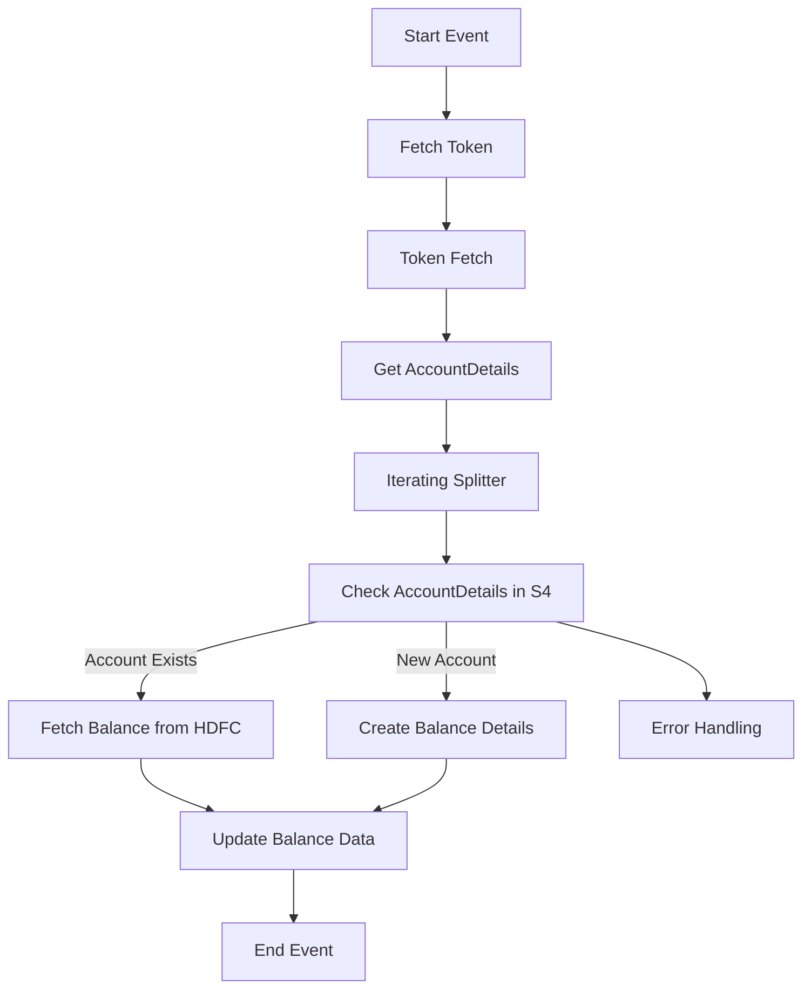

<h1 style="color: #1f4e79; text-align: center; font-size: 3em;">HDFC BalanceUpdate</h1><h2 style="text-align: center;">Technical Specification Document</h2>

<table border="1" style="margin: 0 auto; border-collapse: collapse;"><tr><td style="padding: 10px;"><b>Author</b></td><td style="padding: 10px;">Rohancherian783</td></tr><tr><td style="padding: 10px;"><b>Date</b></td><td style="padding: 10px;">2025-12-23</td></tr></table>

<h1 style="color: #1f4e79; font-size: 2.5em;">Table of Contents</h1>
1. Introduction 
1.1 Purpose 
1.2 Scope 
2. Integration Overview 
2.1 Integration Architecture 
2.2 Integration Components 
3. Integration Scenarios 
3.1 Scenario Description 
3.2 Data Flows 
3.3 Security Requirements 
4. Error Handling and Logging 
5. Testing Validation 
6. Reference Documents 

<h1 style="color: #1f4e79;">1. Introduction</h1>
<h2 style="color: #1f4e79;">1.1 Purpose</h2>
The purpose of the 'HDFC_BalanceUpdate' iFlow is to facilitate the integration of balance updates from HDFC Bank to an SAP S/4HANA system. This integration ensures that the bank account balances are accurately reflected in the SAP system, enabling real-time financial reporting and decision-making.

<h2 style="color: #1f4e79;">1.2 Scope</h2>
This iFlow covers the end-to-end process of fetching bank account details from HDFC, updating the balance in the SAP S/4HANA system, and handling any errors that may occur during the process. It includes the necessary configurations for security, error handling, and logging.

<h1 style="color: #1f4e79;">2. Integration Overview</h1>
<h2 style="color: #1f4e79;">2.1 Integration Architecture</h2>

<h2 style="color: #1f4e79;">2.2 Integration Components</h2>
- **Sender System**: HDFC Bank
- **Receiver System**: SAP S/4HANA
- **Adapters**: 
  - HTTP Adapter for communication with HDFC Bank
  - OData Adapter for interaction with SAP S/4HANA
  - Mail Adapter for notifications

<h1 style="color: #1f4e79;">3. Integration Scenarios</h1>
<h2 style="color: #1f4e79;">3.1 Scenario Description</h2>
The integration scenario involves the following steps:
1. A scheduled trigger initiates the iFlow.
2. The iFlow fetches an authentication token from HDFC.
3. It retrieves account details from HDFC.
4. The account details are checked against the SAP S/4HANA system.
5. If the account exists, the balance is fetched and updated in SAP.
6. If the account is new, a new balance record is created.
7. Notifications are sent via email in case of errors.

<h2 style="color: #1f4e79;">3.2 Data Flows</h2>
- **Mapping Logic**: The iFlow uses Groovy scripts and content modifiers to transform data between HDFC and SAP formats.
- **XSLT**: Not explicitly mentioned in the provided artifacts.
- **Groovy Scripts**: Various Groovy scripts are used for tasks such as setting properties, preparing payloads, and handling errors.

<h2 style="color: #1f4e79;">3.3 Security Requirements</h2>
- **Credentials**: Basic authentication is used for the HTTP adapter with credentials stored securely.
- **Auth Mechanisms**: OAuth tokens are fetched and used for secure communication with HDFC.

<h1 style="color: #1f4e79;">4. Error Handling and Logging</h1>
The iFlow includes an error subprocess that captures any errors during execution. It logs error messages and sends notifications via email to the relevant stakeholders. The error handling subprocess is triggered whenever an exception occurs, ensuring that issues are addressed promptly.

<h1 style="color: #1f4e79;">5. Testing Validation</h1>
Testing of the iFlow should include:
- Unit tests for individual components (e.g., Groovy scripts).
- Integration tests to validate end-to-end functionality.
- Performance tests to ensure the iFlow can handle expected loads.

<h1 style="color: #1f4e79;">6. Reference Documents</h1>
- iFlow Content: `test_update toS4.iflw`
- Groovy Scripts: `script1.groovy`, `script2.groovy`, etc.
- Configuration files for adapters and security settings.
