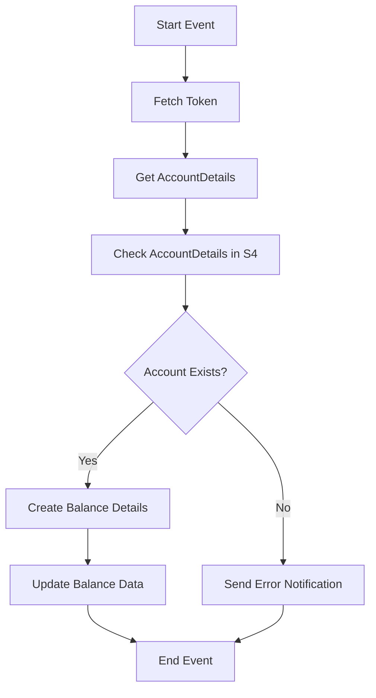

<h1 style="color: #1f4e79; text-align: center; font-size: 3em;">HDFC BalanceUpdate</h1><h2 style="text-align: center;">Technical Specification Document</h2>

<table border="1" style="margin: 0 auto; border-collapse: collapse;"><tr><td style="padding:10px"><b>Author</b></td><td style="padding:10px">Rohancherian783</td></tr><tr><td style="padding:10px"><b>Date</b></td><td style="padding:10px">2025-12-23</td></tr></table>

<h1 style="color: #1f4e79;">Table of Contents</h1>
1. Introduction 
1.1 Purpose 
1.2 Scope 
2. Integration Overview 
2.1 Integration Architecture 
2.2 Integration Components 
3. Integration Scenarios 
3.1 Scenario Description 
3.2 Data Flows 
3.3 Security Requirements 
4. Error Handling and Logging 
5. Testing Validation 
6. Reference Documents 

<h1 style="color: #1f4e79;">1. Introduction</h1>
1.1 Purpose: The purpose of this document is to provide a comprehensive technical overview of the iFlow 'HDFC_BalanceUpdate', detailing its architecture, components, scenarios, and error handling mechanisms.

1.2 Scope: This document covers the integration flow designed for updating bank balance information from HDFC to the S4 system, including the various components involved in the process.

<h1 style="color: #1f4e79;">2. Integration Overview</h1>
2.1 Integration Architecture:

2.2 Integration Components:
- **Sender Systems**: 
  - HDFC (Bank)
  - Mail Services (Mail1, Mail2, Mail3)
  
- **Receiver Systems**: 
  - S4_BANKBALANCE_CDS
  - S4_BANKBALANCE1
  - S4_BANKBALANCE_CDS
  - S4_BANKACCOUNTDETAILS_CDS
  - S4_BANKBALANCE
  
- **Adapters**: 
  - HTTP Adapter
  - OData Adapter
  - Mail Adapter

<h1 style="color: #1f4e79;">3. Integration Scenarios</h1>
3.1 Scenario Description: The iFlow is designed to fetch balance details from HDFC and update them in the S4 system. It handles both successful and error scenarios, sending notifications as necessary.

3.2 Data Flows: The data flows through various service tasks and subprocesses, including fetching tokens, retrieving account details, and updating balance information.

3.3 Security Requirements: The integration flow employs Basic Authentication for secure communication with the S4 system and uses client certificates for secure access to HDFC services.

<h1 style="color: #1f4e79;">4. Error Handling and Logging</h1>
The iFlow includes error handling subprocesses that capture exceptions and send notifications via email. It logs all events and errors for monitoring and troubleshooting purposes.

<h1 style="color: #1f4e79;">5. Testing Validation</h1>
Testing will be conducted to ensure that the iFlow functions as expected, including unit tests for individual components and integration tests for the entire flow.

<h1 style="color: #1f4e79;">6. Reference Documents</h1>
- SAP Integration Documentation
- HDFC API Documentation
- S4 System Integration Guidelines
