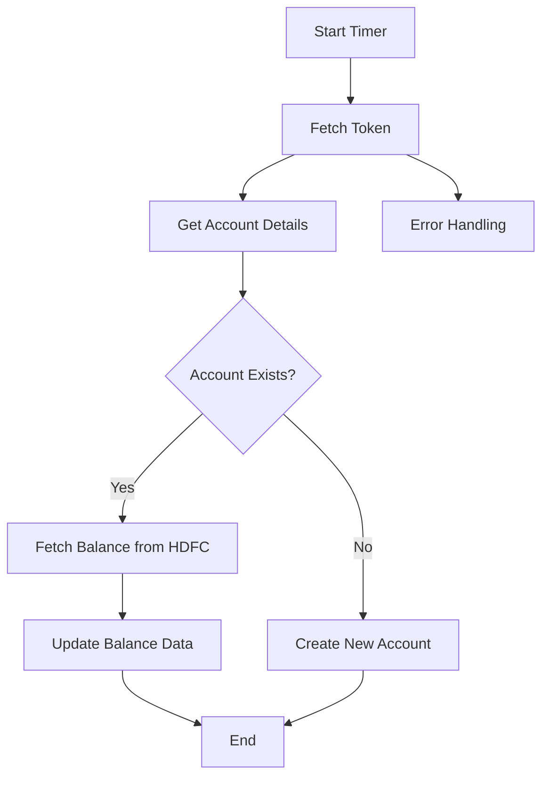

<h1 style="color: #1f4e79; text-align: center; font-size: 3.5em; margin-bottom: 10px;">HDFC BalanceUpdate</h1><h2 style="text-align: center; font-size: 1.8em; font-weight: normal; margin-top: 0;">Technical Specification Document</h2>

<table style="width: 60%; margin: 0 auto;"><tr><th>Author</th><td>Rohancherian783</td></tr><tr><th>Date</th><td>2026-01-05</td></tr><tr><th>Version</th><td>1.0.0</td></tr></table>

<h1 style="color: #1f4e79; font-size: 2.5em;">Table of Contents</h1>
1. Introduction  
&nbsp;&nbsp;&nbsp; 1.1 Purpose  
&nbsp;&nbsp;&nbsp; 1.2 Scope  
2. Integration Overview  
&nbsp;&nbsp;&nbsp; 2.1 Integration Architecture  
&nbsp;&nbsp;&nbsp; 2.2 Integration Components  
3. Integration Scenarios  
&nbsp;&nbsp;&nbsp; 3.1 Scenario Description  
&nbsp;&nbsp;&nbsp; 3.2 Data Flows  
&nbsp;&nbsp;&nbsp; 3.3 Security Requirements  
4. Error Handling and Logging  
5. Testing Validation  
6. Reference Documents  

<h1 style="color: #1f4e79;">1. Introduction</h1>
<b style="color: #1f4e79;">1.1 Purpose:</b>  
The 'HDFC_BalanceUpdate' iFlow addresses the need for real-time balance updates from HDFC Bank to the S4HANA system. The business problem it solves is the lack of timely and accurate financial data, which can lead to discrepancies in financial reporting and decision-making. The iFlow is triggered by a scheduled timer event, which initiates the process of fetching the latest balance information from HDFC Bank. The technical outcome involves the successful retrieval of balance data, transformation of the data into the required format, and subsequent posting to the S4HANA system, ensuring that the financial records are up-to-date.

<b style="color: #1f4e79;">1.2 Scope:</b>  
The scope of this iFlow includes the following endpoints and data transformation logic:
- **Endpoints:**
  - HDFC Bank API for balance inquiry
  - S4HANA endpoints for balance updates
- **Data Transformation Logic:**
  - The iFlow retrieves balance data from HDFC Bank, processes it, and formats it into JSON/XML as required by S4HANA.
  - It includes error handling mechanisms to manage any discrepancies or failures during data retrieval or posting.
- **Target Systems:**
  - The primary target system is S4HANA, where the balance updates will be posted.
  - Secondary systems include email notifications for error handling.

<h1 style="color: #1f4e79;">2. Integration Overview</h1>
<b style="color: #1f4e79;">2.1 Integration Architecture:</b>  

<b style="color: #1f4e79;">2.2 Integration Components:</b>  
| Component | Role | Details |
| :--- | :--- | :--- |
| HTTP Adapter | Receiver | Used to connect to HDFC Bank API for balance inquiries. |
| OData Adapter | Receiver | Used to post balance updates to S4HANA. |
| Content Modifier | Enricher | Modifies the message content to include necessary headers and body structure for API calls. |
| Groovy Script | Script | Used for custom logic such as generating tokens and handling complex transformations. |
| Mail Adapter | Receiver | Sends email notifications in case of errors during processing. |

<h1 style="color: #1f4e79;">3. Integration Scenarios</h1>
<b style="color: #1f4e79;">3.1 Scenario Description:</b>  
1. The iFlow is triggered by a timer event based on a predefined schedule.
2. The flow initiates by fetching an authentication token from HDFC Bank.
3. It retrieves account details from S4HANA to check if the account exists.
4. If the account exists, it fetches the balance from HDFC Bank.
5. The balance data is transformed and updated in S4HANA.
6. If the account does not exist, a new account is created in S4HANA.
7. In case of any errors during the process, an email notification is sent to the relevant stakeholders.

<b style="color: #1f4e79;">3.2 Data Flows:</b>  
The data flows through various components as follows:
- From the timer event to the token fetch service.
- From the token fetch to the account details retrieval.
- From account details to balance fetch and update processes.
- Error handling flows to notify stakeholders via email.

<b style="color: #1f4e79;">3.3 Security Requirements:</b>  
- Use of Basic Authentication for API calls to HDFC Bank.
- Secure handling of sensitive data such as tokens and account information.
- Implementation of error handling to manage and log any security breaches or data inconsistencies.

<h1 style="color: #1f4e79;">4. Error Handling and Logging</h1>  
The iFlow includes a subprocess dedicated to error handling. In case of any errors during the execution, the following actions are taken:
- Log the error details for further analysis.
- Send an email notification to the relevant stakeholders with the error message and processing log ID.
- Retry mechanisms are implemented for transient errors.

<h1 style="color: #1f4e79;">5. Testing Validation</h1>  
**Testing Details – Sheet: Testing**  
| Test Case ID | Scenario | Expected Outcome |
| :--- | :--- | :--- |
| TC_001 | Trigger iFlow | iFlow should start without errors. |
| TC_002 | Fetch Token | Valid token should be retrieved from HDFC Bank. |
| TC_003 | Account Exists | Correct account details should be fetched from S4HANA. |
| TC_004 | Fetch Balance | Balance data should be retrieved and posted to S4HANA. |
| TC_005 | Error Handling | Email notification should be sent on error. |

<h1 style="color: #1f4e79;">6. Reference Documents</h1>  
- HDFC Bank API Documentation  
- S4HANA Integration Guidelines  
- SAP CPI Best Practices Guide  
