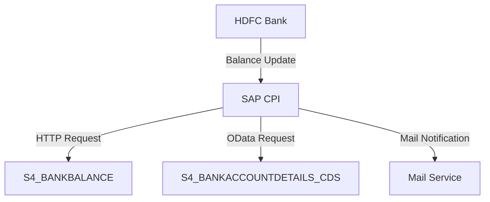

<h1 style="color: #1f4e79; text-align: center; font-size: 3em;">HDFC BalanceUpdate</h1><h2 style="text-align: center;">Technical Specification Document</h2>

<table border="1" style="margin: 0 auto; border-collapse: collapse;"><tr><td style="padding: 10px;"><b>Author</b></td><td style="padding: 10px;">Rohancherian783</td></tr><tr><td style="padding: 10px;"><b>Date</b></td><td style="padding: 10px;">2025-12-23</td></tr></table>

<h1 style="color: #1f4e79; font-size: 2.5em;">Table of Contents</h1>
1. Introduction 
1.1 Purpose 
1.2 Scope 
2. Integration Overview 
2.1 Integration Architecture 
2.2 Integration Components 
3. Integration Scenarios 
3.1 Scenario Description 
3.2 Data Flows 
3.3 Security Requirements 
4. Error Handling and Logging 
5. Testing Validation 
6. Reference Documents 

<h1 style="color: #1f4e79;">1. Introduction</h1>
<h2 style="color: #1f4e79;">1.1 Purpose</h2>
The purpose of the HDFC_BalanceUpdate iFlow is to facilitate the integration of balance updates from HDFC Bank to an SAP S/4HANA system. This integration ensures that the latest balance information is accurately reflected in the SAP system, enabling real-time financial reporting and decision-making.

<h2 style="color: #1f4e79;">1.2 Scope</h2>
This document covers the technical aspects of the HDFC_BalanceUpdate iFlow, including its architecture, components, integration scenarios, data flows, error handling, and testing validation.

<h1 style="color: #1f4e79;">2. Integration Overview</h1>
<h2 style="color: #1f4e79;">2.1 Integration Architecture</h2>

<h2 style="color: #1f4e79;">2.2 Integration Components</h2>
<table>
    <tr>
        <th>Component Type</th>
        <th>Name/Details</th>
        <th>Description</th>
    </tr>
    <tr>
        <td>Sender System</td>
        <td>HDFC Bank</td>
        <td>Source of balance updates.</td>
    </tr>
    <tr>
        <td>Receiver System</td>
        <td>SAP S/4HANA</td>
        <td>Target system for balance updates.</td>
    </tr>
    <tr>
        <td>Adapter</td>
        <td>HTTP</td>
        <td>Used for sending balance updates via HTTP requests.</td>
    </tr>
    <tr>
        <td>Adapter</td>
        <td>OData</td>
        <td>Used for querying bank account details.</td>
    </tr>
    <tr>
        <td>Adapter</td>
        <td>Mail</td>
        <td>Used for sending email notifications on errors.</td>
    </tr>
</table>

<h1 style="color: #1f4e79;">3. Integration Scenarios</h1>
<h2 style="color: #1f4e79;">3.1 Scenario Description</h2>
1. The process starts with a timer event that triggers the balance update. 
2. A token is fetched from HDFC Bank using an HTTP request. 
3. The balance details are retrieved from HDFC Bank. 
4. The balance data is updated in the SAP S/4HANA system. 
5. If any errors occur during the process, notifications are sent via email.

<h2 style="color: #1f4e79;">3.2 Data Flows</h2>
- **Mapping Logic**: The iFlow uses various mapping techniques to transform data from HDFC Bank format to SAP S/4HANA format.
- **XSLT**: XSLT transformations are applied to convert XML data structures as needed.
- **Groovy Scripts**: Groovy scripts are utilized for custom logic, such as generating JWT tokens and handling dynamic properties.

<h2 style="color: #1f4e79;">3.3 Security Requirements</h2>
| Security Aspect | Details |
|-----------------|---------|
| Credentials | Basic authentication is used for HTTP requests to HDFC Bank. |
| Token Management | JWT tokens are generated and used for secure communication. |
| Email Notifications | Email credentials are managed securely within the CPI environment. |

<h1 style="color: #1f4e79;">4. Error Handling and Logging</h1>
The iFlow implements a robust error handling strategy using subprocesses to manage exceptions. Errors are logged, and notifications are sent via email to relevant stakeholders. The error messages include details about the failure, allowing for quick resolution.

<h1 style="color: #1f4e79;">5. Testing Validation</h1>
Testing of the HDFC_BalanceUpdate iFlow includes unit tests for individual components, integration tests for end-to-end scenarios, and performance testing to ensure the system can handle expected loads.

<h1 style="color: #1f4e79;">6. Reference Documents</h1>
- iFlowContent.xml
- Groovy scripts (script1.groovy, script2.groovy, etc.)
- XSLT transformation files
- Email configuration settings
- API documentation for HDFC Bank
