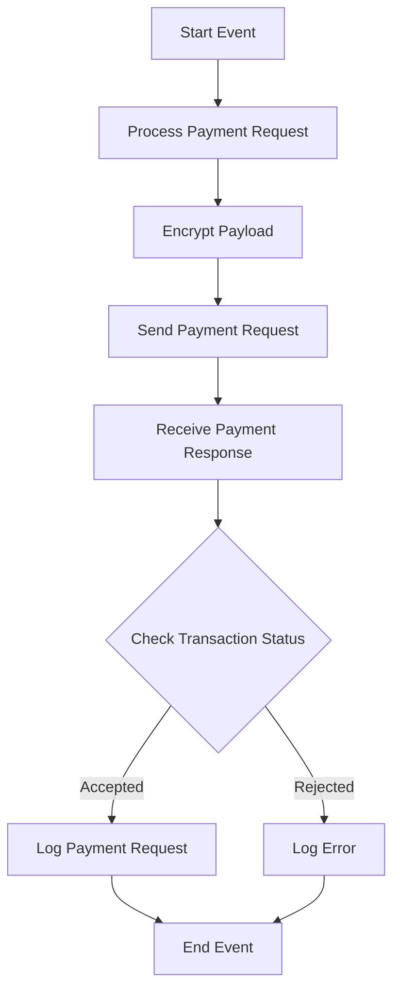

<h1 style="color: #1f4e79; text-align: center; font-size: 3em;">HDFC PaymentUpload</h1><h2 style="text-align: center;">Technical Specification Document</h2>

<table border="1" style="margin: 0 auto; border-collapse: collapse;"><tr><td style="padding: 10px;"><b>Author</b></td><td style="padding: 10px;">Rohancherian783</td></tr><tr><td style="padding: 10px;"><b>Date</b></td><td style="padding: 10px;">2025-12-23</td></tr></table>

<h1 style="color: #1f4e79; font-size: 2.5em;">Table of Contents</h1>
1. Introduction 
1.1 Purpose 
1.2 Scope 
2. Integration Overview 
2.1 Integration Architecture 
2.2 Integration Components 
3. Integration Scenarios 
3.1 Scenario Description 
3.2 Data Flows 
3.3 Security Requirements 
4. Error Handling and Logging 
5. Testing Validation 
6. Reference Documents 

<h1 style="color: #1f4e79;">1. Introduction</h1>
<h2 style="color: #1f4e79;">1.1 Purpose</h2>
The purpose of the HDFC_PaymentUpload iFlow is to facilitate the secure and efficient upload of payment data to the HDFC banking system. This integration ensures that payment requests are processed correctly and that any errors are handled appropriately.

<h2 style="color: #1f4e79;">1.2 Scope</h2>
This report covers the technical aspects of the HDFC_PaymentUpload iFlow, including its architecture, components, integration scenarios, data flows, error handling, and testing validation.

<h1 style="color: #1f4e79;">2. Integration Overview</h1>
<h2 style="color: #1f4e79;">2.1 Integration Architecture</h2>

<h2 style="color: #1f4e79;">2.2 Integration Components</h2>
- **Sender System**: The iFlow initiates the process by receiving payment data from an external system.
- **Receiver Systems**: 
  - HDFC: The primary endpoint for processing payment requests.
  - HDFC_Token: Used for obtaining authentication tokens.
  - Mail: For sending notifications regarding the payment status.
- **Adapters**: 
  - HTTP Adapter: Used for sending and receiving HTTP requests.
  - Mail Adapter: Used for sending email notifications.

<h1 style="color: #1f4e79;">3. Integration Scenarios</h1>
<h2 style="color: #1f4e79;">3.1 Scenario Description</h2>
The iFlow processes payment requests by:
1. Receiving payment data.
2. Encrypting the payload.
3. Sending the encrypted payload to the HDFC API.
4. Receiving the response and checking the transaction status.
5. Logging the request and response data.
6. Sending email notifications based on the transaction status.

<h2 style="color: #1f4e79;">3.2 Data Flows</h2>
- **Mapping Logic**: The iFlow uses a message mapping file (`MM_HDFCPayment_req.mmap`) to transform incoming JSON data into the required XML format for HDFC.
- **XSLT and Groovy Scripts**: Various Groovy scripts are utilized for encryption, decryption, and payload logging throughout the process.

<h2 style="color: #1f4e79;">3.3 Security Requirements</h2>
- **Credentials**: The iFlow uses credentials stored in secure properties for accessing the HDFC API and sending emails.
- **Authentication Mechanisms**: OAuth 2.0 is used for authenticating requests to the HDFC API, with tokens being retrieved from the HDFC_Token endpoint.

<h1 style="color: #1f4e79;">4. Error Handling and Logging</h1>
The iFlow includes error handling subprocesses that log errors and send notifications via email when exceptions occur. The error messages are enriched with details about the failure, including the transaction ID and error description.

<h1 style="color: #1f4e79;">5. Testing Validation</h1>
Testing of the iFlow involves validating the successful processing of payment requests, ensuring that the correct data is sent to HDFC, and verifying that error handling mechanisms function as expected.

<h1 style="color: #1f4e79;">6. Reference Documents</h1>
- iFlow Content: `Test_PaymentUpload.iflw`
- Mapping File: `MM_HDFCPayment_req.mmap`
- Groovy Scripts: `script1.groovy`, `script2.groovy`, `script3.groovy`, etc.
