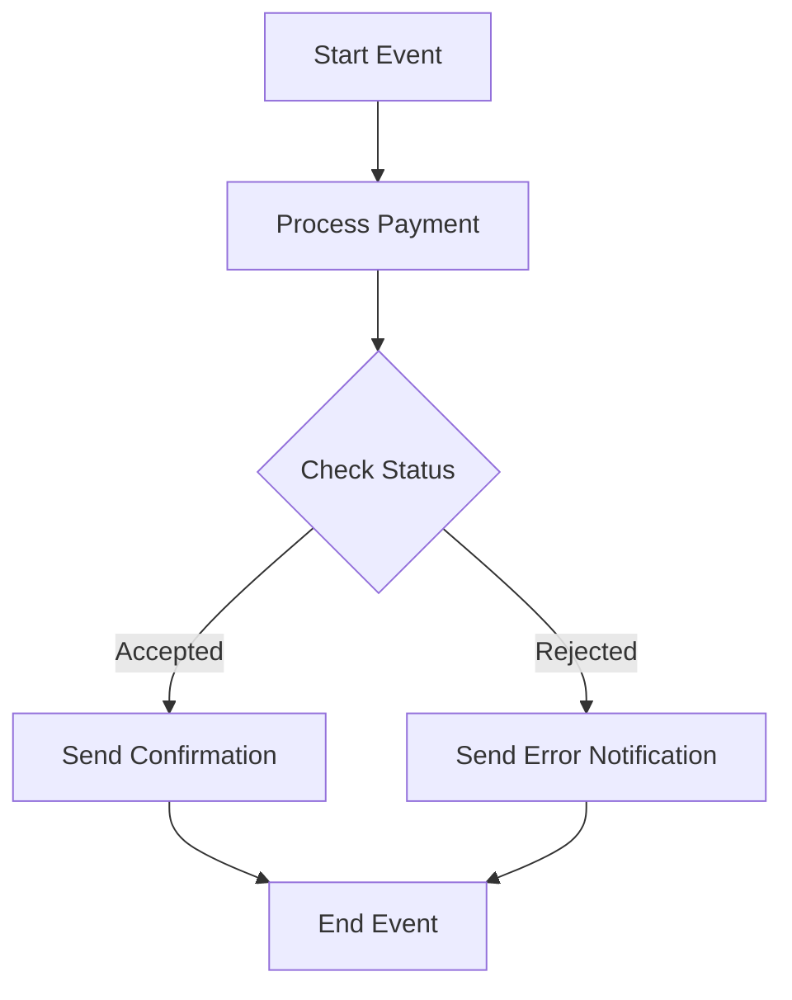

<h1 style="color: #1f4e79; text-align: center; font-size: 3em;">HDFC PaymentUpload</h1><h2 style="text-align: center;">Technical Specification Document</h2>

<table border="1" style="margin: 0 auto; border-collapse: collapse;"><tr><td style="padding: 10px;"><b>Author</b></td><td style="padding: 10px;">Rohancherian783</td></tr><tr><td style="padding: 10px;"><b>Date</b></td><td style="padding: 10px;">2025-12-23</td></tr></table>

<h1 style="color: #1f4e79; font-size: 2.5em;">Table of Contents</h1>
1. Introduction 
1.1 Purpose 
1.2 Scope 
2. Integration Overview 
2.1 Integration Architecture 
2.2 Integration Components 
3. Integration Scenarios 
3.1 Scenario Description 
3.2 Data Flows 
3.3 Security Requirements 
4. Error Handling and Logging 
5. Testing Validation 
6. Reference Documents 

<h1 style="color: #1f4e79;">1. Introduction</h1>
<h2 style="color: #1f4e79;">1.1 Purpose</h2>
The purpose of the HDFC_PaymentUpload iFlow is to facilitate the secure upload of payment data to the HDFC bank system, ensuring that all transactions are processed efficiently and securely.

<h2 style="color: #1f4e79;">1.2 Scope</h2>
This iFlow integrates with HDFC's payment processing system, handling the transformation and transmission of payment data, including error handling and notification mechanisms.

<h1 style="color: #1f4e79;">2. Integration Overview</h1>
<h2 style="color: #1f4e79;">2.1 Integration Architecture</h2>

<h2 style="color: #1f4e79;">2.2 Integration Components:</h2>
<table>
    <tr>
        <th>Component Type</th>
        <th>Name/Details</th>
        <th>Description</th>
    </tr>
    <tr>
        <td>Sender System</td>
        <td>IFlow</td>
        <td>Initiates the payment upload process.</td>
    </tr>
    <tr>
        <td>Receiver System</td>
        <td>HDFC</td>
        <td>Receives payment data for processing.</td>
    </tr>
    <tr>
        <td>Adapter</td>
        <td>HTTP</td>
        <td>Used for sending payment requests to HDFC API.</td>
    </tr>
    <tr>
        <td>Adapter</td>
        <td>Mail</td>
        <td>Used for sending notifications regarding payment status.</td>
    </tr>
    <tr>
        <td>Adapter</td>
        <td>OData</td>
        <td>Not utilized in this iFlow.</td>
    </tr>
</table>

<h1 style="color: #1f4e79;">3. Integration Scenarios</h1>
<h2 style="color: #1f4e79;">3.1 Scenario Description</h2>
1. The iFlow is triggered by a start event. 
2. Payment data is processed and transformed into the required format. 
3. The transformed data is sent to the HDFC API via an HTTP adapter. 
4. The response from HDFC is evaluated for success or failure. 
5. Based on the response, either a confirmation email is sent or an error notification is dispatched. 
6. The process ends with an appropriate end event.

<h2 style="color: #1f4e79;">3.2 Data Flows</h2>
- **Mapping Logic**: Utilizes a message mapping file (`MM_HDFCPayment_req.mmap`) to transform incoming payment data into the required format for HDFC.
- **XSLT**: Not explicitly mentioned in the provided artifacts.
- **Groovy Scripts**: Several Groovy scripts are used for encryption, decryption, and payload logging throughout the process.

<h2 style="color: #1f4e79;">3.3 Security Requirements</h2>
| Security Aspect | Details |
|------------------|---------|
| Authentication | Basic authentication is configured for the HTTP adapter. |
| Token Management | OAuth tokens are managed and retrieved via a separate token request process. |
| Encryption | Payment data is encrypted using a 32-byte key before transmission. |

<h1 style="color: #1f4e79;">4. Error Handling and Logging</h1>
The iFlow implements a robust error handling strategy using subprocesses to capture exceptions. When an error occurs, a dedicated subprocess is triggered to log the error details and send notifications to the relevant stakeholders via email.

<h1 style="color: #1f4e79;">5. Testing Validation</h1>
Testing should include unit tests for each Groovy script, integration tests for the entire iFlow, and validation of the email notifications sent upon success or failure of payment processing.

<h1 style="color: #1f4e79;">6. Reference Documents</h1>
- iFlowContent.xml
- Groovy scripts (script1.groovy, script2.groovy, etc.)
- Mapping file (MM_HDFCPayment_req.mmap)
- XSD schema (payments.xsd)
