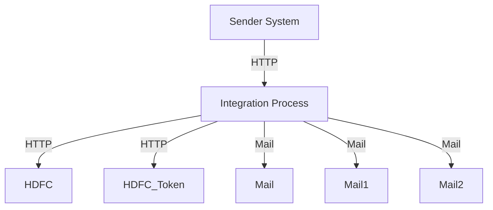

<h1 style="color: #1f4e79; text-align: center; font-size: 3.5em;">HDFC PaymentUpload</h1><h2 style="text-align: center; color: #666;">Technical Specification Document</h2>

<table style="margin: 0 auto; border: 1px solid #ccc; border-collapse: collapse;"><tr><th style="padding: 10px; border: 1px solid #ccc; background: #f9f9f9;">Author</th><td style="padding: 10px; border: 1px solid #ccc;">Rohancherian783</td></tr><tr><th style="padding: 10px; border: 1px solid #ccc; background: #f9f9f9;">Date</th><td style="padding: 10px; border: 1px solid #ccc;">2025-12-23</td></tr></table>

<h1 style="color: #1f4e79; font-size: 2.5em;">Table of Contents</h1>
1. Introduction  
2. Integration Overview  
3. Integration Scenarios  
4. Error Handling and Logging  
5. Testing Validation  
6. Reference Documents  

<h1 style="color: #1f4e79;">1. Introduction</h1>
1.1 Purpose: The purpose of this document is to provide a comprehensive analysis of the HDFC_PaymentUpload integration flow, detailing its architecture, components, scenarios, error handling, and testing validation.

1.2 Scope: This report covers the integration between the HDFC payment system and the SAP Cloud Platform Integration (CPI), focusing on the payment upload process.

<h1 style="color: #1f4e79;">2. Integration Overview</h1>
2.1 Integration Architecture:

2.2 Integration Components:
| Component Type | Name/Details | Description |
| :--- | :--- | :--- |
| Sender System | IFlow | The integration flow that initiates the payment upload process. |
| Receiver System | HDFC | The external system that processes the payment requests. |
| Adapter | HTTP | Used for sending HTTP requests to the HDFC system. |

<h1 style="color: #1f4e79;">3. Integration Scenarios</h1>
3.1 Scenario Description:
1. The integration flow is triggered by a payment upload request.
2. The flow processes the payment data and sends it to the HDFC system.
3. The response from HDFC is handled, and appropriate notifications are sent.

3.2 Data Flows:
- **Mapping Logic**: The mapping is handled by the MM_HDFCPayment_req.mmap file, which transforms the payment request data into the required format for HDFC.
- **XSLT**: No specific XSLT transformations were identified in the provided artifacts.
- **Groovy Scripts**: 
  - `script1.groovy`: Encrypts the payload with a 32-byte key.
  - `script2.groovy`: Encrypts the 32-byte key.
  - `script4.groovy`: Prepares the JWT payload.
  - `script5.groovy`: Decrypts the encrypted 32-byte key.
  - `script6.groovy`: Decrypts the response from HDFC.
  - `script7.groovy`: Decodes the response.
  - `script8.groovy`: Logs errors.
  - `script9.groovy`: Logs the payment request.
  - `script10.groovy`: Logs the payment response.

3.3 Security Requirements:
| Security Aspect | Details |
| :--- | :--- |
| Authentication | Basic authentication is not enabled for the HDFC endpoint. |
| Encryption | Payloads are encrypted using a 32-byte key and JWT. |
| Token Management | Access tokens are fetched and managed securely. |

<h1 style="color: #1f4e79;">4. Error Handling and Logging</h1>
The integration flow includes an exception subprocess that captures errors during the payment upload process. It sends notifications via email to the relevant stakeholders, detailing the error message and the associated message processing log ID.

<h1 style="color: #1f4e79;">5. Testing Validation</h1>
Testing validation procedures should include unit tests for each Groovy script, integration tests for the entire flow, and end-to-end tests to ensure that the payment upload process works as expected.

<h1 style="color: #1f4e79;">6. Reference Documents</h1>
- Test_PaymentUpload.iflw
- script1.groovy
- script2.groovy
- script4.groovy
- script5.groovy
- script6.groovy
- script7.groovy
- script8.groovy
- script9.groovy
- script10.groovy
- MM_HDFCPayment_req.mmap
