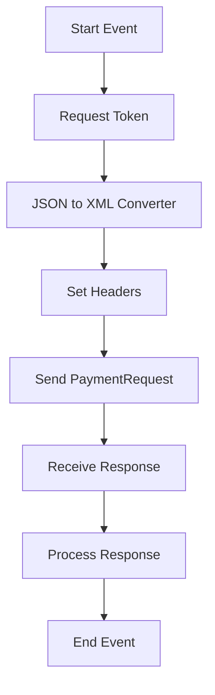

<h1 style="color: #1f4e79; font-size: 3.5em; margin-bottom: 10px; text-align: center !important;">HDFC PaymentUpload</h1><h2 style="font-size: 1.8em; font-weight: normal; margin-top: 0; text-align: center !important;">Technical Specification Document</h2>

<table style="width: 60%; margin: 0 auto; text-align: left;"><tr><th>Author</th><td>Rohancherian783</td></tr><tr><th>Date</th><td>2026-01-05</td></tr><tr><th>Version</th><td>1.0.0</td></tr></table>

<h1 style="color: #1f4e79; font-size: 2.5em; text-align: left;">Table of Contents</h1>
1. Introduction  
&nbsp;&nbsp;&nbsp; 1.1 Purpose  
&nbsp;&nbsp;&nbsp; 1.2 Scope  
2. Integration Overview  
&nbsp;&nbsp;&nbsp; 2.1 Integration Architecture  
&nbsp;&nbsp;&nbsp; 2.2 Integration Components  
3. Integration Scenarios  
&nbsp;&nbsp;&nbsp; 3.1 Scenario Description  
&nbsp;&nbsp;&nbsp; 3.2 Data Flows  
&nbsp;&nbsp;&nbsp; 3.3 Security Requirements  
4. Error Handling and Logging  
5. Testing Validation  
6. Reference Documents  

<h1 style="color: #1f4e79; text-align: left; clear: both;">1. Introduction</h1>
<b style="color: #1f4e79;">1.1 Purpose:</b>

The 'HDFC_PaymentUpload' iFlow is designed to facilitate the secure and efficient transfer of payment data from an internal system to the HDFC bank's payment processing system. The primary business problem this iFlow addresses is the need for a reliable mechanism to upload payment requests while ensuring data integrity and security through encryption and token-based authentication.

The iFlow is triggered by an incoming message from a specified endpoint, which contains payment details in a structured format. Upon receiving this message, the iFlow processes the data, transforms it into the required format, and securely transmits it to the HDFC payment API. The desired technical outcome is to ensure that payment requests are successfully uploaded to the bank, with appropriate error handling and notification mechanisms in place to inform stakeholders of the transaction status.

<b style="color: #1f4e79;">1.2 Scope:</b>

The scope of the 'HDFC_PaymentUpload' iFlow includes the following components:

- **Endpoints:** The iFlow integrates with the HDFC payment API and a mail server for notifications.
- **Data Transformation Logic:** The iFlow includes multiple transformation steps, including JSON to XML conversion, XML to JSON conversion, and message mapping to ensure compatibility with the HDFC API requirements.
- **Target Systems:** The primary target system is the HDFC payment processing system, with additional notifications sent to internal stakeholders via email.
- **Security Measures:** The iFlow implements token-based authentication for secure API access, along with encryption for sensitive data during transmission.

Exclusions from the scope include any payment processing logic that occurs outside of the iFlow, such as business rules for payment validation or approval processes that are managed by other systems.

<h1 style="color: #1f4e79; text-align: left; clear: both;">2. Integration Overview</h1>
<b style="color: #1f4e79;">2.1 Integration Architecture:</b>

<b style="color: #1f4e79;">2.2 Integration Components:</b>

| Component | Role | Details |
| :--- | :--- | :--- |
| **EndpointSender** | Initiates the iFlow | Receives payment requests from the internal system. |
| **HTTP Adapter** | Sends requests to HDFC API | Configured for POST requests with necessary headers. |
| **Content Modifier** | Modifies message content | Prepares the request payload and sets headers. |
| **JSON to XML Converter** | Converts JSON to XML | Ensures the data format is compatible with HDFC API. |
| **XML to JSON Converter** | Converts XML back to JSON | Converts response data for internal processing. |
| **Mail Adapter** | Sends notifications | Notifies stakeholders of transaction status via email. |
| **Error Handling Subprocess** | Manages errors | Logs errors and sends notifications in case of failures. |

<h1 style="color: #1f4e79; text-align: left; clear: both;">3. Integration Scenarios</h1>
<b style="color: #1f4e79;">3.1 Scenario Description:</b>

1. **Trigger:** The iFlow is triggered by an incoming message containing payment details.
   
2. **Token Request:** The iFlow initiates a request to obtain an authentication token from the HDFC API.

3. **Data Transformation:** The payment data is transformed from JSON to XML format to meet the HDFC API requirements.

4. **Header Configuration:** The necessary headers, including authorization and content type, are set.

5. **Payment Request Submission:** The iFlow sends the payment request to the HDFC API.

6. **Response Handling:** The iFlow receives the response from the HDFC API and processes it to determine the transaction status.

7. **Notification:** Based on the response, the iFlow sends an email notification to stakeholders regarding the transaction status.

8. **Error Handling:** If any errors occur during the process, the iFlow logs the error and sends a notification.

<b style="color: #1f4e79;">3.2 Data Flows:</b>

- **Input Data:** Payment details in JSON format.
- **Output Data:** Transaction status and response from HDFC API.

<b style="color: #1f4e79;">3.3 Security Requirements:</b>

- **Token-Based Authentication:** The iFlow must securely obtain and use an access token for API calls.
- **Data Encryption:** Sensitive data must be encrypted during transmission to ensure confidentiality.
- **Error Logging:** All errors must be logged for auditing and troubleshooting purposes.

<h1 style="color: #1f4e79; text-align: left; clear: both;">4. Error Handling and Logging</h1>

The iFlow includes an error handling subprocess that captures any errors during the execution. It logs the error details and sends an email notification to the relevant stakeholders. The error messages include information about the transaction ID and the nature of the error, allowing for quick resolution.

<h1 style="color: #1f4e79; text-align: left; clear: both;">5. Testing Validation</h1>

**Testing Details – Sheet: Testing**

| Test Case ID | Scenario | Expected Outcome |
| :--- | :--- | :--- |
| TC_001 | Valid Payment Request | Payment successfully uploaded to HDFC. |
| TC_002 | Invalid Payment Request | Error notification sent to stakeholders. |
| TC_003 | Token Retrieval | Token successfully retrieved from HDFC API. |
| TC_004 | Response Handling | Correct transaction status logged and notified. |

<h1 style="color: #1f4e79; text-align: left; clear: both;">6. Reference Documents</h1>

- HDFC API Documentation
- SAP CPI Integration Guidelines
- Security Best Practices for API Integration
