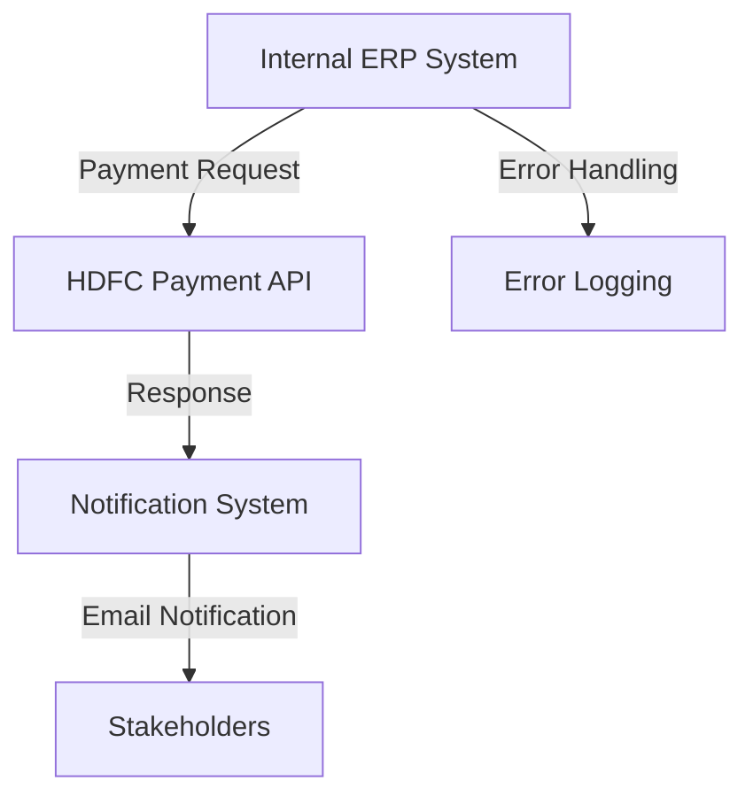

<h1 style="color: #1f4e79; text-align: center; font-size: 3em;">HDFC PaymentUpload</h1><h2 style="text-align: center;">Technical Specification Document</h2>

<table border="1" style="margin: 0 auto; border-collapse: collapse; min-width: 350px;"><tr><th style="padding: 10px; background-color: #f2f2f2; text-align: left;">Author</th><td style="padding: 10px;">Rohancherian783</td></tr><tr><th style="padding: 10px; background-color: #f2f2f2; text-align: left;">Date</th><td style="padding: 10px;">2025-12-23</td></tr><tr><th style="padding: 10px; background-color: #f2f2f2; text-align: left;">Version</th><td style="padding: 10px;">1.0.0</td></tr></table>

<h1 style="color: #1f4e79; font-size: 2.5em;">Table of Contents</h1>

1. Introduction  
&nbsp;&nbsp;&nbsp; 1.1 Purpose  
&nbsp;&nbsp;&nbsp; 1.2 Scope  
2. Integration Overview  
&nbsp;&nbsp;&nbsp; 2.1 Integration Architecture  
&nbsp;&nbsp;&nbsp; 2.2 Integration Components  
3. Integration Scenarios  
&nbsp;&nbsp;&nbsp; 3.1 Scenario Description  
&nbsp;&nbsp;&nbsp; 3.2 Data Flows  
&nbsp;&nbsp;&nbsp; 3.3 Security Requirements  
4. Error Handling and Logging  
5. Testing Validation  
6. Reference Documents  

<h1 style="color: #1f4e79;">1. Introduction</h1>

<b style="color: #1f4e79;">1.1 Purpose:</b>

The purpose of the 'HDFC_PaymentUpload' integration flow is to facilitate the seamless transfer of payment data from an internal system to the HDFC bank's payment processing system. This integration is crucial for automating payment uploads, thereby reducing manual intervention and minimizing errors associated with data entry. The integration flow aims to ensure that payment requests are securely transmitted, processed, and acknowledged by the HDFC system, while also providing mechanisms for error handling and notification.

The integration involves multiple systems, including the internal ERP system that generates payment requests, the HDFC payment API for processing these requests, and an email notification system for alerting stakeholders about the status of payment uploads. The technical objective is to implement a robust and secure integration that adheres to industry standards for data transmission, including encryption and authentication protocols.

<b style="color: #1f4e79;">1.2 Scope:</b>

The scope of the 'HDFC_PaymentUpload' integration flow encompasses the entire lifecycle of payment processing, from the generation of payment requests to the receipt of confirmation or error notifications from HDFC. The integration flow includes the following key components:

- **Source Systems:** The internal ERP system that generates payment requests in a predefined format (e.g., XML or JSON).
- **HDFC Payment API:** The endpoint provided by HDFC for processing payment requests, which requires secure authentication and data encryption.
- **Error Handling Mechanisms:** Processes to capture and log errors during the payment upload process, including the generation of error notifications via email.
- **Notification System:** An email service that sends alerts to relevant stakeholders regarding the success or failure of payment uploads.

The integration flow is designed to handle various scenarios, including successful payment uploads, validation errors, and system failures, ensuring that all stakeholders are informed in a timely manner.

<h1 style="color: #1f4e79;">2. Integration Overview</h1>

<b style="color: #1f4e79;">2.1 Integration Architecture:</b>

<b style="color: #1f4e79;">2.2 Integration Components:</b>

| Component Type | Name/Details | Description |
| :--- | :--- | :--- |
| Source System | Internal ERP | Generates payment requests in XML/JSON format |
| Integration Flow | HDFC_PaymentUpload | Manages the entire payment upload process |
| API Endpoint | HDFC Payment API | Receives payment requests and returns responses |
| Notification Service | Email Service | Sends notifications regarding payment status |
| Error Handling | Logging Mechanism | Captures and logs errors during processing |

<h1 style="color: #1f4e79;">3. Integration Scenarios</h1>

<b style="color: #1f4e79;">3.1 Scenario Description:</b>

1. **Successful Payment Upload:** The integration flow processes a payment request successfully, and the HDFC API returns a confirmation response.
2. **Validation Error:** The payment request fails validation checks, and an error notification is generated and sent to stakeholders.
3. **System Failure:** The integration encounters a system error (e.g., network issues), and appropriate error handling procedures are initiated.

<b style="color: #1f4e79;">3.2 Data Flows:</b>

- Payment requests are generated in the internal ERP system.
- The requests are sent to the HDFC Payment API via a secure HTTP POST request.
- The API processes the request and returns a response indicating success or failure.
- In case of success, a confirmation email is sent to stakeholders.
- In case of failure, an error notification is generated and sent to stakeholders.

<b style="color: #1f4e79;">3.3 Security Requirements:</b>

| Security Aspect | Description |
| :--- | :--- |
| Authentication | Use of OAuth 2.0 for secure API access |
| Data Encryption | All payment data must be encrypted during transmission |
| Error Handling | Secure logging of errors without exposing sensitive information |

<h1 style="color: #1f4e79;">4. Error Handling and Logging</h1>

The integration flow includes robust error handling mechanisms to capture and log errors that may occur during the payment upload process. This includes validation errors, system failures, and API response errors. Each error is logged with relevant details, including timestamps, error codes, and messages, to facilitate troubleshooting and resolution.

<h1 style="color: #1f4e79;">5. Testing Validation</h1>

Testing of the integration flow will involve unit testing of individual components, integration testing of the entire flow, and user acceptance testing (UAT) to ensure that all scenarios are handled correctly. Test cases will cover successful payment uploads, validation errors, and system failures.

<h1 style="color: #1f4e79;">6. Reference Documents</h1>

- HDFC Payment API Documentation
- Internal ERP System Specifications
- Security Protocols and Standards Documentation
- Error Handling Guidelines and Best Practices
