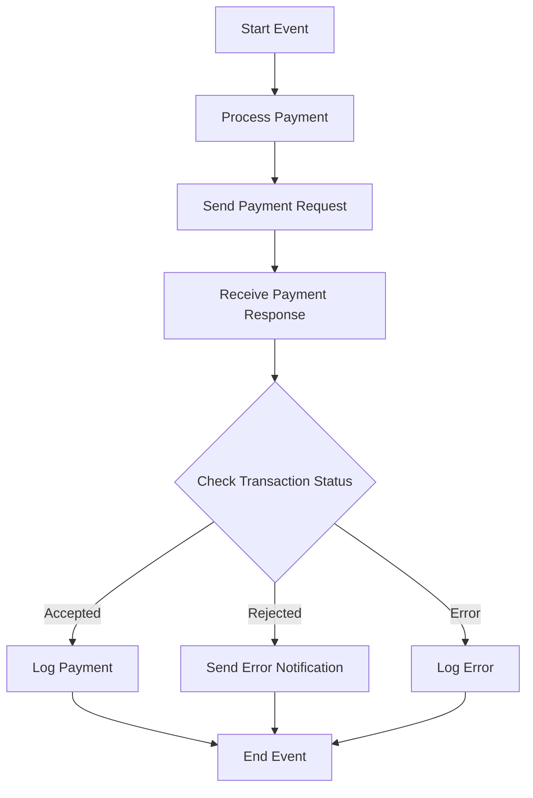

<h1 style="color: #1f4e79; text-align: center; font-size: 3em;">HDFC PaymentUpload</h1><h2 style="text-align: center;">Technical Specification Document</h2>

<table border="1" style="margin: 0 auto; border-collapse: collapse; min-width: 300px;"><tr><th style="padding: 10px; background-color: #f2f2f2;">Author</th><td style="padding: 10px;">Rohancherian783</td></tr><tr><th style="padding: 10px; background-color: #f2f2f2;">Date</th><td style="padding: 10px;">2025-12-23</td></tr></table>

<h1 style="color: #1f4e79; font-size: 2.5em;">Table of Contents</h1>
1. Introduction  
2. Integration Overview  
3. Integration Scenarios  
4. Error Handling and Logging  
5. Testing Validation  
6. Reference Documents  

<h1 style="color: #1f4e79;">1. Introduction</h1>

1.1 **Purpose**: 

The purpose of the 'HDFC_PaymentUpload' iFlow is to facilitate the secure and efficient upload of payment data to the HDFC bank system. This integration ensures that payment requests are processed correctly and that appropriate responses are handled effectively.

1.2 **Scope**: 

This report covers the technical aspects of the iFlow, including its architecture, integration components, scenarios, error handling mechanisms, and testing validation procedures.

<h1 style="color: #1f4e79;">2. Integration Overview</h1>

2.1 **Integration Architecture**: 

2.2 **Integration Components**:

| Component Type | Name/Details | Description |
| :--- | :--- | :--- |
| Sender System | HDFC_PaymentUpload | Initiates the payment upload process. |
| Receiver System | HDFC | The bank system that processes payment requests. |
| Adapter | HTTP Adapter | Used for sending and receiving HTTP requests. |

<h1 style="color: #1f4e79;">3. Integration Scenarios</h1>

3.1 **Scenario Description**: 

1. The iFlow is triggered by a start event.
  
2. Payment data is processed and prepared for upload.

3. A payment request is sent to the HDFC bank system.

4. The response from the bank is received and processed.

5. The transaction status is checked to determine the next steps.

3.2 **Data Flows**:

- **Mapping Logic**: The iFlow utilizes a message mapping to convert the payment request data into the required format for HDFC.

- **XSLT**: XSLT transformations are applied where necessary to ensure data compatibility.

- **Groovy Scripts**: Groovy scripts are used for various processing tasks, including encryption and payload preparation.

3.3 **Security Requirements**:

| Security Aspect | Details |
| :--- | :--- |
| Authentication | Basic authentication is used for secure communication with the HDFC API. |
| Encryption | Data is encrypted using AES encryption before transmission. |

<h1 style="color: #1f4e79;">4. Error Handling and Logging</h1>

The iFlow includes comprehensive error handling mechanisms. Errors encountered during the payment upload process trigger an error subprocess that logs the error details and sends notifications to the relevant stakeholders.

<h1 style="color: #1f4e79;">5. Testing Validation</h1>

Testing of the iFlow should include:

- Unit testing of individual components.
  
- Integration testing to ensure end-to-end functionality.

- Performance testing to validate the handling of large volumes of payment data.

<h1 style="color: #1f4e79;">6. Reference Documents</h1>

- HDFC_PaymentUpload.iflw

- MM_HDFCPayment_req.mmap

- Groovy scripts: script1.groovy, script2.groovy, script4.groovy, script5.groovy, script6.groovy, script7.groovy, script8.groovy, script9.groovy, script10.groovy

- XSD files for validation of payment data.
