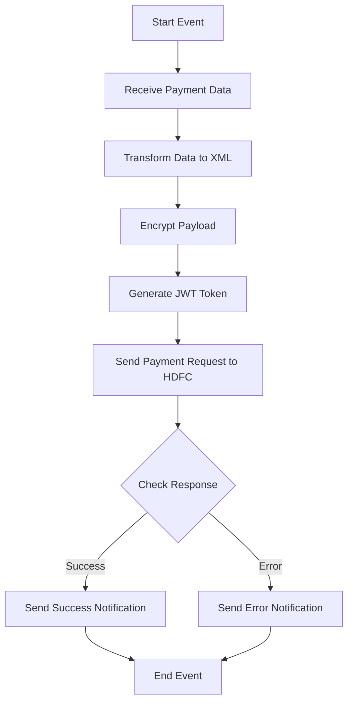

<h1 style="color: #1f4e79; text-align: center; font-size: 3.5em; margin-bottom: 10px;">HDFC PaymentUpload</h1><h2 style="text-align: center; font-size: 1.8em; font-weight: normal; margin-top: 0;">Technical Specification Document</h2>

<table style="width: 60%; margin: 0 auto;"><tr><th>Author</th><td>Rohancherian783</td></tr><tr><th>Date</th><td>2026-01-05</td></tr><tr><th>Version</th><td>1.0.0</td></tr></table>

<h1 style="color: #1f4e79; font-size: 2.5em; text-align: left;">Table of Contents</h1>
1. Introduction  
&nbsp;&nbsp;&nbsp; 1.1 Purpose  
&nbsp;&nbsp;&nbsp; 1.2 Scope  
2. Integration Overview  
&nbsp;&nbsp;&nbsp; 2.1 Integration Architecture  
&nbsp;&nbsp;&nbsp; 2.2 Integration Components  
3. Integration Scenarios  
&nbsp;&nbsp;&nbsp; 3.1 Scenario Description  
&nbsp;&nbsp;&nbsp; 3.2 Data Flows  
&nbsp;&nbsp;&nbsp; 3.3 Security Requirements  
4. Error Handling and Logging  
5. Testing Validation  
6. Reference Documents  

<h1 style="color: #1f4e79; text-align: left;">1. Introduction</h1>
<b style="color: #1f4e79;">1.1 Purpose:</b>

The 'HDFC_PaymentUpload' iFlow is designed to facilitate the secure and efficient upload of payment data to the HDFC bank's API. The primary business problem it addresses is the need for a reliable integration mechanism that ensures payment requests are processed accurately and securely, while also providing feedback on the status of these requests. 

The iFlow is triggered by an incoming message, which is expected to contain payment data in a specific format. Upon receiving this message, the iFlow initiates a series of processing steps, including data transformation, encryption, and API calls to HDFC's payment processing service. The desired technical outcome is to successfully upload the payment data and receive an acknowledgment or error response from the HDFC API, which is then communicated back to the originating system.

<b style="color: #1f4e79;">1.2 Scope:</b>

The scope of the 'HDFC_PaymentUpload' iFlow includes the following components:

- **Endpoints**: 
  - Sender endpoint for receiving payment data.
  - Receiver endpoint for sending requests to the HDFC payment API.
  - Additional endpoints for sending email notifications in case of errors.

- **Data Transformation Logic**: 
  - Conversion of incoming JSON data to XML format suitable for HDFC's API.
  - Encryption of sensitive data using a 32-byte key.
  - Generation of JWT tokens for secure API authentication.

- **Target Systems**: 
  - HDFC payment processing API.
  - Email server for sending notifications.

- **Constraints**: 
  - The iFlow must adhere to HDFC's API specifications, including required headers and payload structure.
  - All sensitive data must be encrypted before transmission.

- **Exclusions**: 
  - The iFlow does not handle payment data validation; it assumes that incoming data is pre-validated by the originating system.

<h1 style="color: #1f4e79; text-align: left;">2. Integration Overview</h1>
<b style="color: #1f4e79;">2.1 Integration Architecture:</b> 

<b style="color: #1f4e79;">2.2 Integration Components:</b>
| Component | Role | Details |
| :--- | :--- | :--- |
| Sender Adapter | Receives payment data | Configured to accept JSON payloads. |
| HTTP Receiver Adapter | Sends requests to HDFC API | Uses POST method with appropriate headers. |
| Content Modifier | Transforms and enriches data | Converts JSON to XML and adds necessary headers. |
| Groovy Scripts | Handles encryption and JWT generation | Custom scripts for payload encryption and token creation. |
| Mail Adapter | Sends notifications | Configured to send emails on success or error. |

<h1 style="color: #1f4e79; text-align: left;">3. Integration Scenarios</h1>
<b style="color: #1f4e79;">3.1 Scenario Description:</b>

1. **Trigger**: The iFlow is triggered by an incoming message containing payment data.
   
2. **Data Transformation**: The incoming JSON data is transformed into XML format suitable for HDFC's API.

3. **Encryption**: The payload is encrypted using a 32-byte key to ensure data security during transmission.

4. **JWT Generation**: A JWT token is generated for authentication with the HDFC API.

5. **API Call**: The encrypted payload and JWT token are sent to the HDFC payment processing API.

6. **Response Handling**: The response from HDFC is checked:
   - If successful, a success notification is sent to the originating system.
   - If an error occurs, an error notification is sent with details of the failure.

7. **End Event**: The process concludes with either a success or error notification.

<b style="color: #1f4e79;">3.2 Data Flows:</b>
- **Incoming Data**: JSON format containing payment details.
- **Outgoing Data**: XML format sent to HDFC API, including JWT token in headers.

<b style="color: #1f4e79;">3.3 Security Requirements:</b>
- All sensitive data must be encrypted before transmission.
- JWT tokens must be securely generated and validated.
- Email notifications must be sent securely, ensuring no sensitive information is exposed.

<h1 style="color: #1f4e79; text-align: left;">4. Error Handling and Logging</h1>

The iFlow includes error handling mechanisms that capture any exceptions during processing. In case of an error, the iFlow will:
- Log the error details for troubleshooting.
- Send an email notification to the relevant stakeholders with the error message and processing log ID.

<h1 style="color: #1f4e79; text-align: left;">5. Testing Validation</h1>
**Testing Details – Sheet: Testing**
| Test Case ID | Scenario | Expected Outcome |
| :--- | :--- | :--- |
| TC_001 | Valid Payment Data | Payment successfully uploaded to HDFC. |
| TC_002 | Invalid Payment Data | Error notification sent with details. |
| TC_003 | Network Failure | Error notification sent with details. |
| TC_004 | Successful Response Handling | Success notification sent to originating system. |

<h1 style="color: #1f4e79; text-align: left;">6. Reference Documents</h1>
- HDFC API Documentation
- SAP CPI Integration Guide
- Security Best Practices for Data Transmission
