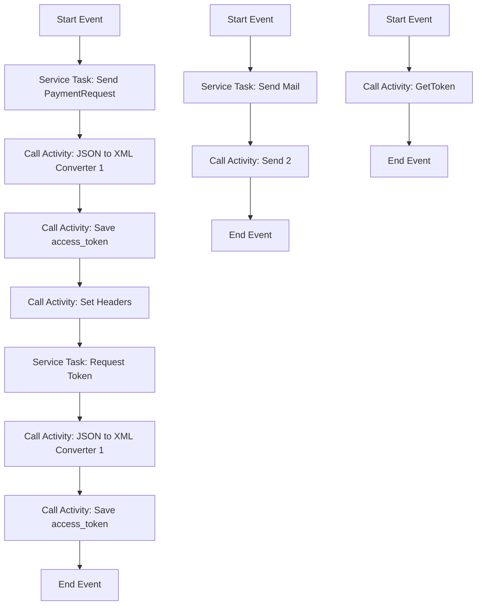

<h1 style="color: #1f4e79; text-align: center; font-size: 3em;">HDFC PaymentUpload</h1><h2 style="text-align: center;">Technical Specification Document</h2>

<table border="1" style="margin: 0 auto; border-collapse: collapse;"><tr><td style="padding:10px"><b>Author</b></td><td style="padding:10px">Rohancherian783</td></tr><tr><td style="padding:10px"><b>Date</b></td><td style="padding:10px">2025-12-23</td></tr></table>

<h1 style="color: #1f4e79;">Table of Contents</h1>
1. Introduction 
1.1 Purpose 
1.2 Scope 
2. Integration Overview 
2.1 Integration Architecture 
2.2 Integration Components 
3. Integration Scenarios 
3.1 Scenario Description 
3.2 Data Flows 
3.3 Security Requirements 
4. Error Handling and Logging 
5. Testing Validation 
6. Reference Documents 

<h1 style="color: #1f4e79;">1. Introduction</h1>
1.1 Purpose: The purpose of this document is to provide a comprehensive technical overview of the iFlow 'HDFC_PaymentUpload', detailing its architecture, components, integration scenarios, error handling, and testing validation.

1.2 Scope: This document covers the integration of the HDFC Payment Upload process within the SAP Cloud Platform Integration (CPI) environment, focusing on the technical aspects of the iFlow.

<h1 style="color: #1f4e79;">2. Integration Overview</h1>
2.1 Integration Architecture:

2.2 Integration Components:
- **Sender System**: The iFlow acts as the sender, initiating the payment upload process.
- **Receiver Systems**: 
  - HDFC: The main endpoint for processing payment uploads.
  - HDFC_Token: Endpoint for obtaining authentication tokens.
  - Mail: Endpoint for sending email notifications regarding payment status.
- **Adapters**: 
  - HTTP Adapter for communication with HDFC API.
  - Mail Adapter for sending email notifications.

<h1 style="color: #1f4e79;">3. Integration Scenarios</h1>
3.1 Scenario Description: The iFlow 'HDFC_PaymentUpload' is designed to facilitate the upload of payment data to the HDFC system, including error handling and notification mechanisms.

3.2 Data Flows: The data flows through various components, starting from the initiation of the payment request, processing through the HDFC API, and concluding with email notifications based on the transaction status.

3.3 Security Requirements: The integration requires secure handling of sensitive data, including the use of tokens for authentication and encryption for data transmission.

<h1 style="color: #1f4e79;">4. Error Handling and Logging</h1>
The iFlow includes error handling mechanisms that capture exceptions during the payment upload process. Errors are logged, and notifications are sent to the relevant stakeholders via email.

<h1 style="color: #1f4e79;">5. Testing Validation</h1>
Testing will be conducted to validate the functionality of the iFlow, ensuring that payment uploads are processed correctly and that error handling works as intended.

<h1 style="color: #1f4e79;">6. Reference Documents</h1>
- SAP Cloud Platform Integration Documentation
- HDFC API Documentation
- Internal Integration Guidelines and Standards
