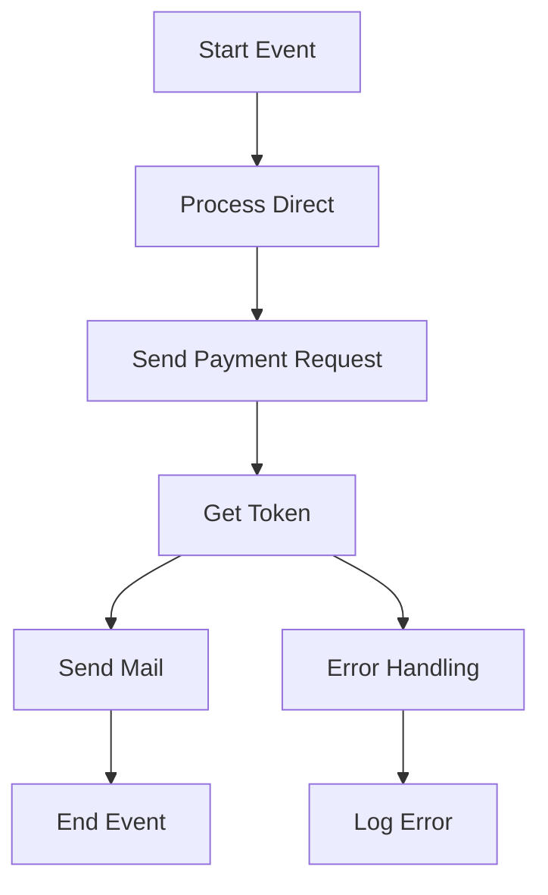

<h1 style="color: #1f4e79; text-align: center; font-size: 3em;">HDFC PaymentUpload</h1><h2 style="text-align: center;">Technical Specification Document</h2>

<table border="1" style="margin: 0 auto; border-collapse: collapse;"><tr><td style="padding:10px"><b>Author</b></td><td style="padding:10px">Rohancherian783</td></tr><tr><td style="padding:10px"><b>Date</b></td><td style="padding:10px">2025-12-23</td></tr></table>

<h1 style="color: #1f4e79;">Table of Contents</h1>
1. Introduction 
2. Integration Overview 
3. Integration Scenarios 
4. Error Handling and Logging 
5. Testing Validation 
6. Reference Documents 

<h1 style="color: #1f4e79;">1. Introduction</h1>
1.1 Purpose  
The iFlow 'HDFC_PaymentUpload' is designed to facilitate the upload of payment data to the HDFC bank system. It handles the transformation of incoming payment requests, manages authentication, and processes responses from the bank.

1.2 Scope  
The systems involved in this integration include:
- SAP Cloud Platform Integration (CPI)
- HDFC Bank API for payment processing
- Email service for notifications

<h1 style="color: #1f4e79;">2. Integration Overview</h1>
2.1 Integration Architecture  

2.2 Integration Components  
- **Senders**: 
  - Process Direct (HDFC_PaymentIflow_Endpoint)
- **Receivers**: 
  - HDFC (Payment API)
  - HDFC_Token (Token API)
  - Mail (Notification service)
- **Adapters**: 
  - HTTP Adapter
  - Mail Adapter

<h1 style="color: #1f4e79;">3. Integration Scenarios</h1>
3.1 Scenario Description  
The integration scenario involves the following logical steps:
1. Receive payment data from the source system.
2. Transform the data into the required format.
3. Authenticate and send the payment request to HDFC.
4. Handle the response and notify the relevant stakeholders via email.

3.2 Data Flows  
The iFlow utilizes Groovy scripts for data transformation and XSLT for XML formatting. Key transformations include:
- JSON to XML conversion for payment requests.
- XML to JSON conversion for responses.

3.3 Security Requirements  
- Authentication Type: OAuth for HDFC API
- Certificate-based authentication for secure communication.

<h1 style="color: #1f4e79;">4. Error Handling and Logging</h1>
The iFlow includes an Exception Subprocess to handle errors. It captures exceptions during the payment processing and sends error notifications via email. Logging scripts are implemented to log errors and transaction details for auditing purposes.

<h1 style="color: #1f4e79;">5. Testing Validation</h1>
| Test Case ID | Scenario                     | Expected Outcome                                      |
|--------------|------------------------------|------------------------------------------------------|
| TC_001       | Valid Payment Upload         | Payment processed successfully                        |
| TC_002       | Invalid Payment Data         | Error notification sent to stakeholders               |
| TC_003       | Token Retrieval              | Token retrieved successfully                           |
| TC_004       | Email Notification           | Email sent to the specified recipients                |

<h1 style="color: #1f4e79;">6. Reference Documents</h1>
- HDFC_PaymentUpload.iflw
- MM_HDFCPayment_req.mmap
- Payment API Documentation
- Token API Documentation
- Email Notification Template
