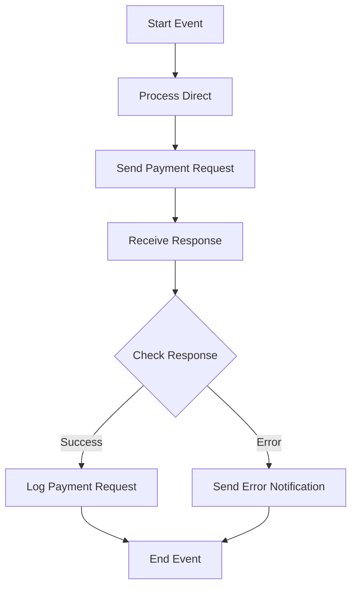

<h1 style="color: #1f4e79; text-align: center; font-size: 3em;">HDFC PaymentUpload</h1><h2 style="text-align: center;">Technical Specification Document</h2>

<table border="1" style="margin: 0 auto; border-collapse: collapse; min-width: 350px;"><tr><th style="padding: 10px; background-color: #f2f2f2; text-align: left;">Author</th><td style="padding: 10px;">Rohancherian783</td></tr><tr><th style="padding: 10px; background-color: #f2f2f2; text-align: left;">Date</th><td style="padding: 10px;">2025-12-23</td></tr><tr><th style="padding: 10px; background-color: #f2f2f2; text-align: left;">Version</th><td style="padding: 10px;">1.0.0</td></tr></table>

<h1 style="color: #1f4e79; font-size: 2.5em;">Table of Contents</h1>

1. Introduction  
&nbsp;&nbsp;&nbsp; 1.1 Purpose  
&nbsp;&nbsp;&nbsp; 1.2 Scope  
2. Integration Overview  
&nbsp;&nbsp;&nbsp; 2.1 Integration Architecture  
&nbsp;&nbsp;&nbsp; 2.2 Integration Components  
3. Integration Scenarios  
&nbsp;&nbsp;&nbsp; 3.1 Scenario Description  
&nbsp;&nbsp;&nbsp; 3.2 Data Flows  
&nbsp;&nbsp;&nbsp; 3.3 Security Requirements  
4. Error Handling and Logging  
5. Testing Validation  
6. Reference Documents  

<h1 style="color: #1f4e79;">1. Introduction</h1>

<b style="color: #1f4e79;">1.1 Purpose:</b> The purpose of the HDFC_PaymentUpload integration flow is to facilitate the secure and efficient upload of payment data to the HDFC banking system. This integration ensures that payment requests are processed accurately and that any errors are handled appropriately.

<b style="color: #1f4e79;">1.2 Scope:</b> This report covers the technical aspects of the HDFC_PaymentUpload iFlow, including its architecture, components, integration scenarios, data flows, security requirements, error handling, and testing validation.

<h1 style="color: #1f4e79;">2. Integration Overview</h1>

<b style="color: #1f4e79;">2.1 Integration Architecture:</b> 

<b style="color: #1f4e79;">2.2 Integration Components:</b>

| Component Type | Name/Details | Description |
| :--- | :--- | :--- |
| EndpointSender | IFlow | Initiates the payment upload process. |
| EndpointReceiver | HDFC | Receives payment data from the iFlow. |
| EndpointReceiver | HDFC_Token | Handles token generation for secure API calls. |
| EndpointReceiver | Mail | Sends notifications regarding payment status. |
| EndpointReceiver | Mail1 | Sends error notifications. |
| EndpointReceiver | Mail2 | Sends additional notifications if required. |
| IntegrationProcess | Integration Process | Main process for handling payment uploads. |
| IntegrationProcess | GetToken | Sub-process for obtaining authentication tokens. |

<h1 style="color: #1f4e79;">3. Integration Scenarios</h1>

<b style="color: #1f4e79;">3.1 Scenario Description:</b> 

1. Payment data is received from the source system.
2. The data is transformed into the required format.
3. A payment request is sent to the HDFC API.
4. The response is received and processed.
5. Notifications are sent based on the response status.

<b style="color: #1f4e79;">3.2 Data Flows:</b> 

- Payment data is uploaded to the HDFC system.
- Token generation for secure API access.
- Error handling and notification processes.

<b style="color: #1f4e79;">3.3 Security Requirements:</b>

| Security Aspect | Description |
| :--- | :--- |
| Authentication | Use of OAuth tokens for secure API access. |
| Data Encryption | Payment data must be encrypted during transmission. |
| Error Handling | Proper logging and notification for errors encountered during processing. |

<h1 style="color: #1f4e79;">4. Error Handling and Logging</h1>

The integration flow includes error handling mechanisms that log errors and send notifications to relevant stakeholders. This ensures that any issues encountered during the payment upload process are addressed promptly.

<h1 style="color: #1f4e79;">5. Testing Validation</h1>

Testing will be conducted to validate the functionality of the HDFC_PaymentUpload iFlow, ensuring that all components work as expected and that error handling is effective.

<h1 style="color: #1f4e79;">6. Reference Documents</h1>

- HDFC API Documentation
- SAP CPI Integration Guidelines
- Security Protocols for Data Transmission
