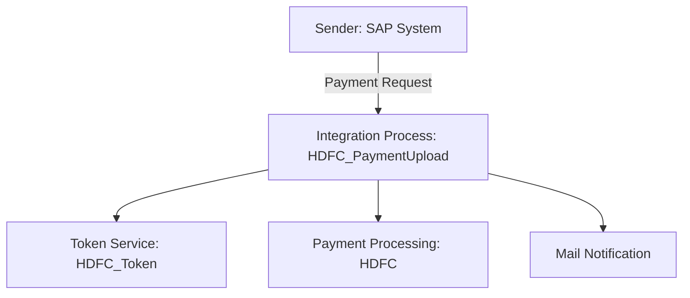

<h1 style="color: #1f4e79; text-align: center; font-size: 3.5em; margin-bottom: 10px;">HDFC PaymentUpload</h1><h2 style="text-align: center; font-size: 1.8em; font-weight: normal; margin-top: 0;">Technical Specification Document</h2>

<table style="width: 60%; margin: 0 auto;"><tr><th>Author</th><td>Rohancherian783</td></tr><tr><th>Date</th><td>2026-01-05</td></tr><tr><th>Version</th><td>1.0.0</td></tr></table>

<h1 style="color: #1f4e79; font-size: 2.5em;">Table of Contents</h1>
1. Introduction  
&nbsp;&nbsp;&nbsp; 1.1 Purpose  
&nbsp;&nbsp;&nbsp; 1.2 Scope  
2. Integration Overview  
&nbsp;&nbsp;&nbsp; 2.1 Integration Architecture  
&nbsp;&nbsp;&nbsp; 2.2 Integration Components  
3. Integration Scenarios  
&nbsp;&nbsp;&nbsp; 3.1 Scenario Description  
&nbsp;&nbsp;&nbsp; 3.2 Data Flows  
&nbsp;&nbsp;&nbsp; 3.3 Security Requirements  
4. Error Handling and Logging  
5. Testing Validation  
6. Reference Documents  

<h1 style="color: #1f4e79;">1. Introduction</h1>
<b style="color: #1f4e79;">1.1 Purpose:</b>
The 'HDFC_PaymentUpload' iFlow addresses the need for seamless integration between the SAP system and HDFC's payment processing system. The primary business problem it solves is the automated upload of payment data to HDFC, ensuring that transactions are processed efficiently and accurately. The trigger mechanism for this iFlow is an incoming payment request, which initiates the integration process. The technical outcome includes the successful transformation of payment data into the required format, secure transmission to HDFC, and appropriate error handling to manage any issues that arise during the process.

<b style="color: #1f4e79;">1.2 Scope:</b>
The scope of the 'HDFC_PaymentUpload' iFlow includes the following endpoints and data transformation logic:
- **Endpoints:**
  - **Sender Endpoint:** SAP system (initiates the payment upload).
  - **Receiver Endpoint:** HDFC payment processing API (receives the payment data).
  - **Token Endpoint:** HDFC token service (for authentication).
  - **Mail Endpoints:** For sending notifications in case of errors.
  
- **Data Transformation Logic:**
  - The iFlow transforms incoming payment requests from JSON to XML format using a mapping defined in the MM_HDFCPayment_req mapping file.
  - It also handles the encryption of sensitive data before transmission to HDFC.

- **Target Systems:**
  - HDFC payment processing system for payment uploads.
  - Email system for notifications regarding the status of payment uploads.

<h1 style="color: #1f4e79;">2. Integration Overview</h1>
<b style="color: #1f4e79;">2.1 Integration Architecture:</b> 

<b style="color: #1f4e79;">2.2 Integration Components:</b>
| Component               | Role                                   | Details                                                                 |
|------------------------|----------------------------------------|-------------------------------------------------------------------------|
| EndpointSender         | Initiates the payment upload process   | Receives payment requests from the SAP system.                         |
| EndpointReceiver        | Receives payment data                  | HDFC payment processing API endpoint.                                   |
| HDFC_Token             | Authentication                         | Token service for obtaining access tokens for secure API calls.        |
| Mail                   | Notification                           | Sends email notifications for errors or confirmations.                 |
| Content Modifier       | Data transformation                    | Modifies the payload for the HDFC API as per requirements.             |
| Scripts                | Custom logic                           | Groovy scripts for encryption and decryption of sensitive data.        |

<h1 style="color: #1f4e79;">3. Integration Scenarios</h1>
<b style="color: #1f4e79;">3.1 Scenario Description:</b>
1. **Trigger:** The process starts when a payment request is received from the SAP system.
2. **Token Generation:** The iFlow calls the HDFC token service to obtain an authentication token.
3. **Data Transformation:** The payment request is transformed from JSON to XML format using the defined mapping.
4. **Encryption:** The payload is encrypted using a 32-byte key before sending it to HDFC.
5. **Payment Upload:** The encrypted payload is sent to the HDFC payment processing API.
6. **Response Handling:** The response from HDFC is decrypted and processed. If successful, a confirmation email is sent; if there is an error, an error email is sent with details.

<b style="color: #1f4e79;">3.2 Data Flows:</b>
- **Incoming Payment Request:** JSON format from SAP.
- **Outgoing Payment Request:** XML format to HDFC after transformation and encryption.
- **Response from HDFC:** JSON format, which is decrypted and processed.

<b style="color: #1f4e79;">3.3 Security Requirements:</b>
- Use of HTTPS for secure communication with HDFC.
- Token-based authentication for API calls.
- Encryption of sensitive data before transmission.

<h1 style="color: #1f4e79;">4. Error Handling and Logging</h1>
The iFlow includes error handling mechanisms to capture and log errors during the payment upload process. If an error occurs, the iFlow sends an email notification with the error details to the designated recipients. Additionally, all events are logged for auditing and troubleshooting purposes.

<h1 style="color: #1f4e79;">5. Testing Validation</h1>
**Testing Details – Sheet: Testing**
| Test Case ID | Scenario                          | Expected Outcome                                   |
| :---         | :---                              | :---                                              |
| TC_001       | Successful Payment Upload         | Payment is uploaded successfully to HDFC.        |
| TC_002       | Token Generation Failure          | Error email is sent with token generation error. |
| TC_003       | Invalid Payment Data              | Error email is sent with validation error details.|
| TC_004       | HDFC API Unavailable              | Error email is sent indicating API unavailability.|

<h1 style="color: #1f4e79;">6. Reference Documents</h1>
- HDFC API Documentation
- SAP Integration Documentation
- Security Standards for Data Transmission
