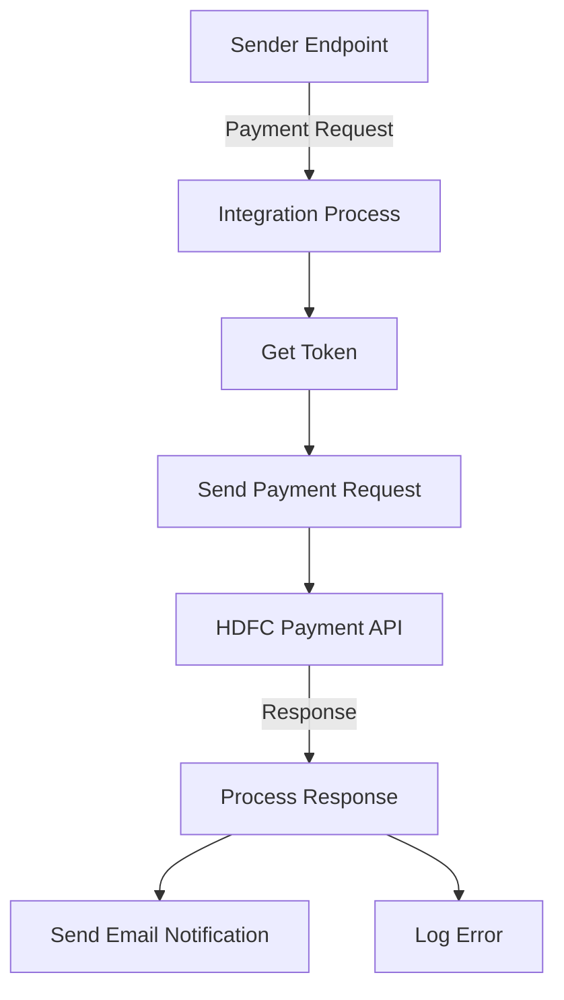

<h1 style="color: #1f4e79; text-align: center; font-size: 3.5em; margin-bottom: 10px;">HDFC PaymentUpload</h1><h2 style="text-align: center; font-size: 1.8em; font-weight: normal; margin-top: 0;">Technical Specification Document</h2>

<table style="width: 60%; margin: 0 auto;"><tr><th>Author</th><td>Rohancherian783</td></tr><tr><th>Date</th><td>2026-01-05</td></tr><tr><th>Version</th><td>1.0.0</td></tr></table>

<h1 style="color: #1f4e79; font-size: 2.5em;">Table of Contents</h1>
1. Introduction  
&nbsp;&nbsp;&nbsp; 1.1 Purpose  
&nbsp;&nbsp;&nbsp; 1.2 Scope  
2. Integration Overview  
&nbsp;&nbsp;&nbsp; 2.1 Integration Architecture  
&nbsp;&nbsp;&nbsp; 2.2 Integration Components  
3. Integration Scenarios  
&nbsp;&nbsp;&nbsp; 3.1 Scenario Description  
&nbsp;&nbsp;&nbsp; 3.2 Data Flows  
&nbsp;&nbsp;&nbsp; 3.3 Security Requirements  
4. Error Handling and Logging  
5. Testing Validation  
6. Reference Documents  

<h1 style="color: #1f4e79;">1. Introduction</h1>
<b style="color: #1f4e79;">1.1 Purpose:</b>

The iFlow 'HDFC_PaymentUpload' is designed to facilitate the seamless integration of payment data from various sources into the HDFC banking system. The primary business problem it addresses is the need for a reliable and secure mechanism to upload payment requests, ensuring that all transactions are processed efficiently and accurately. 

The iFlow is triggered by incoming payment requests, which can be in various formats (e.g., JSON, XML, CSV). Upon receiving a request, the iFlow initiates a series of transformations and validations to prepare the data for submission to the HDFC payment API. The desired technical outcome is to successfully upload payment data while handling any errors gracefully and providing feedback to the originating system.

<b style="color: #1f4e79;">1.2 Scope:</b>

The scope of the 'HDFC_PaymentUpload' iFlow includes the following components:

- **Endpoints**: 
  - Sender endpoint for receiving payment requests.
  - Receiver endpoint for sending requests to the HDFC payment API.
  - Additional endpoints for sending email notifications in case of errors.

- **Data Transformation Logic**: 
  - Conversion of incoming payment data from JSON/XML/CSV to the required format for the HDFC API.
  - Encryption and signing of payloads for secure transmission.
  - Error handling and logging mechanisms to capture and report issues.

- **Target Systems**: 
  - HDFC payment processing system.
  - Email server for notifications.

**Constraints**:
- The iFlow must adhere to HDFC's API specifications and security requirements.
- It must handle various data formats and ensure data integrity throughout the process.

**Exclusions**:
- The iFlow does not include any user interface components for manual data entry.
- It does not handle payment processing logic beyond the upload of payment requests.

<h1 style="color: #1f4e79;">2. Integration Overview</h1>
<b style="color: #1f4e79;">2.1 Integration Architecture:</b>

<b style="color: #1f4e79;">2.2 Integration Components:</b>

| Component | Role | Details |
| :--- | :--- | :--- |
| Sender Endpoint | Receives payment requests | Accepts incoming requests in various formats (JSON, XML, CSV) |
| Integration Process | Main processing logic | Orchestrates the flow of data through various steps |
| Get Token | Authentication | Retrieves an access token for API calls |
| Send Payment Request | External Call | Sends the payment request to the HDFC payment API |
| HDFC Payment API | Receiver | The target system for processing payment requests |
| Process Response | Handles API response | Validates and processes the response from HDFC |
| Send Email Notification | Notification | Sends email alerts in case of errors or successful uploads |
| Log Error | Error Handling | Captures and logs errors for troubleshooting |

<h1 style="color: #1f4e79;">3. Integration Scenarios</h1>
<b style="color: #1f4e79;">3.1 Scenario Description:</b>

1. **Trigger**: The iFlow is triggered by an incoming payment request at the sender endpoint.
  
2. **Token Retrieval**: The iFlow calls the 'Get Token' subprocess to authenticate and retrieve an access token required for API calls.

3. **Payment Request Submission**: The iFlow transforms the incoming payment data into the required format and sends it to the HDFC payment API.

4. **Response Handling**: The iFlow processes the response from the HDFC API. If the response indicates success, it logs the transaction. If there is an error, it triggers the error handling subprocess.

5. **Email Notification**: In case of errors, the iFlow sends an email notification to the relevant stakeholders with details of the error.

<b style="color: #1f4e79;">3.2 Data Flows:</b>

- **Incoming Payment Request**: 
  - Format: JSON/XML/CSV
  - Data is transformed and validated before submission.

- **Outgoing Payment Request**: 
  - Format: JSON
  - Includes encrypted payload and necessary headers.

- **Response from HDFC**: 
  - Format: JSON
  - Contains transaction status and any error messages.

<b style="color: #1f4e79;">3.3 Security Requirements:</b>

- **Authentication**: The iFlow must authenticate with the HDFC API using OAuth 2.0.
- **Data Encryption**: All sensitive data must be encrypted before transmission.
- **Error Handling**: Any errors must be logged and reported to ensure compliance with security policies.

<h1 style="color: #1f4e79;">4. Error Handling and Logging</h1>

The iFlow includes robust error handling mechanisms to capture and log errors at various stages of the process. In case of an error during the payment request submission or response processing, the following actions are taken:

- An error message is generated and logged.
- An email notification is sent to the relevant stakeholders with details of the error.
- The iFlow continues to process subsequent requests without interruption.

<h1 style="color: #1f4e79;">5. Testing Validation</h1>

**Testing Details – Sheet: Testing**

| Test Case ID | Scenario | Expected Outcome |
| :--- | :--- | :--- |
| TC001 | Valid Payment Request | Payment successfully uploaded to HDFC |
| TC002 | Invalid Payment Request | Error logged and email notification sent |
| TC003 | Token Retrieval Failure | Error logged and email notification sent |
| TC004 | Successful Response Handling | Transaction logged successfully |

<h1 style="color: #1f4e79;">6. Reference Documents</h1>

- HDFC API Documentation
- SAP CPI Integration Guidelines
- Security Compliance Standards for Payment Processing
