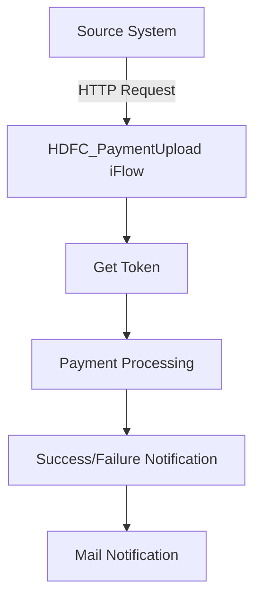

<h1 style="color: #1f4e79; text-align: center; font-size: 3em;">HDFC PaymentUpload</h1><h2 style="text-align: center;">Technical Specification Document</h2>

<table border="1" style="margin: 0 auto; border-collapse: collapse;"><tr><td style="padding: 10px;"><b>Author</b></td><td style="padding: 10px;">Rohancherian783</td></tr><tr><td style="padding: 10px;"><b>Date</b></td><td style="padding: 10px;">2025-12-22</td></tr></table>

<h1 style="color: #1f4e79; font-size: 2.5em;">Table of Contents</h1>
1. Introduction 
1.1 Purpose 
1.2 Scope 
2. Integration Overview 
2.1 Integration Architecture 
2.2 Integration Components 
3. Integration Scenarios 
3.1 Scenario Description 
3.2 Data Flows 
3.3 Security Requirements 
4. Error Handling and Logging 
5. Testing Validation 
6. Reference Documents 

<h1 style="color: #1f4e79;">1. Introduction</h1>
<h2 style="color: #1f4e79;">1.1 Purpose</h2>
The purpose of the HDFC_PaymentUpload iFlow is to facilitate the secure upload of payment data to the HDFC banking system, ensuring that all transactions are processed efficiently and securely.

<h2 style="color: #1f4e79;">1.2 Scope</h2>
This iFlow covers the integration between the source system and HDFC's payment processing API, including token generation, data transformation, and error handling mechanisms.

<h1 style="color: #1f4e79;">2. Integration Overview</h1>
<h2 style="color: #1f4e79;">2.1 Integration Architecture</h2>

<h2 style="color: #1f4e79;">2.2 Integration Components</h2>
- **Sender System**: Source System (initiates payment upload).
- **Receiver Systems**: 
  - HDFC (for payment processing).
  - HDFC_Token (for token generation).
  - Mail (for notifications).
  
- **Adapters**: 
  - HTTP Adapter (for communication with HDFC API).
  - Mail Adapter (for sending notifications).

<h1 style="color: #1f4e79;">3. Integration Scenarios</h1>
<h2 style="color: #1f4e79;">3.1 Scenario Description</h2>
1. The source system sends a payment upload request to the HDFC_PaymentUpload iFlow.
2. The iFlow retrieves an authentication token from HDFC_Token.
3. The payment data is transformed into the required format.
4. The transformed data is sent to HDFC for processing.
5. Based on the response, a success or failure notification is sent to the relevant parties via email.

<h2 style="color: #1f4e79;">3.2 Data Flows</h2>
- **Mapping Logic**: Utilizes a message mapping file (MM_HDFCPayment_req.mmap) to transform the incoming JSON payload into the required XML format for HDFC.
- **XSLT and Groovy Scripts**: Various Groovy scripts are used for encryption, decryption, and payload preparation.

<h2 style="color: #1f4e79;">3.3 Security Requirements</h2>
- **Credentials**: Utilizes OAuth 2.0 for secure token generation.
- **Authentication Mechanisms**: Basic authentication is disabled; instead, token-based authentication is used.

<h1 style="color: #1f4e79;">4. Error Handling and Logging</h1>
The iFlow includes an error subprocess that captures exceptions and sends error notifications via email. It logs all events and errors for monitoring and troubleshooting purposes.

<h1 style="color: #1f4e79;">5. Testing Validation</h1>
Testing involves validating the successful transmission of payment data, ensuring correct transformation, and verifying that error handling works as expected.

<h1 style="color: #1f4e79;">6. Reference Documents</h1>
- iFlowContent.xml
- Groovy scripts (script1.groovy, script2.groovy, etc.)
- Mapping file (MM_HDFCPayment_req.mmap)
- Configuration files for adapters and endpoints.
