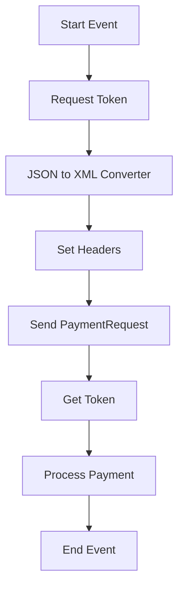

<h1 style="color: #1f4e79; text-align: center; font-size: 3em;">HDFC PaymentUpload</h1><h2 style="text-align: center;">Technical Specification Document</h2>

<table border="1" style="margin: 0 auto; border-collapse: collapse; min-width: 300px;"><tr><th style="padding: 10px; background-color: #f2f2f2;">Author</th><td style="padding: 10px;">Rohancherian783</td></tr><tr><th style="padding: 10px; background-color: #f2f2f2;">Date</th><td style="padding: 10px;">2025-12-23</td></tr></table>

<h1 style="color: #1f4e79; font-size: 2.5em;">Table of Contents</h1>

1. Introduction  

2. Integration Overview  

3. Integration Scenarios  

4. Error Handling and Logging  

5. Testing Validation  

6. Reference Documents  

<h1 style="color: #1f4e79;">1. Introduction</h1>

<b style="color: #1f4e79;">1.1 Purpose:</b> 

The purpose of the 'HDFC_PaymentUpload' iFlow is to facilitate the secure and efficient upload of payment data to the HDFC banking system. This integration ensures that payment requests are processed accurately and that responses are handled appropriately.

<b style="color: #1f4e79;">1.2 Scope:</b> 

This iFlow covers the end-to-end process of uploading payment data, including token generation, data encryption, and error handling. It integrates with HDFC's API to send payment requests and receive responses, while also managing notifications via email for both successful and failed transactions.

<h1 style="color: #1f4e79;">2. Integration Overview</h1>

<b style="color: #1f4e79;">2.1 Integration Architecture:</b> 

<b style="color: #1f4e79;">2.2 Integration Components:</b>

| Component Type | Name/Details | Description |
| :--- | :--- | :--- |
| Sender System | IFlow | Initiates the payment upload process. |
| Receiver System | HDFC | The banking system that processes payment requests. |
| Adapter | HTTP | Used for sending requests to the HDFC API. |

<h1 style="color: #1f4e79;">3. Integration Scenarios</h1>

<b style="color: #1f4e79;">3.1 Scenario Description:</b> 

1. The process starts with a trigger event that initiates the payment upload.
  
2. A token is requested from the HDFC API to authenticate the session.

3. The payment data is converted from JSON to XML format.

4. Appropriate headers are set for the HTTP request.

5. The payment request is sent to the HDFC API.

6. The response is processed, and notifications are sent based on the transaction status.

<b style="color: #1f4e79;">3.2 Data Flows:</b>

- **Mapping Logic**: The payment data is mapped from the source format to the required format for HDFC using a message mapping file.

- **XSLT**: Not applicable in this scenario as JSON to XML conversion is used.

- **Groovy Scripts**: Various Groovy scripts are utilized for encryption, logging, and error handling throughout the process.

<b style="color: #1f4e79;">3.3 Security Requirements:</b>

| Security Aspect | Details |
| :--- | :--- |
| Authentication | OAuth 2.0 token-based authentication is used to secure API calls. |
| Encryption | Data is encrypted using AES encryption before transmission to ensure confidentiality. |

<h1 style="color: #1f4e79;">4. Error Handling and Logging</h1>

The error handling strategy involves the use of subprocesses to capture exceptions during the payment upload process. If an error occurs, an email notification is sent to the relevant stakeholders with details of the error, including the message processing log ID for further investigation. Additionally, all errors are logged for auditing purposes.

<h1 style="color: #1f4e79;">5. Testing Validation</h1>

Validation steps include:

- Testing the successful upload of payment data to ensure that the integration works as expected.
  
- Simulating various error scenarios to verify that the error handling mechanisms are functioning correctly.

- Ensuring that email notifications are sent for both successful and failed transactions.

<h1 style="color: #1f4e79;">6. Reference Documents</h1>

- cpi-artifacts/MC/HDFC_PaymentUpload/src/main/resources/scenarioflows/integrationflow/Test_PaymentUpload.iflw

- HDFC API Documentation

- Integration Testing Plan for HDFC Payment Upload
