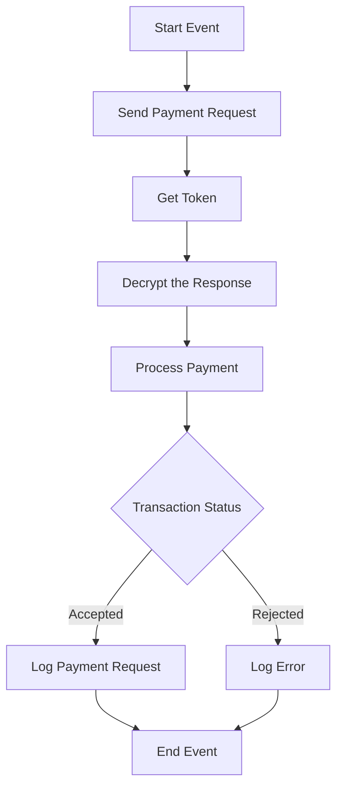

<h1 style="color: #1f4e79; text-align: center; font-size: 3em;">HDFC PaymentUpload</h1><h2 style="text-align: center;">Technical Specification</h2>

<table border="1" style="margin: 0 auto; border-collapse: collapse;"><tr><td style="padding: 10px;"><b>Author</b></td><td style="padding: 10px;">Rohancherian783</td></tr><tr><td style="padding: 10px;"><b>Date</b></td><td style="padding: 10px;">2025-12-23</td></tr></table>

<h1 style="color: #1f4e79;">1. Introduction</h1>
<cite_start>1.1 Purpose: Explain the solution conceptualized<cite: 28>. 
<cite_start>1.2 Scope: Outline data flows and integration touchpoints<cite: 30>.

<h1 style="color: #1f4e79;">2. Integration Overview</h1>
<cite_start>2.1 Integration Architecture: Provide a Mermaid graph<cite: 35>.

<cite_start>2.2 Integration Components: List Sender/Receiver and Adapters<cite: 37>.

- **Sender**: IFlow
- **Receivers**: HDFC, HDFC_Token, Mail, Mail1, Mail2
- **Adapters**: HTTP, Mail

<h1 style="color: #1f4e79;">3. Integration Scenarios</h1>
<cite_start>3.1 Scenario Description: Step-by-step logic<cite: 39>.

1. The process starts with a payment request being sent.
2. A token is fetched from the HDFC API.
3. The response is decrypted.
4. The payment is processed based on the transaction status.
5. Depending on the status, either a success or error log is generated.

<cite_start>3.2 Data Flows: Explain Mapping (Field to Field) and Groovy/XSLT logic<cite: 41, 45>.

- **Mapping**: The mapping is done using the MM_HDFCPayment_req mapping file.
- **Groovy Logic**: Various Groovy scripts are used for encryption, decryption, and payload logging.

<cite_start>3.3 Security Requirements: Credentials and Auth mechanisms<cite: 48>.

- **Authentication**: Basic authentication is disabled; instead, OAuth tokens are used.
- **Credentials**: Stored securely and referenced in the iFlow.

<h1 style="color: #1f4e79;">4. Error Handling and Logging</h1>
<cite_start>Describe exception subprocesses and logging scripts<cite: 51, 53>.

- **Exception Handling**: The iFlow includes subprocesses for handling errors, which log the error messages and send notifications via email.
- **Logging**: All events are logged, and specific error messages are sent to designated email addresses.

<h1 style="color: #1f4e79;">5. Testing Validation</h1>
<cite_start>Provide Test Case IDs and Scenarios<cite: 67>.

- **Test Case IDs**: 
  - TC001: Validate successful payment processing.
  - TC002: Validate error handling for rejected transactions.

<h1 style="color: #1f4e79;">6. Reference Documents</h1>
<cite_start>List analyzed files (iFlowContent.xml, scripts, etc.)[cite: 21, 23].

- **iFlow Content**: Test_PaymentUpload.iflw
- **Scripts**: Various Groovy scripts used for processing and logging.
- **Mapping Files**: MM_HDFCPayment_req.mmap

