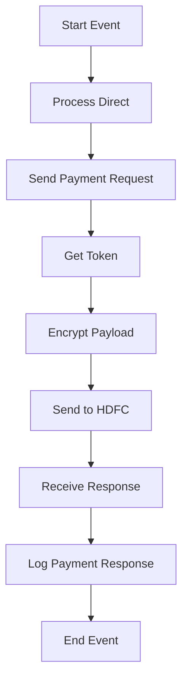

<h1 style="color: #1f4e79; text-align: center; font-size: 3em;">HDFC PaymentUpload</h1><h2 style="text-align: center;">Technical Specification Document</h2>

<table border="1" style="margin: 0 auto; border-collapse: collapse;"><tr><td style="padding: 10px;"><b>Author</b></td><td style="padding: 10px;">Rohancherian783</td></tr><tr><td style="padding: 10px;"><b>Date</b></td><td style="padding: 10px;">2025-12-23</td></tr></table>

<h1 style="color: #1f4e79; font-size: 2.5em;">Table of Contents</h1>
1. Introduction 
1.1 Purpose 
1.2 Scope 
2. Integration Overview 
2.1 Integration Architecture 
2.2 Integration Components 
3. Integration Scenarios 
3.1 Scenario Description 
3.2 Data Flows 
3.3 Security Requirements 
4. Error Handling and Logging 
5. Testing Validation 
6. Reference Documents 

<h1 style="color: #1f4e79;">1. Introduction</h1>
<h2 style="color: #1f4e79;">1.1 Purpose</h2>
The purpose of the HDFC_PaymentUpload iFlow is to facilitate the secure upload of payment data to the HDFC bank system, ensuring that all transactions are processed efficiently and securely.

<h2 style="color: #1f4e79;">1.2 Scope</h2>
This iFlow integrates with HDFC's payment processing system, handling the transformation of payment data formats, managing authentication, and ensuring error handling and logging mechanisms are in place.

<h1 style="color: #1f4e79;">2. Integration Overview</h1>
<h2 style="color: #1f4e79;">2.1 Integration Architecture</h2>

<h2 style="color: #1f4e79;">2.2 Integration Components</h2>
- **Sender System**: The iFlow acts as the sender, initiating the payment upload process.
- **Receiver Systems**: 
  - HDFC: The main endpoint for payment processing.
  - HDFC_Token: Endpoint for token retrieval.
  - Mail: For sending notifications regarding the payment status.
- **Adapters**: 
  - HTTP Adapter for communication with HDFC.
  - Mail Adapter for sending email notifications.

<h1 style="color: #1f4e79;">3. Integration Scenarios</h1>
<h2 style="color: #1f4e79;">3.1 Scenario Description</h2>
The iFlow begins with a start event that triggers the payment upload process. It retrieves a token from HDFC, encrypts the payment data, and sends it to the HDFC payment API. The response is then processed, and appropriate notifications are sent based on the transaction status.

<h2 style="color: #1f4e79;">3.2 Data Flows</h2>
- **Mapping Logic**: The iFlow utilizes a message mapping file (`MM_HDFCPayment_req.mmap`) to transform the incoming payment data into the required format for HDFC.
- **XSLT and Groovy Scripts**: Various Groovy scripts are used for encryption, decryption, and payload logging throughout the process.

<h2 style="color: #1f4e79;">3.3 Security Requirements</h2>
- **Credentials**: The iFlow uses credentials stored in secure properties for authentication with HDFC.
- **Authentication Mechanisms**: OAuth 2.0 is employed for secure token retrieval and API access.

<h1 style="color: #1f4e79;">4. Error Handling and Logging</h1>
The iFlow includes an error subprocess that captures exceptions and sends error notifications via email. It logs all events and errors to ensure traceability and facilitate troubleshooting.

<h1 style="color: #1f4e79;">5. Testing Validation</h1>
Testing involves validating the end-to-end flow of payment data, ensuring that all transformations are correct, and verifying that error handling mechanisms function as expected.

<h1 style="color: #1f4e79;">6. Reference Documents</h1>
- iFlow Content: `Test_PaymentUpload.iflw`
- Groovy Scripts: `script1.groovy`, `script2.groovy`, `script4.groovy`, `script5.groovy`, `script6.groovy`, `script7.groovy`, `script8.groovy`, `script9.groovy`, `script10.groovy`
- Mapping File: `MM_HDFCPayment_req.mmap`
