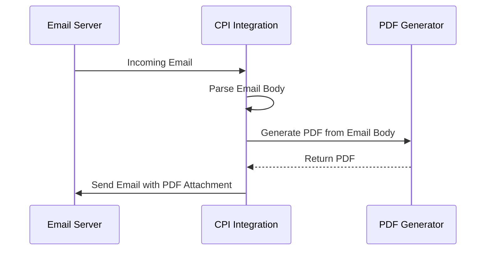

# Consolidated Technical Report for SAP CPI Package: PDFcoveter

## 1. High-level architecture
The architecture of the PDFcoveter integration package involves the processing of incoming emails, extracting their content, generating PDF documents from the email body, and sending these PDFs as attachments in outgoing emails. The integration utilizes various Groovy scripts to handle email parsing, PDF generation, and attachment management.

## 2. Purpose of each iFlow
The package contains multiple iFlows, each designed to handle specific tasks related to email processing and PDF generation. The main purposes include:
- **Email Parsing**: Extracting the body of incoming emails.
- **PDF Generation**: Creating PDF documents from the extracted email content.
- **Attachment Management**: Attaching generated PDFs to outgoing emails.

## 3. Sender/Receiver systems (Consolidated)
- **Sender System**: Email server (SMTP) that sends emails to the CPI.
- **Receiver System**: Email server (SMTP) that receives emails with PDF attachments generated by the CPI.

## 4. Adapter types used (Consolidated)
- **Mail Adapter**: Used for receiving incoming emails and sending outgoing emails.
- **HTTP Adapter**: Not explicitly mentioned but may be used for any web service calls if needed.

## 5. Step-by-step flow explanation (For each iFlow)
### iFlow 1: Email to PDF Conversion
1. **Receive Email**: The iFlow triggers on receiving an email.
2. **Parse Email**: The email body is extracted using Groovy scripts (e.g., `script1.groovy`, `script2.groovy`).
3. **Generate PDFs**: Two PDFs are generated from the email body using various scripts (e.g., `script19.groovy`, `script20.groovy`).
4. **Attach PDFs**: The generated PDFs are attached to the outgoing email.
5. **Send Email**: The email with attachments is sent to the specified recipient.

### iFlow 2: Error Handling
1. **Catch Errors**: Any errors during PDF generation or email processing are caught.
2. **Log Errors**: Errors are logged for debugging purposes.

## 6. Mapping logic summary (Summarize XSLT, Mappings)
No XSLT mappings are explicitly mentioned in the provided artifacts. The mapping logic primarily involves Groovy scripts that handle the transformation of email content into PDF format.

## 7. Groovy script explanations (Summarize all scripts and their usage/purpose)
- **Email Parsing Scripts**: 
  - `script1.groovy`, `script2.groovy`: Extract the email body from incoming emails, handling both plain text and HTML formats.
  
- **PDF Generation Scripts**:
  - `script3.groovy`, `script4.groovy`, `script5.groovy`: Generate PDFs from the extracted email body, ensuring proper content handling and error management.
  
- **Attachment Management Scripts**:
  - `script6.groovy`, `script7.groovy`, `script8.groovy`: Set the appropriate headers for email attachments, ensuring that the generated PDFs are correctly attached to outgoing emails.

- **Error Handling Scripts**:
  - `script28.groovy`: Logs attachment details for debugging.

## 8. Error handling
Error handling is implemented in various scripts, particularly in `script5.groovy`, where exceptions during PDF generation are caught, and an error message is set in the message body. Additionally, logs are maintained for debugging purposes.

## 9. Security/authentication
The integration package does not explicitly mention security configurations. However, standard practices for securing email communications (e.g., using SSL/TLS for SMTP) should be followed. Credentials for accessing the email server should be securely stored and managed within the CPI environment.

## 10. High-Level Process Flow Diagram

This report consolidates the provided artifacts into a structured overview of the PDFcoveter integration package, detailing its architecture, purpose, and functionality.
