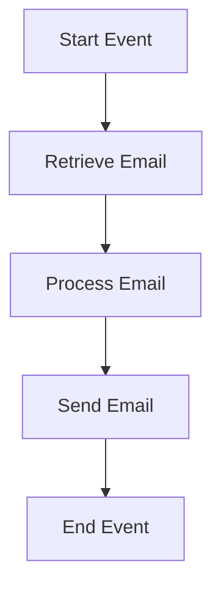

<h1 style="color: #1f4e79; text-align: center; font-size: 3.5em;">Task1</h1><h2 style="text-align: center; font-size: 2em;">Technical Specification Document</h2>

<table><tr><th>Author</th><td>Rohancherian783</td></tr><tr><th>Date</th><td>2026-01-05</td></tr><tr><th>Version</th><td>1.0.0</td></tr></table>

<h1 style="color: #1f4e79; font-size: 2.5em;">Table of Contents</h1>

1. Introduction  
&nbsp;&nbsp;&nbsp; 1.1 Purpose  
&nbsp;&nbsp;&nbsp; 1.2 Scope  

2. Integration Overview  
&nbsp;&nbsp;&nbsp; 2.1 Integration Architecture  
&nbsp;&nbsp;&nbsp; 2.2 Integration Components  

3. Integration Scenarios  
&nbsp;&nbsp;&nbsp; 3.1 Scenario Description  
&nbsp;&nbsp;&nbsp; 3.2 Data Flows  
&nbsp;&nbsp;&nbsp; 3.3 Security Requirements  

4. Error Handling and Logging  

5. Testing Validation  

6. Reference Documents  

<h1 style="color: #1f4e79;">1. Introduction</h1>

<b style="color: #1f4e79;">1.1 Purpose:</b>

The purpose of the iFlow 'Task1' is to facilitate the automated processing of email communications between two endpoints: a sender and a receiver. This integration flow is designed to read incoming emails from a specified mailbox, process the content, and subsequently send an email to a designated recipient. The business logic behind this iFlow is to streamline communication processes, ensuring that important messages are captured and forwarded without manual intervention. The iFlow leverages the capabilities of SAP Cloud Platform Integration (CPI) to connect to external email services, specifically using IMAP for receiving emails and SMTP for sending them. This automation not only enhances operational efficiency but also reduces the risk of human error in communication.

<b style="color: #1f4e79;">1.2 Scope:</b>

The scope of the iFlow 'Task1' encompasses the integration of email services within the SAP CPI environment. It involves the following key components:

- **Email Retrieval**: The iFlow retrieves unread emails from a specified Gmail account using the IMAP protocol. This process includes filtering emails based on specific criteria, such as unread status, to ensure that only relevant messages are processed.

- **Email Processing**: Once the emails are retrieved, the iFlow utilizes a Groovy script to manipulate the email content as necessary. This may include extracting specific information from the email body or headers, which can then be used to construct the outgoing email.

- **Email Sending**: After processing, the iFlow sends the email to a predefined recipient using the SMTP protocol. The email's subject and body are dynamically populated based on the processed content, ensuring that the recipient receives the relevant information.

- **Error Handling and Logging**: The iFlow includes mechanisms for error handling and logging to track the success or failure of email processing. This is crucial for maintaining operational integrity and for troubleshooting any issues that may arise during execution.

Overall, the iFlow 'Task1' aims to provide a seamless integration solution for email communications, enhancing the efficiency of business processes that rely on timely and accurate information exchange.

<h1 style="color: #1f4e79;">2. Integration Overview</h1>

<b style="color: #1f4e79;">2.1 Integration Architecture:</b>

<b style="color: #1f4e79;">2.2 Integration Components:</b>

| Component Type       | Name/Details                     | Description                                                                 |
|----------------------|----------------------------------|-----------------------------------------------------------------------------|
| Sender               | Gmail IMAP                      | Retrieves unread emails from the specified Gmail account.                  |
| Receiver             | Gmail SMTP                     | Sends processed emails to the designated recipient via SMTP.               |
| Groovy Script        | script30.groovy                 | Processes the email content and prepares it for sending.                   |
| Content Modifier     | Enriches email content           | Modifies the email subject and body based on extracted information.         |
| Logging              | All events                       | Logs all events for monitoring and troubleshooting purposes.                |

<h1 style="color: #1f4e79;">3. Integration Scenarios</h1>

<b style="color: #1f4e79;">3.1 Scenario Description:</b>

1. **Email Retrieval**: The iFlow initiates by connecting to the Gmail account using IMAP to fetch unread emails from the inbox.

2. **Email Processing**: The retrieved emails are processed using a Groovy script that extracts necessary information, such as the subject and body content.

3. **Email Sending**: After processing, the iFlow constructs a new email and sends it to the specified recipient using SMTP.

4. **Completion**: The iFlow concludes by marking the email processing as complete, logging the event for future reference.

<b style="color: #1f4e79;">3.2 Data Flows:</b>

- Incoming emails are fetched from the Gmail inbox.
- The email content is processed and modified as needed.
- The processed email is sent to the recipient's email address.

<b style="color: #1f4e79;">3.3 Security Requirements:</b>

| Security Aspect          | Requirement                          |
|--------------------------|--------------------------------------|
| Authentication           | Basic authentication for IMAP/SMTP  |
| Data Encryption          | Use of SSL/TLS for secure email transmission |
| Access Control           | Ensure only authorized users can access the iFlow |
| Logging                  | Maintain logs of all email transactions for auditing purposes |

<h1 style="color: #1f4e79;">4. Error Handling and Logging</h1>

The iFlow incorporates robust error handling mechanisms to capture and log any issues that may occur during the email retrieval, processing, or sending stages. This includes:

- **Error Notifications**: Alerts are generated for critical failures, allowing for immediate attention.
- **Log Files**: Detailed logs are maintained for each transaction, providing insights into the flow's performance and any encountered errors.

<h1 style="color: #1f4e79;">5. Testing Validation</h1>

Testing of the iFlow will involve:

- **Unit Testing**: Each component will be tested individually to ensure functionality.
- **Integration Testing**: The complete flow will be tested to validate the interaction between components.
- **User Acceptance Testing (UAT)**: End-users will validate the iFlow against business requirements to ensure it meets expectations.

<h1 style="color: #1f4e79;">6. Reference Documents</h1>

- SAP Cloud Platform Integration Documentation
- Email Protocol Specifications (IMAP, SMTP)
- Groovy Scripting Guide for SAP CPI
