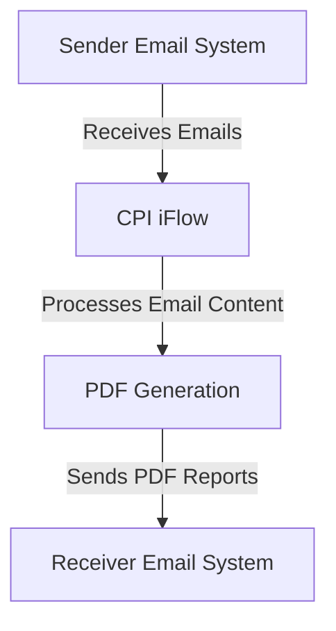

<div style="float: left; text-align: left;"></div><div style="float: right; text-align: right;"></div><div style="clear: both;"></div>
<div style="height: 80px;"></div><h1 style="color: #1f4e79; font-size: 3em; text-align: center; margin-top: 5px; margin-bottom: 5px;">Task1</h1><h2 style="color: #1f4e79; font-size: 1.5em; text-align: center; margin-top: 5px; margin-bottom: 0px;">SAP CPI Technical Specification Document</h2><div style="height: 100px;"></div><div style="width: 100%; text-align: center;">
<table border="1" style="width: 400px; border-collapse: collapse; border-color: black; margin: 0 auto; text-align: left;">
  <tr><td style="width: 30%; padding: 5px;">**Author:**</td><td style="padding: 5px;">Rohancherian783</td></tr>
  <tr><td style="padding: 5px;">**Date:**</td><td style="padding: 5px;">2025-12-11</td></tr>
  <tr><td style="padding: 5px;">**Version (Commit):**</td><td style="padding: 5px;">cc9dbd8</td></tr>
</table>
</div>
<div style="page-break-after: always;"></div>

<div style="float: left; text-align: left;"></div><div style="float: right; text-align: right;"></div><div style="clear: both;"></div>
```markdown

<h1 style="color: #1f4e79; font-size: 2.5em;">Table of Contents</h1>

1. Introduction
   1.1 Purpose
   1.2 Scope
2. Integration Overview
   2.1 Integration Architecture
   2.2 Integration Components
3. Integration Scenarios
   3.1 Scenario Description
   3.2 Data Flows
   3.3 Security Requirements
4. Error Handling and Logging
5. Testing Validation
6. Reference Documents


<div style="page-break-after: always;"></div>
<div style="float: left; text-align: left;"></div><div style="float: right; text-align: right;"></div><div style="clear: both;"></div>


<h1 style="color: #1f4e79;">1. Introduction</h1>

<h2 style="color: #1f4e79;">1.1 Purpose</h2>
The purpose of this iFlow, named 'Task1', is to process incoming emails, extract their content, and generate PDF reports based on the email body. The generated PDFs are then attached to an outgoing email.

<h2 style="color: #1f4e79;">1.2 Scope</h2>
This iFlow interacts with email systems to receive and send emails. It processes emails in MIME format, extracts the body content, and generates PDF documents. The systems affected include the email server for both sending and receiving emails, as well as the SAP Cloud Platform Integration (CPI) environment where this iFlow is deployed.

<h1 style="color: #1f4e79;">2. Integration Overview</h1>

<h2 style="color: #1f4e79;">2.1 Integration Architecture</h2>
The integration architecture consists of a sender email system that receives emails, a CPI iFlow that processes these emails, and a receiver email system that sends out the generated PDF reports. The iFlow utilizes various components to handle email content and PDF generation.



<h2 style="color: #1f4e79;">2.2 Integration Components</h2>
The integration components include:
- **Sender System**: The email server that sends incoming emails to the iFlow.
- **Receiver System**: The email server that receives outgoing emails with PDF attachments.
- **Adapters Used**: 
  - IMAP Adapter for receiving emails.
  - SMTP Adapter for sending emails.

<h1 style="color: #1f4e79;">3. Integration Scenarios</h1>

<h2 style="color: #1f4e79;">3.1 Scenario Description</h2>
The iFlow operates in the following steps:
1. An email is received via the IMAP adapter.
2. The email content is extracted using JavaMail API.
3. Two PDFs are generated from the email body.
4. The PDFs are attached to an outgoing email.
5. The email is sent via the SMTP adapter.

<h2 style="color: #1f4e79;">3.2 Data Flows</h2>
The mapping logic involves extracting the email body and generating PDFs using Groovy scripts. The key Groovy scripts include:
- **script1.groovy**: Extracts email content.
- **script20.groovy**: Generates two PDFs and prepares them for attachment.
- **script30.groovy**: Cleans the email body and prepares the final email for sending.

<h2 style="color: #1f4e79;">3.3 Security Requirements</h2>
The iFlow does not require basic authentication for the sender email system. However, it ensures that the email content is processed securely and that the generated PDFs are sent without exposing sensitive information.

<h1 style="color: #1f4e79;">4. Error Handling and Logging</h1>
Error handling is implemented within the Groovy scripts to catch exceptions during PDF generation. Logs are maintained to track the processing of emails and any errors encountered during execution.

<h1 style="color: #1f4e79;">5. Testing Validation</h1>
Key testing scenarios include:
- Sending emails with various content types (plain text, HTML).
- Validating the generation of PDFs from different email bodies.
- Ensuring that the outgoing email contains the correct attachments.

<h1 style="color: #1f4e79;">6. Reference Documents</h1>
The following artifacts were analyzed for this iFlow:
- iFlow Content: `Task1.iflw`
- Groovy Scripts: `script1.groovy`, `script20.groovy`, `script30.groovy`, etc.
- XSLT files: Not applicable for this iFlow.
```
