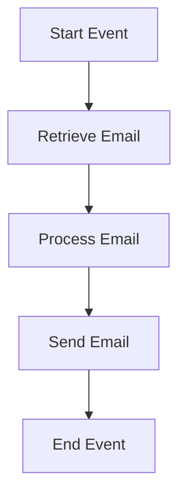

<h1 style="color: #1f4e79; text-align: center; font-size: 3.5em; margin-bottom: 10px;">Task1</h1><h2 style="text-align: center; font-size: 1.8em; font-weight: normal; margin-top: 0;">Technical Specification Document</h2>

<table style="width: 60%; margin: 0 auto;"><tr><th>Author</th><td>Rohancherian783</td></tr><tr><th>Date</th><td>2026-01-05</td></tr><tr><th>Version</th><td>1.0.0</td></tr></table>

<h1 style="color: #1f4e79; font-size: 2.5em;">Table of Contents</h1>
1. Introduction  
&nbsp;&nbsp;&nbsp; 1.1 Purpose  
&nbsp;&nbsp;&nbsp; 1.2 Scope  
2. Integration Overview  
&nbsp;&nbsp;&nbsp; 2.1 Integration Architecture  
&nbsp;&nbsp;&nbsp; 2.2 Integration Components  
3. Integration Scenarios  
&nbsp;&nbsp;&nbsp; 3.1 Scenario Description  
&nbsp;&nbsp;&nbsp; 3.2 Data Flows  
&nbsp;&nbsp;&nbsp; 3.3 Security Requirements  
4. Error Handling and Logging  
5. Testing Validation  
6. Reference Documents  

<h1 style="color: #1f4e79;">1. Introduction</h1>
<b style="color: #1f4e79;">1.1 Purpose:</b>
The iFlow 'Task1' addresses the need for automated email processing within an organization. It retrieves unread emails from a specified inbox, processes the content, and sends a formatted email to a designated recipient. The trigger mechanism for this iFlow is a scheduled polling of the email inbox, which occurs every 10 seconds. The technical outcome includes the successful retrieval of emails, transformation of their content, and dispatching of emails with appropriate headers and body content.

<b style="color: #1f4e79;">1.2 Scope:</b>
The iFlow integrates with the following endpoints:
- **Sender Endpoint:** IMAP server (imap.gmail.com:993) for retrieving emails.
- **Receiver Endpoint:** SMTP server (smtp.gmail.com:587) for sending emails.

The data transformation logic involves extracting the subject and body from the incoming email, modifying the content as necessary, and then sending it to the specified recipient. The target systems include the email servers for both sending and receiving emails.

<h1 style="color: #1f4e79;">2. Integration Overview</h1>
<b style="color: #1f4e79;">2.1 Integration Architecture:</b>

<b style="color: #1f4e79;">2.2 Integration Components:</b>
| Component                | Role                     | Details                                                                 |
|--------------------------|--------------------------|-------------------------------------------------------------------------|
| IMAP Adapter             | Email Retrieval          | Connects to the IMAP server to fetch unread emails from the inbox.      |
| SMTP Adapter             | Email Sending            | Connects to the SMTP server to send processed emails to the recipient.   |
| Groovy Script            | Content Processing       | Executes custom logic to modify the email content before sending.       |
| Content Modifier         | Header Modification      | Sets the email subject and other headers based on the incoming email.   |

<h1 style="color: #1f4e79;">3. Integration Scenarios</h1>
<b style="color: #1f4e79;">3.1 Scenario Description:</b>
1. The iFlow is triggered by a scheduled event every 10 seconds.
2. The IMAP adapter connects to the email server and retrieves unread emails from the inbox.
3. Each email is processed by the Groovy script, which extracts the subject and body.
4. The Content Modifier updates the email headers, including the subject.
5. The SMTP adapter sends the modified email to the specified recipient.
6. The process ends after the email is sent.

<b style="color: #1f4e79;">3.2 Data Flows:</b>
- **Input:** Unread emails from the inbox.
- **Output:** Formatted emails sent to the recipient.

<b style="color: #1f4e79;">3.3 Security Requirements:</b>
- Use of secure connections (IMAPS and SMTPS) for email retrieval and sending.
- Authentication mechanisms must be in place for both IMAP and SMTP connections.

<h1 style="color: #1f4e79;">4. Error Handling and Logging</h1>
Error handling is implemented to capture any issues during email retrieval or sending. Logs are maintained for all events, including successful and failed attempts, to facilitate troubleshooting.

<h1 style="color: #1f4e79;">5. Testing Validation</h1>
**Testing Details – Sheet: Testing**
| Test Case ID | Scenario                     | Expected Outcome                                   |
| :---         | :---                        | :---                                             |
| TC01         | Retrieve unread emails       | Emails are successfully retrieved from the inbox. |
| TC02         | Process email content        | Email content is correctly modified.              |
| TC03         | Send email                   | Email is sent to the recipient without errors.    |

<h1 style="color: #1f4e79;">6. Reference Documents</h1>
- SAP CPI Documentation
- Email Adapter Configuration Guide
- Groovy Script Reference Guide
