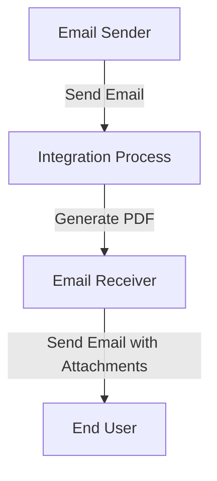

<div style="float: left; text-align: left;"></div><div style="float: right; text-align: right;"></div><div style="clear: both;"></div>
<div style="height: 80px;"></div><h1 style="color: #1f4e79; font-size: 3em; text-align: center; margin-top: 5px; margin-bottom: 5px;">Task1</h1><h2 style="color: #1f4e79; font-size: 1.5em; text-align: center; margin-top: 5px; margin-bottom: 0px;">SAP CPI Technical Specification Document</h2><div style="height: 100px;"></div><div style="width: 100%; text-align: center;">
<table border="1" style="width: 400px; border-collapse: collapse; border-color: black; margin: 0 auto; text-align: left;">
  <tr><td style="width: 30%; padding: 5px;">**Author:**</td><td style="padding: 5px;">Rohancherian783</td></tr>
  <tr><td style="padding: 5px;">**Date:**</td><td style="padding: 5px;">2025-12-12</td></tr>
  <tr><td style="padding: 5px;">**Version (Commit):**</td><td style="padding: 5px;">1b41a1a</td></tr>
</table>
</div>
<div style="page-break-after: always;"></div>

<div style="float: left; text-align: left;"></div><div style="float: right; text-align: right;"></div><div style="clear: both;"></div>
```markdown
<h1 style="color: #1f4e79; font-size: 2.5em;">Table of Contents</h1>
1. Introduction<br>
1.1 Purpose<br>
1.2 Scope<br>
2. Integration Overview<br>
2.1 Integration Architecture<br>
2.2 Integration Components<br>
3. Integration Scenarios<br>
3.1 Scenario Description<br>
3.2 Data Flows<br>
3.3 Security Requirements<br>
4. Error Handling and Logging<br>
5. Testing Validation<br>
6. Reference Documents<br>


<div style="page-break-before: always;"></div>
<div style="float: left; text-align: left;"></div><div style="float: right; text-align: right;"></div><div style="clear: both;"></div>


<h1 style="color: #1f4e79;">1. Introduction</h1>

<h2 style="color: #1f4e79;">1.1 Purpose</h2>
The purpose of this iFlow, named 'Task1', is to process incoming emails, extract their content, and generate PDF reports based on the email body. The generated PDFs are then attached to outgoing emails.

<h2 style="color: #1f4e79;">1.2 Scope</h2>
This iFlow interacts with email systems to receive and send emails. It processes email content, generates PDF documents, and handles attachments. The systems affected include the email server for both sending and receiving emails.


<div style="float: left; text-align: left;"></div><div style="float: right; text-align: right;"></div><div style="clear: both;"></div>
<h1 style="color: #1f4e79;">2. Integration Overview</h1>

<h2 style="color: #1f4e79;">2.1 Integration Architecture</h2>
The integration architecture consists of a sender and receiver email system, with an integration process that handles the transformation and generation of PDFs. The architecture is designed to facilitate the flow of email content into PDF format and back into email attachments.



<h2 style="color: #1f4e79;">2.2 Integration Components</h2>
- **Sender System**: Email server that receives emails.
- **Receiver System**: Email server that sends emails.
- **Adapters Used**: IMAP for receiving emails and SMTP for sending emails.


<div style="float: left; text-align: left;"></div><div style="float: right; text-align: right;"></div><div style="clear: both;"></div>
<h1 style="color: #1f4e79;">3. Integration Scenarios</h1>

<h2 style="color: #1f4e79;">3.1 Scenario Description</h2>
The iFlow begins by receiving an email via the IMAP adapter. The email content is extracted, and two PDF documents are generated from this content. These PDFs are then attached to a new email, which is sent out via the SMTP adapter.

<h2 style="color: #1f4e79;">3.2 Data Flows</h2>
The data flow involves:
1. Receiving an email.
2. Extracting the email body using JavaMail API.
3. Generating two PDFs using iText library.
4. Attaching the PDFs to a new email.
5. Sending the email with the attachments.

The Groovy scripts used for PDF generation and email processing include:
- **script23.groovy**: Handles the extraction of email content and PDF generation.
- **script24.groovy**: Merges two PDFs into one.
- **script30.groovy**: Cleans the email body and prepares it for PDF generation.

<h2 style="color: #1f4e79;">3.3 Security Requirements</h2>
The iFlow does not require basic authentication for the sender. However, it is essential to ensure that the email server configurations are secure and that sensitive information is handled appropriately.


<div style="float: left; text-align: left;"></div><div style="float: right; text-align: right;"></div><div style="clear: both;"></div>
<h1 style="color: #1f4e79;">4. Error Handling and Logging</h1>
Error handling is implemented within the Groovy scripts to catch exceptions during PDF generation. Logs are created to capture any issues that arise, ensuring that errors can be traced and resolved efficiently.


<div style="float: left; text-align: left;"></div><div style="float: right; text-align: right;"></div><div style="clear: both;"></div>
<h1 style="color: #1f4e79;">5. Testing Validation</h1>
Key testing scenarios include:
- Validating the extraction of email content.
- Ensuring that PDFs are generated correctly from the email body.
- Testing the sending of emails with attachments to verify that the process works end-to-end.


<div style="float: left; text-align: left;"></div><div style="float: right; text-align: right;"></div><div style="clear: both;"></div>
<h1 style="color: #1f4e79;">6. Reference Documents</h1>
The following artifacts were analyzed:
- iFlow Content: `Task1.iflw`
- Groovy Scripts: `script23.groovy`, `script24.groovy`, `script30.groovy`, etc.
- XSLT files: Not applicable in this scenario.
```
