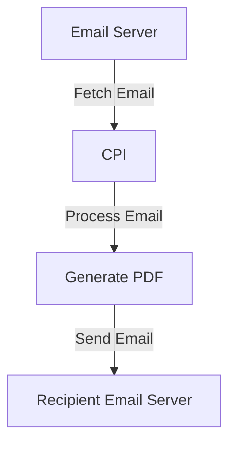

```html
<div style="width: 100%; overflow: hidden; margin-bottom: 20px;">
  <div style="float: left;">
    
  </div>
  <div style="float: right; border: 1px solid #924b95; padding: 5px;">
    
  </div>
</div>
<br><br><br>
<h1 align="center" style="color: #1f4e79; font-size: 3em; margin-top: 150px;">Task1 Integration Technical Specification</h1>
<br><br><br>
<div style="width: 400px; border: 1px solid black; padding: 5px;">
| Field | Value |
|:---|:---|
| **Author** | [Lead Developer Name] |
| **Date** | [Current Date, e.g., 2025-12-10] |
| **Version** | 1.0 (Draft) |
</div>
<br><br><br><br><br><br><br><br><br><br><br><br><br><br><br><br><br><br><br><br>
```

<h1 style="color: #1f4e79; font-size: 2.5em;">Table of Contents</h1>
1. Introduction  
   1.1 Purpose  
   1.2 Scope  
2. Integration Overview  
   2.1 Integration Architecture  
   2.2 Integration Components  
3. Integration Scenarios  
   3.1 Scenario Description  
   3.2 Data Flows  
   3.3 Security Requirements  
4. Error Handling and Logging  
5. Testing Validation  
6. Reference Documents  

<br><br><br><br><br><br><br><br><br><br><br><br><br><br><br><br><br><br><br><br>

# 1. Introduction
## 1.1 Purpose
The purpose of the Task1 iFlow is to automate the process of converting email content into PDF documents and sending them as attachments. This integration facilitates the generation of reports based on incoming emails, enhancing the efficiency of document handling.

## 1.2 Scope
This iFlow interacts with email systems to receive messages, processes the content to generate PDF files, and sends these files as email attachments. The systems affected include the email server for sending and receiving emails and the SAP Cloud Platform Integration (CPI) for processing the iFlow.

# 2. Integration Overview
## 2.1 Integration Architecture
The integration architecture consists of a sender and receiver system where emails are fetched, processed, and sent as PDF attachments. The architecture is designed to ensure seamless communication between the email server and the CPI.



## 2.2 Integration Components
- **Sender System:** Email server (IMAP) for receiving emails.
- **Receiver System:** Email server (SMTP) for sending emails.
- **Adapters Used:** IMAP adapter for fetching emails and SMTP adapter for sending emails.

# 3. Integration Scenarios
## 3.1 Scenario Description
1. An email is received in the sender email server.
2. The iFlow fetches the email content.
3. The content is processed to generate two PDF documents.
4. The PDFs are attached to a new email and sent to the specified recipient.

## 3.2 Data Flows
The mapping logic involves extracting the email body, generating PDFs, and setting them as attachments. The Groovy scripts handle the PDF generation and attachment logic.

## 3.3 Security Requirements
The integration requires secure authentication for both the sender and receiver email servers. Credentials are managed within the CPI environment to ensure secure access.

# 4. Error Handling and Logging
Error handling is implemented to catch exceptions during PDF generation and email sending. Logs are maintained to track the success or failure of each step in the iFlow.

# 5. Testing Validation
Key testing scenarios include:
- Validating the successful fetching of emails.
- Ensuring PDFs are generated correctly from the email content.
- Confirming that emails with attachments are sent successfully.

# 6. Reference Documents
- iFlow Content: `Task1.iflw`
- Groovy Scripts: 
  - `script23.groovy`
  - `script17.groovy`
  - `script24.groovy`
  - `script11.groovy`
  - `script26.groovy`
  - `script25.groovy`
  - `script10.groovy`
  - `script29.groovy`
  - `script18.groovy`
  - `script30.groovy`
  - `script15.groovy`
  - `script19.groovy`
  - `script3.groovy`
  - `script5.groovy`
  - `script14.groovy`
  - `script12.groovy`
  - `script21.groovy`
  - `script9.groovy`
  - `script8.groovy`
  - `script16.groovy`
  - `script6.groovy`
  - `script27.groovy`
  - `script22.groovy`
  - `script4.groovy`
  - `script1.groovy`
  - `script13.groovy`
  - `script28.groovy`
  - `script7.groovy`
  - `script20.groovy`
  - `script2.groovy`
```
