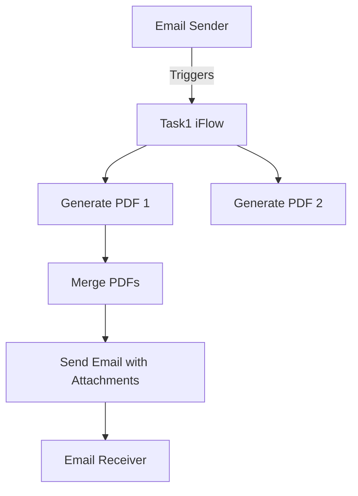

<div style="float: left; text-align: left;"></div><div style="float: right; text-align: right;"></div><div style="clear: both;"></div>
<div style="height: 80px;"></div><h1 style="color: #1f4e79; font-size: 3em; text-align: center; margin-top: 5px; margin-bottom: 5px;">Task1</h1><h2 style="color: #1f4e79; font-size: 1.5em; text-align: center; margin-top: 5px; margin-bottom: 0px;">SAP CPI Technical Specification Document</h2><div style="height: 100px;"></div><div style="width: 100%; text-align: center;">
<table border="1" style="width: 400px; border-collapse: collapse; border-color: black; margin: 0 auto; text-align: left;">
  <tr><td style="width: 30%; padding: 5px;">**Author:**</td><td style="padding: 5px;">Rohancherian783</td></tr>
  <tr><td style="padding: 5px;">**Date:**</td><td style="padding: 5px;">2025-12-11</td></tr>
  <tr><td style="padding: 5px;">**Version (Commit):**</td><td style="padding: 5px;">d363360</td></tr>
</table>
</div>
<div style="page-break-after: always;"></div>

<div style="float: left; text-align: left;"></div><div style="float: right; text-align: right;"></div><div style="clear: both;"></div>
```markdown

<h1 style="color: #1f4e79; font-size: 2.5em;">Table of Contents</h1>
1. Introduction  
   1.1 Purpose  
   1.2 Scope  
2. Integration Overview  
   2.1 Integration Architecture  
   2.2 Integration Components  
3. Integration Scenarios  
   3.1 Scenario Description  
   3.2 Data Flows  
   3.3 Security Requirements  
4. Error Handling and Logging  
5. Testing Validation  
6. Reference Documents  


<div style="page-break-before: always;"></div>
<div style="float: left; text-align: left;"></div><div style="float: right; text-align: right;"></div><div style="clear: both;"></div>


<h1 style="color: #1f4e79;">1. Introduction</h1>

<h2 style="color: #1f4e79;">1.1 Purpose</h2>
The purpose of this iFlow, named 'Task1', is to process incoming emails, extract their content, and generate PDF reports based on the email body. The generated PDFs are then attached to outgoing emails for further distribution.

<h2 style="color: #1f4e79;">1.2 Scope</h2>
This iFlow integrates with email systems to receive and send emails. It processes emails containing text content, generates PDF documents from this content, and handles attachments. The systems affected include the email server for both sending and receiving emails, as well as the SAP CPI environment where the iFlow is deployed.


<div style="page-break-before: always;"></div>
<div style="float: left; text-align: left;"></div><div style="float: right; text-align: right;"></div><div style="clear: both;"></div>
<h1 style="color: #1f4e79;">2. Integration Overview</h1>

<h2 style="color: #1f4e79;">2.1 Integration Architecture</h2>
The integration architecture consists of a sender email system that triggers the iFlow upon receiving an email. The iFlow processes the email content, generates PDFs, and sends them as attachments to a specified recipient.



<h2 style="color: #1f4e79;">2.2 Integration Components</h2>
The iFlow utilizes the following components:
- **Sender System**: Email server that receives emails.
- **Receiver System**: Email server that sends emails.
- **Adapters**: 
  - IMAP adapter for receiving emails.
  - SMTP adapter for sending emails.


<div style="page-break-before: always;"></div>
<div style="float: left; text-align: left;"></div><div style="float: right; text-align: right;"></div><div style="clear: both;"></div>
<h1 style="color: #1f4e79;">3. Integration Scenarios</h1>

<h2 style="color: #1f4e79;">3.1 Scenario Description</h2>
The iFlow operates as follows:
1. An email is received via the IMAP adapter.
2. The email content is extracted using JavaMail API.
3. Two PDFs are generated from the email content.
4. The PDFs are merged into a single document.
5. The merged PDF is sent as an attachment to a specified recipient via the SMTP adapter.

<h2 style="color: #1f4e79;">3.2 Data Flows</h2>
The mapping logic involves:
- Extracting the email body from the incoming email.
- Generating PDFs using the iText library.
- Merging the PDFs into one document before sending.

Groovy scripts are used extensively for processing the email content and generating the PDFs. Key scripts include:
- `script23.groovy`: Handles PDF generation and merging.
- `script17.groovy`: Extracts email content and generates a single PDF.
- `script24.groovy`: Creates MIME multipart messages for email attachments.

<h2 style="color: #1f4e79;">3.3 Security Requirements</h2>
The iFlow does not require basic authentication for the sender email system. However, it is essential to ensure that the email servers are secured and that the SMTP and IMAP protocols are configured correctly to prevent unauthorized access.


<div style="page-break-before: always;"></div>
<div style="float: left; text-align: left;"></div><div style="float: right; text-align: right;"></div><div style="clear: both;"></div>
<h1 style="color: #1f4e79;">4. Error Handling and Logging</h1>
Error handling is implemented within the Groovy scripts to catch exceptions during PDF generation. If an error occurs, the message body is set to indicate the error, and the content type is changed to plain text for clarity.


<div style="page-break-before: always;"></div>
<div style="float: left; text-align: left;"></div><div style="float: right; text-align: right;"></div><div style="clear: both;"></div>
<h1 style="color: #1f4e79;">5. Testing Validation</h1>
Key testing scenarios include:
- Sending emails with various content types (plain text, HTML).
- Validating the generated PDFs for correct content.
- Ensuring that the emails are sent with the correct attachments.


<div style="page-break-before: always;"></div>
<div style="float: left; text-align: left;"></div><div style="float: right; text-align: right;"></div><div style="clear: both;"></div>
<h1 style="color: #1f4e79;">6. Reference Documents</h1>
The following artifacts were analyzed:
- `iFlowContent.xml`
- Groovy scripts: `script23.groovy`, `script17.groovy`, `script24.groovy`, etc.
- XSLT files (if applicable).
```
