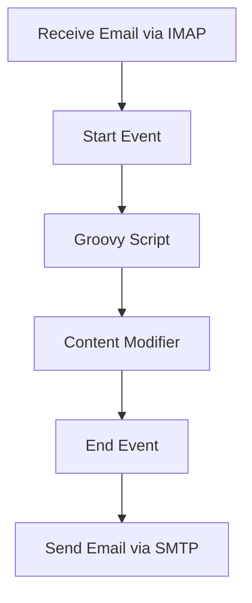

<h1 style="color: #1f4e79; text-align: center; font-size: 3em;">Task1</h1><h2 style="text-align: center;">Technical Specification Document</h2>

<table border="1" style="margin: 0 auto; border-collapse: collapse; min-width: 350px;"><tr><th style="padding: 10px; background-color: #f2f2f2; text-align: left;">Author</th><td style="padding: 10px;">Rohancherian783</td></tr><tr><th style="padding: 10px; background-color: #f2f2f2; text-align: left;">Date</th><td style="padding: 10px;">2026-01-02</td></tr><tr><th style="padding: 10px; background-color: #f2f2f2; text-align: left;">Version</th><td style="padding: 10px;">1.0.0</td></tr></table>

<h1 style="color: #1f4e79; font-size: 2.5em;">Table of Contents</h1>

1. Introduction  
&nbsp;&nbsp;&nbsp; 1.1 Purpose  
&nbsp;&nbsp;&nbsp; 1.2 Scope  

2. Integration Overview  
&nbsp;&nbsp;&nbsp; 2.1 Integration Architecture  
&nbsp;&nbsp;&nbsp; 2.2 Integration Components  

3. Integration Scenarios  
&nbsp;&nbsp;&nbsp; 3.1 Scenario Description  
&nbsp;&nbsp;&nbsp; 3.2 Data Flows  
&nbsp;&nbsp;&nbsp; 3.3 Security Requirements  

4. Error Handling and Logging  

5. Testing Validation  

6. Reference Documents  

<h1 style="color: #1f4e79;">1. Introduction</h1>

<b style="color: #1f4e79;">1.1 Purpose:</b>

The purpose of the iFlow 'Task1' is to facilitate the seamless integration of email communication within the SAP Cloud Platform Integration (CPI) environment. This integration aims to automate the process of sending and receiving emails using SMTP and IMAP protocols. The business context revolves around enhancing communication efficiency by automating notifications and alerts triggered by specific events in the system. The technical objective is to ensure that emails are sent and received reliably, with the ability to process incoming messages and extract relevant data for further processing. This integration will leverage Groovy scripts for data manipulation and content modification, ensuring that the emails sent contain the necessary information formatted correctly.

<b style="color: #1f4e79;">1.2 Scope:</b>

The scope of the 'Task1' iFlow encompasses the integration of email functionalities within the SAP CPI framework. It includes the following components:

- **Email Sending**: Utilizing SMTP to send emails to designated recipients, with customizable subject lines and body content.
- **Email Receiving**: Implementing IMAP to fetch unread emails from a specified inbox, allowing for automated processing of incoming messages.
- **Data Processing**: Using Groovy scripts to manipulate email content and headers, ensuring that the information is relevant and formatted according to business requirements.
- **Logging and Error Handling**: Capturing all events and errors during the email processing to facilitate troubleshooting and ensure reliability.

The integration will interact with external email servers (Gmail in this case) and will be designed to handle various scenarios, including sending notifications based on specific triggers and processing incoming emails for actionable data.

<h1 style="color: #1f4e79;">2. Integration Overview</h1>

<b style="color: #1f4e79;">2.1 Integration Architecture:</b>

<b style="color: #1f4e79;">2.2 Integration Components:</b>

| Component Type       | Name/Details                       | Description                                                                                     |
|----------------------|------------------------------------|-------------------------------------------------------------------------------------------------|
| Email Sender         | SMTP Configuration                 | Configured to send emails to specified recipients with customizable subject and body content.   |
| Email Receiver       | IMAP Configuration                 | Configured to fetch unread emails from a specified inbox for processing.                        |
| Groovy Script        | script30.groovy                   | Script used for processing and modifying email content before sending.                         |
| Content Modifier      | Content Modifier 1                 | Enriches the email content with necessary headers and body information.                        |
| Logging              | Event Logging                      | Captures all events and errors for monitoring and troubleshooting purposes.                     |

<h1 style="color: #1f4e79;">3. Integration Scenarios</h1>

<b style="color: #1f4e79;">3.1 Scenario Description:</b>

1. **Email Sending**: The iFlow initiates by sending an email notification to a specified recipient when a certain event occurs in the system.
2. **Email Receiving**: The iFlow periodically checks the inbox for unread emails, processes them, and extracts relevant information for further actions.
3. **Data Processing**: Upon receiving an email, the iFlow uses a Groovy script to manipulate the content and headers, preparing it for the next steps in the workflow.

<b style="color: #1f4e79;">3.2 Data Flows:</b>

- **Sending Email**:
  - Triggered by an event in the system.
  - Email content is generated and sent via SMTP to the recipient.

- **Receiving Email**:
  - The iFlow polls the inbox using IMAP.
  - Unread emails are fetched and processed.
  - Relevant data is extracted and utilized for further processing.

<b style="color: #1f4e79;">3.3 Security Requirements:</b>

| Security Aspect         | Description                                                                 |
|-------------------------|-----------------------------------------------------------------------------|
| Authentication          | Basic authentication is used for both SMTP and IMAP connections.           |
| Data Encryption         | Emails are sent using secure protocols (STARTTLS for SMTP and IMAPS for IMAP). |
| Access Control          | Ensure that only authorized users can send and receive emails through the iFlow. |

<h1 style="color: #1f4e79;">4. Error Handling and Logging</h1>

The iFlow incorporates comprehensive error handling mechanisms to capture and log any issues that arise during the email sending and receiving processes. All events, including successful transactions and errors, are logged for monitoring purposes. This allows for quick identification and resolution of issues, ensuring the reliability of the integration.

<h1 style="color: #1f4e79;">5. Testing Validation</h1>

Testing will be conducted to validate the functionality of the iFlow, ensuring that emails are sent and received as expected. This includes unit testing of the Groovy scripts, integration testing of the email components, and end-to-end testing of the entire workflow.

<h1 style="color: #1f4e79;">6. Reference Documents</h1>

- SAP Cloud Platform Integration Documentation
- Email Protocol Specifications (SMTP, IMAP)
- Groovy Scripting Guide for SAP CPI
