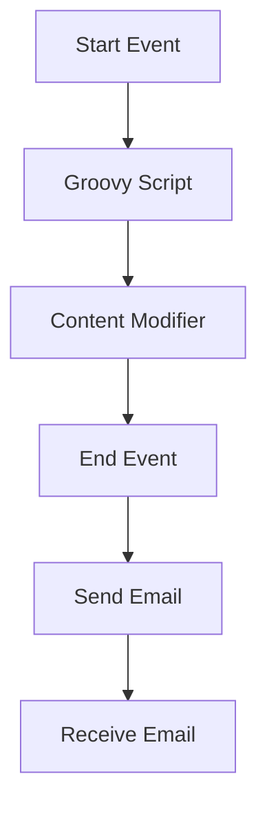

<h1 style="color: #1f4e79; text-align: center; font-size: 3.5em;">Task1</h1><h2 style="text-align: center; font-size: 2em;">Technical Specification Document</h2>

<table><tr><th>Author</th><td>Rohancherian783</td></tr><tr><th>Date</th><td>2026-01-02</td></tr><tr><th>Version</th><td>1.0.0</td></tr></table>

<h1 style="color: #1f4e79; font-size: 2.5em;">Table of Contents</h1>
1. Introduction  
&nbsp;&nbsp;&nbsp; 1.1 Purpose  
&nbsp;&nbsp;&nbsp; 1.2 Scope  
2. Integration Overview  
&nbsp;&nbsp;&nbsp; 2.1 Integration Architecture  
&nbsp;&nbsp;&nbsp; 2.2 Integration Components  
3. Integration Scenarios  
&nbsp;&nbsp;&nbsp; 3.1 Scenario Description  
&nbsp;&nbsp;&nbsp; 3.2 Data Flows  
&nbsp;&nbsp;&nbsp; 3.3 Security Requirements  
4. Error Handling and Logging  
5. Testing Validation  
6. Reference Documents  

<h1 style="color: #1f4e79;">1. Introduction</h1>
<b style="color: #1f4e79;">1.1 Purpose:</b>

The purpose of this report is to provide a comprehensive analysis of the integration flow 'Task1' within the SAP Cloud Platform Integration (CPI) environment. This integration flow is designed to facilitate the seamless exchange of data between different systems, specifically focusing on email communication. The report will detail the technical architecture, components, scenarios, and testing validation to ensure that the integration meets the business requirements effectively.

<b style="color: #1f4e79;">1.2 Scope:</b>

This report covers the integration flow 'Task1', which involves sending and receiving emails through SMTP and IMAP protocols. The scope includes:

- An overview of the integration architecture and components involved in the flow.
- Detailed descriptions of the integration scenarios, including the data flows and security requirements.
- Error handling and logging mechanisms implemented within the integration flow.
- Testing validation to ensure the integration functions as intended and meets the specified business requirements.

The report aims to provide stakeholders with a clear understanding of the integration flow's functionality, technical design, and operational aspects.

<h1 style="color: #1f4e79;">2. Integration Overview</h1>
<b style="color: #1f4e79;">2.1 Integration Architecture:</b> 

<b style="color: #1f4e79;">2.2 Integration Components:</b>

| Component Type       | Name/Details                          | Description                                                                 |
|----------------------|---------------------------------------|-----------------------------------------------------------------------------|
| EndpointSender       | SMTP Server                           | Sends emails to specified recipients using SMTP protocol.                  |
| EndpointReceiver      | IMAP Server                           | Receives emails from the inbox using IMAP protocol.                        |
| Integration Process   | Integration Process                   | Orchestrates the flow of data between the sender and receiver components.  |
| Groovy Script         | script30.groovy                      | Executes custom logic to manipulate data before sending.                   |
| Content Modifier      | Content Modifier 1                    | Modifies the email content and headers before sending.                     |

<h1 style="color: #1f4e79;">3. Integration Scenarios</h1>
<b style="color: #1f4e79;">3.1 Scenario Description:</b>

The integration flow 'Task1' encompasses two primary scenarios: sending and receiving emails. The flow initiates with a start event that triggers the Groovy script to process the incoming data. The processed data is then modified using the Content Modifier before being sent out as an email. The flow also includes a mechanism to receive emails from a specified inbox.

<b style="color: #1f4e79;">3.2 Data Flows:</b>

1. **Sending Email:**
   - The flow starts with a trigger event.
   - The Groovy script processes the input data.
   - The Content Modifier enriches the email content and sets the subject.
   - The email is sent to the recipient using the SMTP server.

2. **Receiving Email:**
   - The flow polls the inbox using the IMAP server.
   - Unread emails are fetched and processed.
   - The flow can trigger further actions based on the content of the received emails.

<b style="color: #1f4e79;">3.3 Security Requirements:</b>

- Basic authentication is disabled for the SMTP and IMAP servers.
- SSL/TLS encryption is utilized for secure email transmission.
- Access control settings are configured to restrict unauthorized access to the integration flow.

<h1 style="color: #1f4e79;">4. Error Handling and Logging</h1>

The integration flow implements comprehensive error handling and logging mechanisms. All events are logged, and errors are captured to ensure that any issues can be diagnosed and resolved promptly. The flow is designed to return exceptions to the sender, allowing for better visibility into any failures that occur during processing.

<h1 style="color: #1f4e79;">5. Testing Validation</h1>

**Testing Details – Sheet: Testing**

| Test Case ID | Scenario                                               | Expected Outcome                          |
|--------------|-------------------------------------------------------|-------------------------------------------|
| TC01         | Create customer account in SCv2 (Individual)         | Contact created in CDC                    |
| TC02         | Create customer account in SCv2 (Company) with a contact person | Group and contact created in CDC          |
| TC03         | Assign contact to a customer account                  | Contact assigned to a group in CDC        |
| TC04         | Update contact details (except email)                 | Contact updated in CDC                     |
| TC05         | Update account details                                 | Group details updated in CDC               |
| TC06         | Lead created in SCv2                                  | Lite account created in CDC                |

<h1 style="color: #1f4e79;">6. Reference Documents</h1>

- SAP Cloud Platform Integration Documentation
- BPMN 2.0 Specification
- Email Protocols (SMTP, IMAP) Documentation
