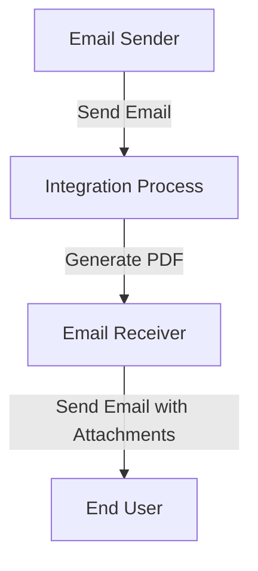

<h1 style="color: #1f4e79; font-size: 3em; text-align: center; margin-top: 5px; margin-bottom: 5px;">Task1</h1><h2 style="color: #1f4e79; font-size: 1.5em; text-align: center; margin-top: 5px; margin-bottom: 0px;">SAP CPI Technical Specification Document</h2>

<table border="1" style="width: 400px; border-collapse: collapse; border-color: black; margin: 0 auto; text-align: left;">
  <tr><td style="width: 30%; padding: 5px;">**Author:**</td><td style="padding: 5px;">Rohancherian783</td></tr>
  <tr><td style="padding: 5px;">**Date:**</td><td style="padding: 5px;">2025-12-16</td></tr>
  <tr><td style="padding: 5px;">**Version (Commit):**</td><td style="padding: 5px;">307f608</td></tr>
</table>

<h1 style="color: #1f4e79; font-size: 2.5em;">Table of Contents</h1>
1. Introduction 
1.1 Purpose 
1.2 Scope 
2. Integration Overview 
2.1 Integration Architecture 
2.2 Integration Components 
3. Integration Scenarios 
3.1 Scenario Description 
3.2 Data Flows 
3.3 Security Requirements 
4. Error Handling and Logging 
5. Testing Validation 
6. Reference Documents 

<h1 style="color: #1f4e79;">1. Introduction</h1>

<h2 style="color: #1f4e79;">1.1 Purpose</h2>
The purpose of this iFlow, named 'Task1', is to process incoming emails, extract their content, and generate PDF reports based on the email body. The generated PDFs are then attached to an outgoing email.

<h2 style="color: #1f4e79;">1.2 Scope</h2>
This iFlow interacts with email systems to receive and send emails. It processes email content, generates PDF documents, and manages attachments. The systems affected include the email server for both sending and receiving emails.

<h1 style="color: #1f4e79;">2. Integration Overview</h1>

<h2 style="color: #1f4e79;">2.1 Integration Architecture</h2>
The integration architecture consists of a sender and receiver email system, with an integration process that handles the transformation of email content into PDF format.

<h2 style="color: #1f4e79;">2.2 Integration Components</h2>
- **Sender System**: Email server that receives emails.
- **Receiver System**: Email server that sends emails.
- **Adapters Used**: 
  - IMAP Adapter for receiving emails.
  - SMTP Adapter for sending emails.

<h1 style="color: #1f4e79;">3. Integration Scenarios</h1>

<h2 style="color: #1f4e79;">3.1 Scenario Description</h2>
The iFlow begins by receiving an email via the IMAP adapter. It extracts the email body, generates two PDF documents from the content, and then sends these PDFs as attachments in a new email via the SMTP adapter.

<h2 style="color: #1f4e79;">3.2 Data Flows</h2>
The data flow involves:
1. Receiving an email.
2. Extracting the email body using JavaMail API.
3. Generating PDFs using iText library.
4. Attaching the PDFs to a new email and sending it.

**Groovy Script Explanations**:
- **script1.groovy**: Extracts email content using JavaMail.
- **script3.groovy**: Converts the CPI body into an InputStream and parses it.
- **script20.groovy**: Generates two PDFs and prepares them for attachment.

<h2 style="color: #1f4e79;">3.3 Security Requirements</h2>
The iFlow does not require basic authentication for the email sender. However, it is essential to ensure that the email server configurations are secure and that sensitive data is handled appropriately.

<h1 style="color: #1f4e79;">4. Error Handling and Logging</h1>
Error handling is implemented within the Groovy scripts. If an error occurs during PDF generation, the error message is logged, and a plain text response is sent back instead of the PDF.

<h1 style="color: #1f4e79;">5. Testing Validation</h1>
Key testing scenarios include:
- Sending an email with various content types (plain text, HTML).
- Validating the generated PDFs for correct content.
- Ensuring that the email with attachments is sent successfully.

<h1 style="color: #1f4e79;">6. Reference Documents</h1>
- iFlow Content: `Task1.iflw`
- Groovy Scripts: `script1.groovy`, `script3.groovy`, `script20.groovy`, etc.
- XSLT Files: Not applicable for this iFlow.
