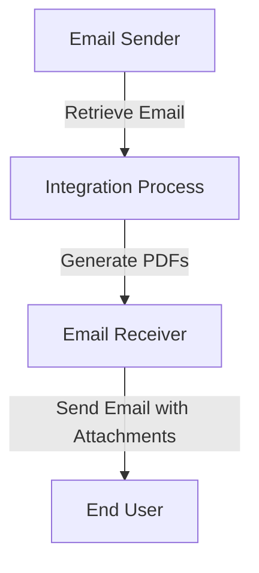

<h2 style="color: #1f4e79;">Table of Contents</h2>

1. Introduction  
&nbsp;&nbsp;1.1 Purpose  
&nbsp;&nbsp;1.2 Scope  

2. Integration Overview  
&nbsp;&nbsp;2.1 Integration Architecture  
&nbsp;&nbsp;2.2 Integration Components  

3. Integration Scenarios  
&nbsp;&nbsp;3.1 Scenario Description  
&nbsp;&nbsp;3.2 Data Flows  
&nbsp;&nbsp;3.3 Security Requirements  

4. Error Handling and Logging  

5. Testing Validation  

6. Reference Documents  

# 1. Introduction

## 1.1 Purpose
The purpose of this iFlow, named 'Task1', is to automate the process of converting email content into PDF documents. It retrieves emails, extracts their content, generates PDF files from this content, and sends these PDFs as email attachments.

## 1.2 Scope
This iFlow integrates with email systems to receive messages and utilizes the iText library to create PDF documents. The affected systems include the email sender and receiver, as well as the SAP Cloud Platform Integration (CPI) environment where the iFlow is deployed.

# 2. Integration Overview

## 2.1 Integration Architecture
The integration architecture consists of a sender and receiver system, where the sender retrieves emails and the receiver sends the generated PDFs. The iFlow processes the email content, generates PDFs, and manages the email attachments.

## 2.2 Integration Components
- **Sender System**: Email system that sends emails to the iFlow.
- **Receiver System**: Email system that receives the generated PDF attachments.
- **Adapters Used**: 
  - Mail Adapter for receiving emails (IMAP).
  - Mail Adapter for sending emails (SMTP).

# 3. Integration Scenarios

## 3.1 Scenario Description
1. The iFlow starts by receiving an email via the Mail Sender adapter.
2. The email content is extracted using JavaMail API.
3. The content is processed to generate two PDF documents.
4. The PDFs are attached to a new email and sent to the specified recipient.

## 3.2 Data Flows
The data flow involves the following steps:
- **Email Retrieval**: The email body is extracted from the incoming email using the JavaMail API.
- **PDF Generation**: Multiple Groovy scripts are used to create PDFs from the email content. The scripts utilize the iText library to generate and manipulate PDF documents.
- **Attachment Handling**: The generated PDFs are attached to the outgoing email using the CamelAttachments header.

### Groovy Script Explanations
- **script1.groovy**: Extracts email content and sets it as the message body.
- **script3.groovy**: Parses the email content using JavaMail API.
- **script17.groovy**: Generates a single PDF from the email body.
- **script26.groovy**: Merges two PDFs into one and sets it as the email body.

## 3.3 Security Requirements
- **Authentication**: Basic authentication is not enabled for the sender.
- **Email Security**: The email content is processed securely, ensuring that sensitive information is handled appropriately.
- **Transport Security**: The email transmission uses secure protocols (IMAP and SMTP).

# 4. Error Handling and Logging
Error handling is implemented within the Groovy scripts to catch exceptions during PDF generation. If an error occurs, a message indicating the failure is set as the body of the message, and the content type is adjusted accordingly. Logging is performed to capture the details of the incoming email and any errors encountered during processing.

# 5. Testing Validation
Key testing scenarios include:
- Sending emails with various content types (plain text, HTML).
- Validating the generation of PDFs from different email formats.
- Ensuring that the PDFs are correctly attached and sent to the recipient.

# 6. Reference Documents
- **iFlow Content**: `Task1.iflw`
- **Groovy Scripts**: 
  - `script1.groovy`
  - `script3.groovy`
  - `script17.groovy`
  - `script26.groovy`
- **PDF Generation Library**: iText library documentation.
