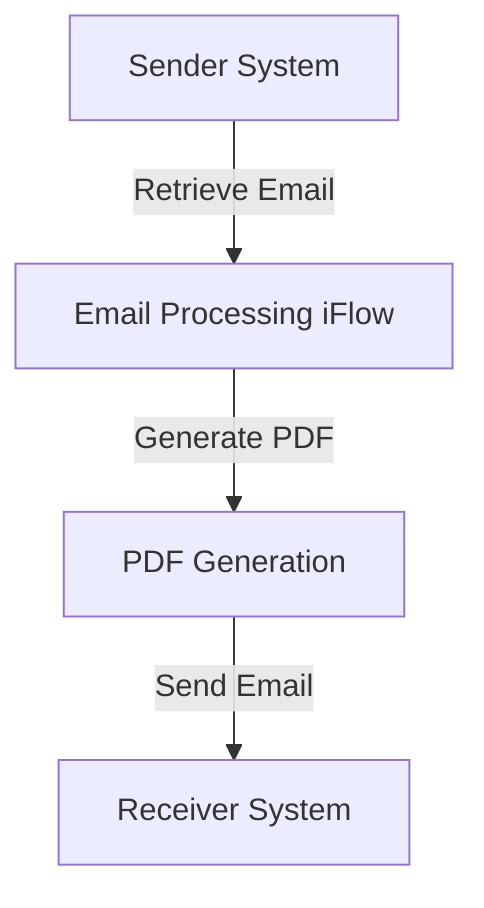

<h1 style="color: #1f4e79; font-size: 3em; text-align: center; margin-top: 5px; margin-bottom: 5px;">Task1</h1><h2 style="color: #1f4e79; font-size: 1.5em; text-align: center; margin-top: 5px; margin-bottom: 0px;">SAP CPI Technical Specification Document</h2>

<table border="1" style="width: 400px; border-collapse: collapse; border-color: black; margin: 0 auto; text-align: left;">
  <tr><td style="width: 30%; padding: 5px;">**Author:**</td><td style="padding: 5px;">Rohancherian783</td></tr>
  <tr><td style="padding: 5px;">**Date:**</td><td style="padding: 5px;">2025-12-15</td></tr>
  <tr><td style="padding: 5px;">**Version (Commit):**</td><td style="padding: 5px;">b9efcad</td></tr>
</table>

<h1 style="color: #1f4e79; font-size: 2.5em;">Table of Contents</h1>
1. Introduction 
&nbsp;&nbsp;1.1 Purpose 
&nbsp;&nbsp;1.2 Scope 
2. Integration Overview 
&nbsp;&nbsp;2.1 Integration Architecture 
&nbsp;&nbsp;2.2 Integration Components 
3. Integration Scenarios 
&nbsp;&nbsp;3.1 Scenario Description 
&nbsp;&nbsp;3.2 Data Flows 
&nbsp;&nbsp;3.3 Security Requirements 
4. Error Handling and Logging 
5. Testing Validation 
6. Reference Documents 

<h1 style="color: #1f4e79;">1. Introduction</h1>

<h2 style="color: #1f4e79;">1.1 Purpose</h2>
The purpose of this iFlow is to process incoming emails, extract their content, and generate PDF reports based on the email body. The generated PDFs are then attached to an outgoing email.

<h2 style="color: #1f4e79;">1.2 Scope</h2>
This iFlow integrates with email systems to receive messages and send PDF attachments. It primarily interacts with the email sender and receiver systems, utilizing SMTP and IMAP protocols for sending and receiving emails, respectively.

<h1 style="color: #1f4e79;">2. Integration Overview</h1>

<h2 style="color: #1f4e79;">2.1 Integration Architecture</h2>
The integration architecture consists of a sender system that retrieves emails and a receiver system that sends out emails with PDF attachments. The iFlow processes the email content, generates PDFs, and manages the email communication.

<h2 style="color: #1f4e79;">2.2 Integration Components</h2>
- **Sender System**: Uses IMAP to retrieve emails.
- **Receiver System**: Uses SMTP to send emails.
- **Adapters**: IMAP and SMTP adapters are utilized for email communication.

<h1 style="color: #1f4e79;">3. Integration Scenarios</h1>

<h2 style="color: #1f4e79;">3.1 Scenario Description</h2>
The iFlow begins by receiving an email through the IMAP adapter. It extracts the email body, generates two PDF documents from the content, and sends these PDFs as attachments in a new email via the SMTP adapter.

<h2 style="color: #1f4e79;">3.2 Data Flows</h2>
The data flow involves:
1. Receiving an email.
2. Extracting the email body using JavaMail API.
3. Generating PDFs using iText library.
4. Attaching the PDFs to a new email and sending it.

The Groovy scripts used in the iFlow handle various tasks such as email extraction, PDF generation, and setting email headers.

<h2 style="color: #1f4e79;">3.3 Security Requirements</h2>
The iFlow does not require basic authentication for the sender system. However, it is essential to ensure that the email accounts used for sending and receiving emails are secured with strong passwords and, if possible, two-factor authentication.

<h1 style="color: #1f4e79;">4. Error Handling and Logging</h1>
Error handling is implemented through try-catch blocks in the Groovy scripts. Any exceptions during PDF generation or email processing are logged, and appropriate error messages are set in the message body.

<h1 style="color: #1f4e79;">5. Testing Validation</h1>
Key testing scenarios include:
- Validating the extraction of email content.
- Ensuring that PDFs are generated correctly.
- Verifying that the emails are sent with the correct attachments.

<h1 style="color: #1f4e79;">6. Reference Documents</h1>
- iFlow Content: `Task1.iflw`
- Groovy Scripts: 
  - `script1.groovy`
  - `script2.groovy`
  - `script3.groovy`
  - `script4.groovy`
  - `script5.groovy`
  - `script6.groovy`
  - `script7.groovy`
  - `script8.groovy`
  - `script9.groovy`
  - `script10.groovy`
  - `script11.groovy`
  - `script12.groovy`
  - `script13.groovy`
  - `script14.groovy`
  - `script15.groovy`
  - `script16.groovy`
  - `script17.groovy`
  - `script18.groovy`
  - `script19.groovy`
  - `script20.groovy`
  - `script21.groovy`
  - `script22.groovy`
  - `script23.groovy`
  - `script24.groovy`
  - `script25.groovy`
  - `script26.groovy`
  - `script27.groovy`
  - `script28.groovy`
  - `script29.groovy`
  - `script30.groovy`
- XSLT files: None used in this iFlow.
