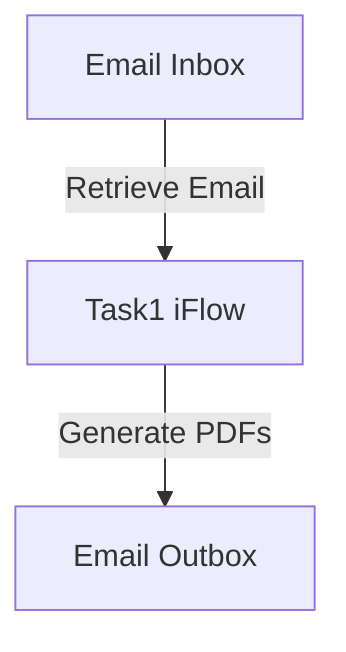

# 1. Introduction

## 1.1 Purpose
The purpose of this iFlow, named 'Task1', is to process incoming emails, extract their content, and generate PDF reports based on the email body. The generated PDFs are then attached to an outgoing email, allowing users to receive the content in a structured format.

## 1.2 Scope
This iFlow interacts with email systems, specifically using SMTP and IMAP protocols for sending and receiving emails. It processes email content, generates PDF documents, and manages attachments. The systems affected include the email server (Gmail in this case) and the SAP Cloud Platform Integration (CPI) environment.

# 2. Integration Overview

## 2.1 Integration Architecture
The integration architecture consists of a sender system (email inbox) that retrieves emails and a receiver system (email outbox) that sends emails with attached PDFs. The iFlow orchestrates the flow of data between these systems, ensuring that the email content is transformed into PDF format.

## 2.2 Integration Components
- **Sender System**: Email inbox (IMAP)
- **Receiver System**: Email outbox (SMTP)
- **Adapter Types Used**: 
  - IMAP Adapter for receiving emails
  - SMTP Adapter for sending emails

# 3. Integration Scenarios

## 3.1 Scenario Description
1. The iFlow starts by retrieving emails from the inbox using the IMAP adapter.
2. The email content is extracted and processed to generate two PDF documents.
3. The generated PDFs are attached to an outgoing email.
4. The email is sent to the specified recipient using the SMTP adapter.

## 3.2 Data Flows
The iFlow utilizes various Groovy scripts to handle the extraction of email content, PDF generation, and attachment management. Key scripts include:
- **script1.groovy**: Extracts email body from the incoming message.
- **script21.groovy**: Generates two PDFs from the email body and prepares them for attachment.
- **script30.groovy**: Cleans the email body and sets the subject for the outgoing email.

### Groovy Script Explanations
- **script1.groovy**: Uses JavaMail API to parse the incoming email and extract the content.
- **script21.groovy**: Creates two PDFs using iText library and attaches them to the message.
- **script30.groovy**: Cleans the email body by removing disclaimers and unnecessary formatting before PDF generation.

## 3.3 Security Requirements
The iFlow does not require basic authentication for the sender system. However, it uses secure connections (SSL/TLS) for both IMAP and SMTP protocols to ensure data security during transmission. Credentials for the email accounts are managed securely within the CPI environment.

# 4. Error Handling and Logging
Error handling is implemented within the Groovy scripts, particularly in `script5.groovy`, which logs exceptions during PDF generation. The iFlow also logs important events and data for debugging purposes, ensuring that any issues can be traced and resolved efficiently.

# 5. Testing Validation
Key testing scenarios include:
- Validating the retrieval of emails from the inbox.
- Ensuring that the PDF generation works correctly with various email contents.
- Testing the attachment of PDFs to the outgoing email.
- Verifying that the email is sent successfully to the intended recipient.

# 6. Reference Documents
- iFlow Content: `Task1.iflw`
- Groovy Scripts: 
  - `script1.groovy`
  - `script21.groovy`
  - `script30.groovy`
  - Additional scripts for PDF generation and email handling.
