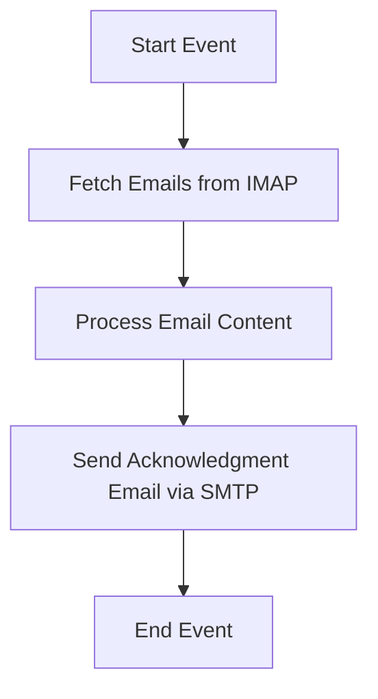

<h1 style="color: #1f4e79; text-align: center; font-size: 3.5em; margin-bottom: 10px;">Task1</h1><h2 style="text-align: center; font-size: 1.8em; font-weight: normal; margin-top: 0;">Technical Specification Document</h2>

<table style="width: 60%; margin: 0 auto;"><tr><th>Author</th><td>Rohancherian783</td></tr><tr><th>Date</th><td>2026-01-05</td></tr><tr><th>Version</th><td>1.0.0</td></tr></table>

<h1 style="color: #1f4e79; font-size: 2.5em;">Table of Contents</h1>
1. Introduction  
&nbsp;&nbsp;&nbsp; 1.1 Purpose  
&nbsp;&nbsp;&nbsp; 1.2 Scope  
2. Integration Overview  
&nbsp;&nbsp;&nbsp; 2.1 Integration Architecture  
&nbsp;&nbsp;&nbsp; 2.2 Integration Components  
3. Integration Scenarios  
&nbsp;&nbsp;&nbsp; 3.1 Scenario Description  
&nbsp;&nbsp;&nbsp; 3.2 Data Flows  
&nbsp;&nbsp;&nbsp; 3.3 Security Requirements  
4. Error Handling and Logging  
5. Testing Validation  
6. Reference Documents  

<h1 style="color: #1f4e79;">1. Introduction</h1>
<b style="color: #1f4e79;">1.1 Purpose:</b>

The iFlow 'Task1' is designed to automate the process of receiving emails from a specified mailbox, processing the content, and sending an acknowledgment email to a designated recipient. The business problem it addresses is the need for efficient email handling and notification in a corporate environment, where timely responses to incoming communications are critical. 

The trigger mechanism for this iFlow is based on a scheduled polling of the email inbox using the IMAP protocol. The iFlow retrieves unread emails, processes their content, and subsequently sends an email using the SMTP protocol. The desired technical outcome is to ensure that all relevant emails are processed and acknowledged without manual intervention, thereby improving operational efficiency and response times.

<b style="color: #1f4e79;">1.2 Scope:</b>

The scope of this iFlow includes the following components:

- **Endpoints**: 
  - **Sender**: An IMAP email server (imap.gmail.com:993) to fetch unread emails from the inbox.
  - **Receiver**: An SMTP email server (smtp.gmail.com:587) to send acknowledgment emails.

- **Data Transformation Logic**: 
  - The iFlow includes a Groovy script that processes the email content and modifies the email headers before sending the acknowledgment.

- **Target Systems**: 
  - The iFlow interacts with Gmail as both the sender and receiver of emails.

**Constraints**:
- The iFlow is limited to handling emails in plain text or HTML format.
- It only processes unread emails and deletes them after processing.
- The iFlow does not handle attachments.

**Exclusions**:
- The iFlow does not include error handling for email delivery failures or invalid email formats.

<h1 style="color: #1f4e79;">2. Integration Overview</h1>
<b style="color: #1f4e79;">2.1 Integration Architecture:</b>

<b style="color: #1f4e79;">2.2 Integration Components:</b>

| Component                | Role                                   | Details                                                                                     |
|--------------------------|----------------------------------------|---------------------------------------------------------------------------------------------|
| IMAP Adapter (Sender)    | Fetches unread emails                  | Connects to the Gmail inbox to retrieve unread emails using IMAP protocol.                 |
| SMTP Adapter (Receiver)   | Sends acknowledgment emails            | Sends processed email content to the specified recipient using SMTP protocol.              |
| Groovy Script            | Processes email content                | Contains logic to modify email headers and body before sending acknowledgment.             |
| Content Modifier         | Modifies email headers                 | Sets the subject of the acknowledgment email based on the original email's subject.       |

<h1 style="color: #1f4e79;">3. Integration Scenarios</h1>
<b style="color: #1f4e79;">3.1 Scenario Description:</b>

1. **Start Event**: The iFlow is triggered based on a scheduled interval defined in the configuration.
   
2. **Fetch Emails from IMAP**: The iFlow connects to the Gmail inbox using the IMAP adapter and retrieves unread emails. The maximum number of emails fetched per poll is set to 20.

3. **Process Email Content**: The Groovy script processes the content of each email. It extracts relevant information such as the subject and body, and prepares it for the acknowledgment email.

4. **Send Acknowledgment Email via SMTP**: The SMTP adapter sends an acknowledgment email to the specified recipient, including the original subject and body content.

5. **End Event**: The iFlow completes the process and waits for the next scheduled trigger.

<b style="color: #1f4e79;">3.2 Data Flows:</b>

- **Incoming Data**: Unread emails fetched from the Gmail inbox.
- **Outgoing Data**: Acknowledgment emails sent to the designated recipient.

<b style="color: #1f4e79;">3.3 Security Requirements:</b>

- The iFlow uses secure connections (IMAPS and SMTPS) to ensure data integrity and confidentiality during email transmission.
- Basic authentication is used for connecting to the email servers, and credentials should be securely managed.

<h1 style="color: #1f4e79;">4. Error Handling and Logging</h1>

The iFlow includes logging for all events, which helps in tracking the flow of emails and any potential issues. Error handling is minimal; if an email fails to send, it will not be retried, and the error will be logged for manual review.

<h1 style="color: #1f4e79;">5. Testing Validation</h1>

**Testing Details – Sheet: Testing**

| Test Case ID | Scenario                          | Expected Outcome                                      |
| :---         | :---                              | :---                                                 |
| TC01         | Fetch unread emails               | Successfully retrieves unread emails from the inbox. |
| TC02         | Process email content             | Correctly modifies email headers and body.           |
| TC03         | Send acknowledgment email         | Acknowledgment email is sent to the specified recipient. |

<h1 style="color: #1f4e79;">6. Reference Documents</h1>

- SAP CPI Documentation
- Email Protocol Specifications (IMAP, SMTP)
- Groovy Scripting Guide for SAP CPI
