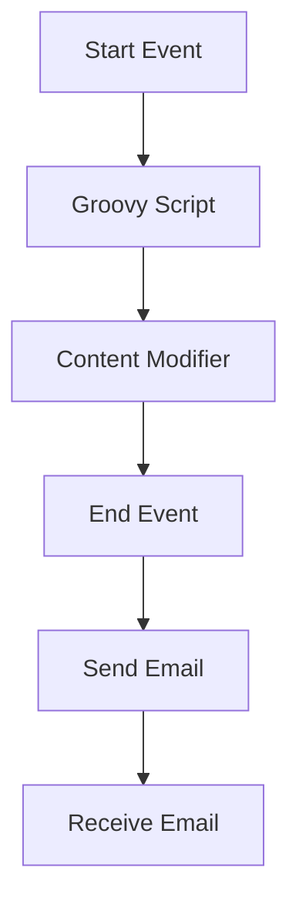

<h1 style="color: #1f4e79; text-align: center; font-size: 3.5em;">Task1</h1><h2 style="text-align: center; font-size: 2em;">Technical Specification Document</h2>

<table><tr><th>Author</th><td>Rohancherian783</td></tr><tr><th>Date</th><td>2026-01-02</td></tr><tr><th>Version</th><td>1.0.0</td></tr></table>

<h1 style="color: #1f4e79; font-size: 2.5em;">Table of Contents</h1>
1. Introduction  
&nbsp;&nbsp;&nbsp; 1.1 Purpose  
&nbsp;&nbsp;&nbsp; 1.2 Scope  
2. Integration Overview  
&nbsp;&nbsp;&nbsp; 2.1 Integration Architecture  
&nbsp;&nbsp;&nbsp; 2.2 Integration Components  
3. Integration Scenarios  
&nbsp;&nbsp;&nbsp; 3.1 Scenario Description  
&nbsp;&nbsp;&nbsp; 3.2 Data Flows  
&nbsp;&nbsp;&nbsp; 3.3 Security Requirements  
4. Error Handling and Logging  
5. Testing Validation  
6. Reference Documents  

<h1 style="color: #1f4e79;">1. Introduction</h1>
<b style="color: #1f4e79;">1.1 Purpose:</b>
The purpose of this report is to provide a comprehensive analysis of the integration flow 'Task1' within the SAP Cloud Platform Integration (CPI) environment. This report outlines the integration architecture, components, scenarios, and testing validation to ensure the successful implementation of the integration flow.

<b style="color: #1f4e79;">1.2 Scope:</b>
This report covers the integration flow 'Task1', detailing its architecture, components, and scenarios. It also includes error handling, logging mechanisms, and testing validation to ensure the integration meets the specified requirements.

<h1 style="color: #1f4e79;">2. Integration Overview</h1>
<b style="color: #1f4e79;">2.1 Integration Architecture:</b> 

<b style="color: #1f4e79;">2.2 Integration Components:</b>
| Component Type      | Name/Details                     | Description                                      |
|---------------------|----------------------------------|--------------------------------------------------|
| Endpoint Sender     | Sender                           | Initiates the integration flow                   |
| Endpoint Receiver    | Receiver                         | Receives the processed data                       |
| Integration Process  | Process_1                       | Main process handling the integration logic      |
| Groovy Script       | script30.groovy                 | Script for processing data                        |
| Content Modifier     | Content Modifier 1              | Modifies the message content before sending      |

<h1 style="color: #1f4e79;">3. Integration Scenarios</h1>
<b style="color: #1f4e79;">3.1 Scenario Description:</b>
1. Trigger the integration flow via a start event.
2. Execute a Groovy script to process incoming data.
3. Modify the content of the message.
4. Send an email to the specified recipient.
5. Receive an email and process it accordingly.

<b style="color: #1f4e79;">3.2 Data Flows:</b>
- Data is received from the sender endpoint.
- The Groovy script processes the incoming data.
- The content modifier enriches the message with additional information.
- The processed message is sent to the receiver endpoint.

<b style="color: #1f4e79;">3.3 Security Requirements:</b>
| Security Aspect           | Requirement                     |
|---------------------------|---------------------------------|
| Authentication            | Basic Authentication disabled    |
| Data Encryption           | None specified                   |
| Access Control            | Not required                     |

<h1 style="color: #1f4e79;">4. Error Handling and Logging</h1>
Error handling is implemented to capture any exceptions during the integration process. All events are logged for monitoring and troubleshooting purposes.

<h1 style="color: #1f4e79;">5. Testing Validation</h1>
**Testing Details – Sheet: Testing**
| Test Case ID | Scenario                                           | Expected Outcome                                      |
|--------------|----------------------------------------------------|------------------------------------------------------|
| TC01         | Trigger integration flow with valid data          | Integration flow executes successfully                |
| TC02         | Trigger integration flow with missing subject      | Error logged indicating missing subject               |
| TC03         | Send email to valid recipient                      | Email is sent successfully to the recipient          |
| TC04         | Send email with invalid SMTP configuration         | Error logged indicating SMTP configuration issue      |
| TC05         | Receive email and process it                       | Email is processed and logged successfully            |
| TC06         | Trigger integration flow with invalid data format  | Error logged indicating data format issue             |

<h1 style="color: #1f4e79;">6. Reference Documents</h1>
- SAP Cloud Platform Integration Documentation
- Integration Flow Design Guidelines
- Error Handling Best Practices in CPI
