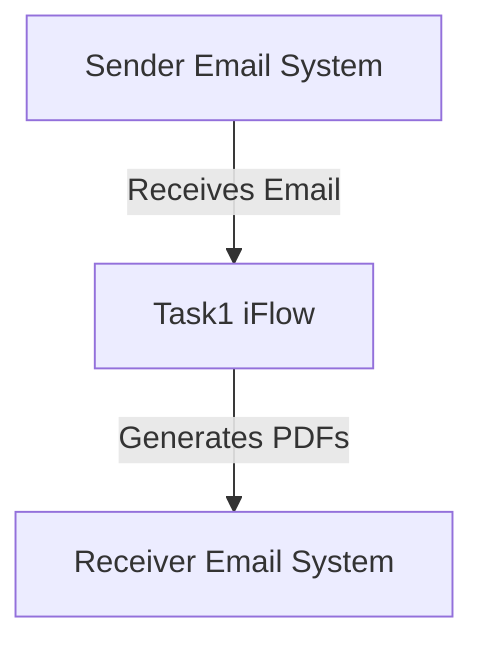

<div style="float: left; text-align: left;"></div><div style="float: right; text-align: right;"></div><div style="clear: both;"></div>

<div style="height: 80px;"></div><h1 style="color: #1f4e79; font-size: 3em; text-align: center; margin-top: 5px; margin-bottom: 5px;">Task1</h1><h2 style="color: #1f4e79; font-size: 1.5em; text-align: center; margin-top: 5px; margin-bottom: 0px;">SAP CPI Technical Specification Document</h2><div style="height: 100px;"></div><div style="width: 100%; text-align: center;">
<table border="1" style="width: 400px; border-collapse: collapse; border-color: black; margin: 0 auto; text-align: left;">
  <tr><td style="width: 30%; padding: 5px;">**Author:**</td><td style="padding: 5px;">Rohancherian783</td></tr>
  <tr><td style="padding: 5px;">**Date:**</td><td style="padding: 5px;">2025-12-11</td></tr>
  <tr><td style="padding: 5px;">**Version (Commit):**</td><td style="padding: 5px;">9c3c7e4</td></tr>
</table>
</div>
<div style="page-break-after: always;"></div>

<div style="float: left; text-align: left;"></div><div style="float: right; text-align: right;"></div><div style="clear: both;"></div>

```markdown

<h1 style="color: #1f4e79; font-size: 2.5em;">Table of Contents</h1>

1. Introduction
    1.1 Purpose
    1.2 Scope
2. Integration Overview
    2.1 Integration Architecture
    2.2 Integration Components
3. Integration Scenarios
    3.1 Scenario Description
    3.2 Data Flows
    3.3 Security Requirements
4. Error Handling and Logging
5. Testing Validation
6. Reference Documents


<div style="page-break-after: always;"></div>

<div style="float: left; text-align: left;"></div><div style="float: right; text-align: right;"></div><div style="clear: both;"></div>


<h1 style="color: #1f4e79;">1. Introduction</h1>

<h2 style="color: #1f4e79;">1.1 Purpose</h2>
The purpose of this iFlow, named 'Task1', is to process incoming emails, extract their content, and generate PDF reports based on the email body. The generated PDFs are then attached to an outgoing email.

<h2 style="color: #1f4e79;">1.2 Scope</h2>
This iFlow interacts with email systems to receive and send emails. It processes email content, generates PDF documents, and handles attachments. The systems affected include the email server for both sending and receiving emails.

<h1 style="color: #1f4e79;">2. Integration Overview</h1>

<h2 style="color: #1f4e79;">2.1 Integration Architecture</h2>
The integration architecture consists of a sender email system that receives emails, processes them through the iFlow, and sends the generated PDF reports to a receiver email system.



<h2 style="color: #1f4e79;">2.2 Integration Components</h2>
- **Sender System**: Email server (IMAP) for receiving emails.
- **Receiver System**: Email server (SMTP) for sending emails.
- **Adapters Used**: 
  - IMAP Adapter for receiving emails.
  - SMTP Adapter for sending emails.

<h1 style="color: #1f4e79;">3. Integration Scenarios</h1>

<h2 style="color: #1f4e79;">3.1 Scenario Description</h2>
The iFlow operates as follows:
1. An email is received by the sender system.
2. The email content is extracted and processed.
3. Two PDFs are generated from the email content.
4. The PDFs are attached to a new email and sent to the receiver system.

<h2 style="color: #1f4e79;">3.2 Data Flows</h2>
The mapping logic involves extracting the email body and generating two separate PDFs. The Groovy scripts handle the PDF generation and attachment processes. Key scripts include:
- **script23.groovy**: Extracts email content and generates two PDFs, merging them into one attachment.
- **script24.groovy**: Creates two separate PDFs and prepares them for attachment.
- **script30.groovy**: Cleans the email body and generates PDFs with dynamic filenames.

<h2 style="color: #1f4e79;">3.3 Security Requirements</h2>
The iFlow does not require basic authentication for the sender system. However, it ensures that the email content is processed securely and that the generated PDFs are sent as attachments with appropriate content types.

<h1 style="color: #1f4e79;">4. Error Handling and Logging</h1>
Error handling is implemented within the Groovy scripts to catch exceptions during PDF generation. Logs are created to capture any issues, ensuring that errors are reported back to the sender.

<h1 style="color: #1f4e79;">5. Testing Validation</h1>
Key testing scenarios include:
- Sending emails with various content types (plain text, HTML).
- Validating the generated PDFs for correct content.
- Ensuring that the attachments are correctly formatted and sent.

<h1 style="color: #1f4e79;">6. Reference Documents</h1>
- iFlow Content: `Task1.iflw`
- Groovy Scripts: 
  - `script23.groovy`
  - `script24.groovy`
  - `script30.groovy`
  - Additional scripts for PDF generation and email handling.
```
