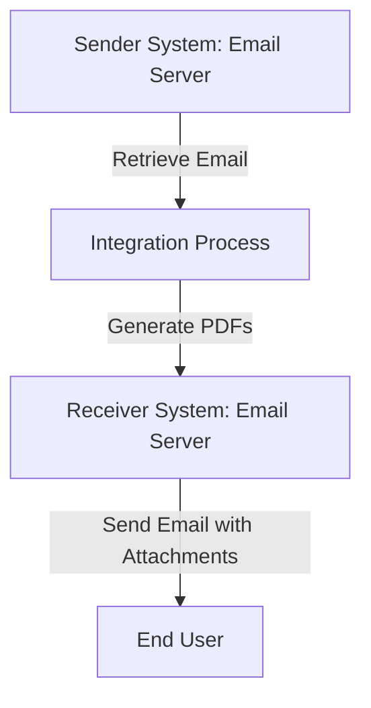

# 1. Introduction

## 1.1 Purpose
The purpose of this iFlow, named 'Task1', is to process incoming emails, extract their content, generate PDF reports based on the email body, and send these reports as attachments in a new email.

## 1.2 Scope
This iFlow interacts with email systems, specifically using SMTP and IMAP protocols for sending and receiving emails. It processes email content, generates PDF documents, and manages attachments. The systems affected include the email server (Gmail in this case) and the SAP Cloud Platform Integration (CPI) environment.

# 2. Integration Overview

## 2.1 Integration Architecture
The integration architecture consists of a sender system that retrieves emails and a receiver system that sends emails with PDF attachments. The iFlow orchestrates the flow of data between these systems.

## 2.2 Integration Components
- **Sender System**: Email server (IMAP) for receiving emails.
- **Receiver System**: Email server (SMTP) for sending emails.
- **Adapters Used**: 
  - IMAP Adapter for receiving emails.
  - SMTP Adapter for sending emails.

# 3. Integration Scenarios

## 3.1 Scenario Description
1. The iFlow starts by retrieving emails from the sender system using the IMAP adapter.
2. The email content is extracted and processed.
3. Two PDF documents are generated based on the email content.
4. The PDFs are attached to a new email.
5. The email is sent to the specified recipient using the SMTP adapter.

## 3.2 Data Flows
The iFlow utilizes Groovy scripts for processing email content and generating PDFs. Key scripts include:
- **script1.groovy**: Extracts email content using JavaMail API.
- **script3.groovy**: Parses the email body and sets it for further processing.
- **script30.groovy**: Generates two PDFs from the email body and prepares them for attachment.

### Groovy Script Explanations
- **script1.groovy**: Converts the CPI message body into an InputStream and extracts the email content.
- **script30.groovy**: Cleans the email body, generates PDFs, and sets them as attachments.

## 3.3 Security Requirements
- **Authentication**: Basic authentication is disabled for the sender system.
- **Email Security**: The SMTP server uses STARTTLS for secure email transmission.
- **Credentials**: Email credentials are managed securely within the CPI environment.

# 4. Error Handling and Logging
Error handling is implemented within the Groovy scripts. If an error occurs during PDF generation, the error message is set as the body of the message, and the content type is changed to "text/plain" to indicate an error response.

# 5. Testing Validation
Key testing scenarios include:
- Validating the retrieval of emails from the IMAP server.
- Ensuring that the PDF generation works correctly with various email contents.
- Testing the sending of emails with attachments to confirm that the PDFs are correctly attached and formatted.

# 6. Reference Documents
- **iFlow Configuration**: `Task1.iflw`
- **Groovy Scripts**: 
  - `script1.groovy`
  - `script3.groovy`
  - `script30.groovy`
  - Additional scripts for PDF generation and email handling.
