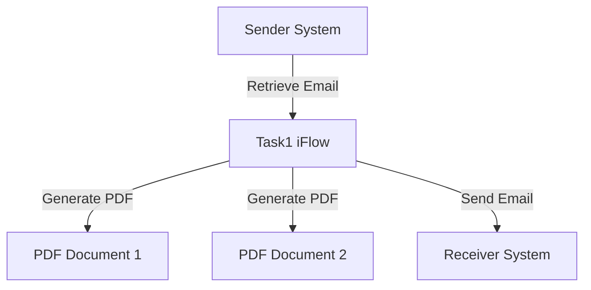

```markdown

<h1 style="color: #1f4e79; font-size: 2.5em; text-align: center;">Table of Contents</h1>

1. Introduction  
   1.1. Purpose  
   1.2. Scope  

2. Integration Overview  
   2.1. Integration Architecture  
   2.2. Integration Components  

3. Integration Scenarios  
   3.1. Scenario Description  
   3.2. Data Flows  
   3.3. Security Requirements  

4. Error Handling and Logging  

5. Testing Validation  

6. Reference Documents  


<br><br><br><br><br><br><br><br><br><br>

# 1. Introduction

## 1.1 Purpose
The purpose of this iFlow, named 'Task1', is to automate the process of converting email content into PDF documents. It extracts the body of incoming emails, generates two separate PDF files from the content, and sends these PDFs as attachments in a new email.

## 1.2 Scope
This iFlow interacts with email systems to receive and send emails. It is designed to work with SMTP and IMAP protocols for sending and receiving emails, respectively. The iFlow processes emails containing text content and generates PDF reports based on that content.

# 2. Integration Overview

## 2.1 Integration Architecture
The integration architecture consists of a sender system that retrieves emails and a receiver system that sends emails with PDF attachments. The iFlow orchestrates the flow between these systems, handling the conversion of email content to PDF format.



## 2.2 Integration Components
- **Sender System**: Uses IMAP to retrieve emails.
- **Receiver System**: Uses SMTP to send emails.
- **Adapters Used**: 
  - IMAP Adapter for receiving emails.
  - SMTP Adapter for sending emails.

# 3. Integration Scenarios

## 3.1 Scenario Description
1. The iFlow starts by receiving an email through the IMAP adapter.
2. The email body is extracted and processed.
3. Two PDFs are generated from the email content.
4. The PDFs are attached to a new email.
5. The new email is sent to the specified recipient using the SMTP adapter.

## 3.2 Data Flows
The data flow involves the following steps:
- **Email Extraction**: The email body is extracted using JavaMail API.
- **PDF Generation**: Multiple Groovy scripts are used to create PDFs from the extracted email content.
- **Attachment Handling**: The generated PDFs are attached to the outgoing email.

### Groovy Script Explanations
- **script1.groovy**: Extracts the email body from the incoming message.
- **script3.groovy**: Parses the email content using JavaMail API.
- **script17.groovy**: Generates a PDF from the email body.
- **script24.groovy**: Creates two PDFs and prepares them for attachment.
- **script30.groovy**: Cleans the email body and generates PDFs with dynamic filenames.

## 3.3 Security Requirements
- **Authentication**: Basic authentication is disabled for the sender.
- **Email Security**: The SMTP server uses STARTTLS for secure email transmission.
- **Access Control**: The iFlow does not expose sensitive headers and restricts CORS.

# 4. Error Handling and Logging
Error handling is implemented through exception handling in Groovy scripts. If an error occurs during PDF generation, a message indicating the error is set as the body of the message, and the content type is changed to plain text for clarity.

# 5. Testing Validation
Key testing scenarios include:
- Sending emails with various content types (plain text, HTML).
- Validating the generated PDFs for correct content.
- Ensuring that emails are sent successfully with the correct attachments.

# 6. Reference Documents
- **iFlow Content**: `Task1.iflw`
- **Groovy Scripts**: 
  - `script1.groovy`
  - `script3.groovy`
  - `script17.groovy`
  - `script24.groovy`
  - `script30.groovy`
  - Additional scripts for PDF generation and email handling.
```
